## Introduction

FlowControl is an application responsible for monitoring network bandwidth and network traffic analysis. This document describes step by step installation and configuration process of FlowControl on VMWare ESXi version 6.5+.	

## Additional Resources

For additional resources and information, please visit Sycope LLC website at www.sycope.com. You may find there:

-   **Documentation:** Documentation and descriptions of our products, available to download in a pdf form, from respective product sites.
-   **Other Sycope LLC solutions:** For more solutions available from Sycope LLC, visit our homepage and hover the mouse over products drop down menu to view full offer.

## Contact Details

Available ways of contacting Sycope LLC SA:

-   **Internet:** To find more products and information please visit our site **www.sycope.com**
-   **E-mail:** For any queries, please email us at: **contact@sycope.com**

## 1. Installation

This chapter will focus on following aspects of installation process:

-   **Preparation**: Information found here is about what is required to install the virtual machine.

-   **Deployment**: Step by step walkthrough of installation and deployment process of virtual appliance.

### 1.1 Preparation

With purchase of FlowControl, you receive OVA file required for deployment of the software. Please ensure that the file is available for installation process.

**Disclaimer:** FlowControlXN is supporting **ESXi 6.5+** version. For the exact software requriements please review Software Requirements section .

> **Attention**: Please note that all CPUs should be divided between 2 sockets, e.g for option with 60k FPS, that has 16 CPUs, there will be 8 CPUs per socket.
>
> It can be check from CLI witch [**status**] command

### 1.2 Deployment

In order to perform the successful installation, please **follow below steps**:

1.  Log in to VMWare ESXi.

    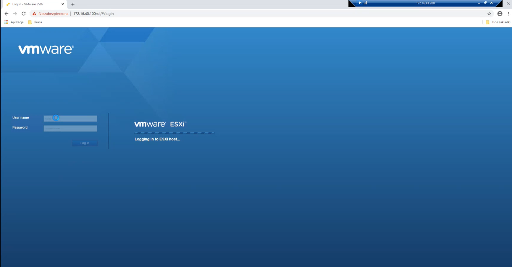

2.  From **Navigator Menu** go to **Virtual Machines**. Click on **Create / Register VM**. Pop up window will show up with few steps to be completed.

3.  Select **Deploy a virtual machine from OVF or OVA file**, and then click **Next**.

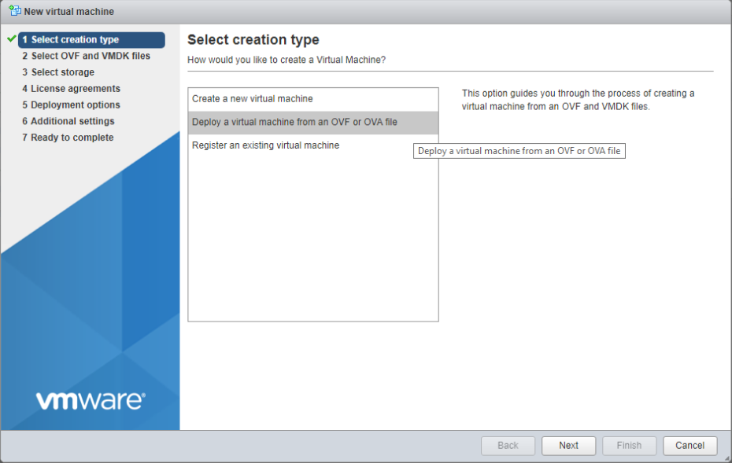

4.  Enter a name of virtual appliance you want to create. Browse the OVA file by clicking on blue parallelogram or drag and drop on it. Click **Next**

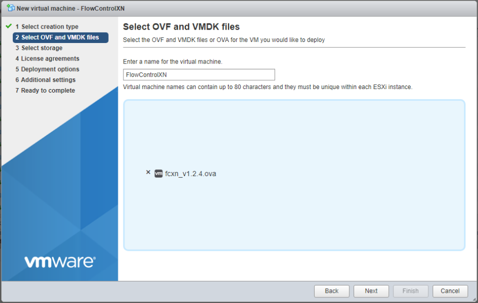

5.  Choose desired datastore that will hold the FlowControl XN files. Click **Next**.

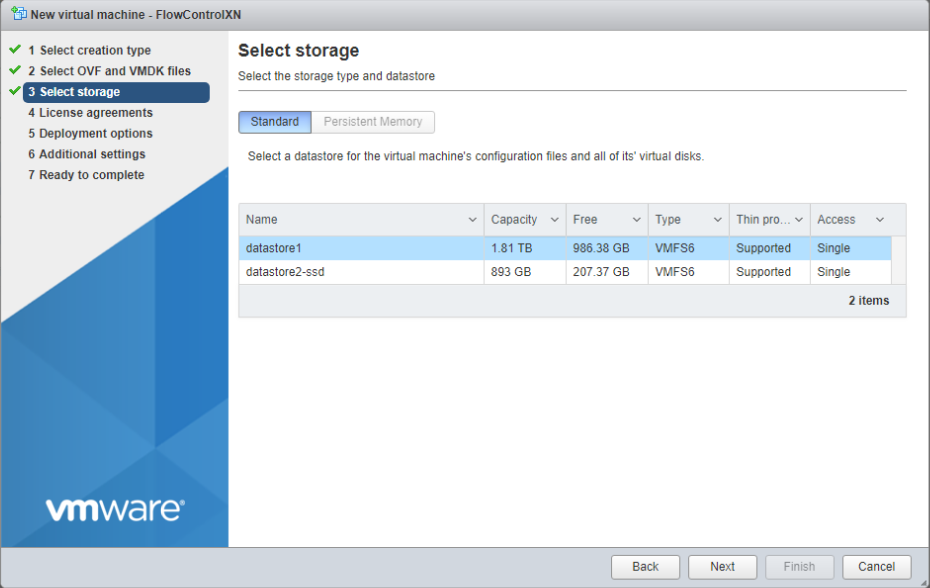

6.  Select data provisioning options depending on your requirements. Make sure that the **Power on automatically** option is deselected. Click **Next**.

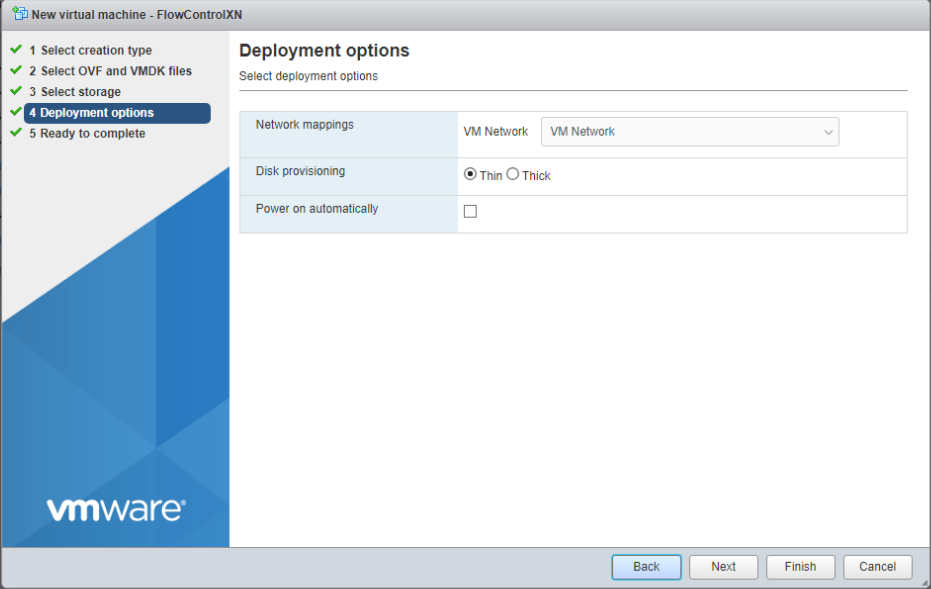

7.  After completing all previous steps, pop up window will show up, summarizing all information about the virtual machine that has been created. Click **Finish** in order to start a deployment process.

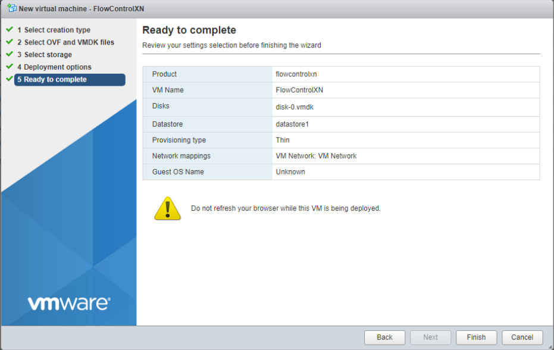

When the deployment process finishes, please give a system 3 - 5 minutes, for it to configure itself. Up till that time it will be unavailable to access.

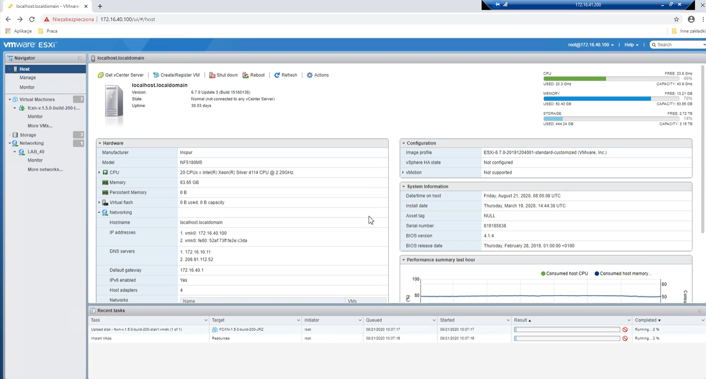

8.  In order to add second HDD to the virtual machine please go to **Edit settings**. Click on **Add hard disk** drop down menu and choose **New hard disk** from available options.

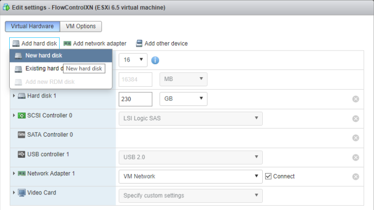

9.  Choosing this option will show window with information to fill in regarding new HDD. Please choose all suitable options for your new hard disk as storage, data provisioning option, etc. Click **Finish** in order to deploy the second HDD.

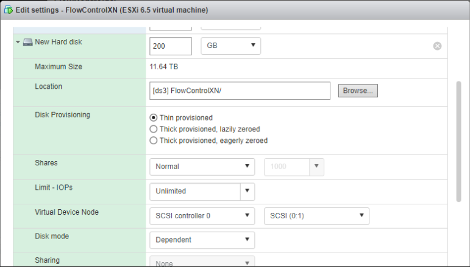

If the installation and deployment have been successfully completed, configuration process can be applied. Run the virtual machine that has been created. In order to access the configuration panel press **Left Shift** button 5 times. Cmd console will pop up, there will be command line asking for a password.

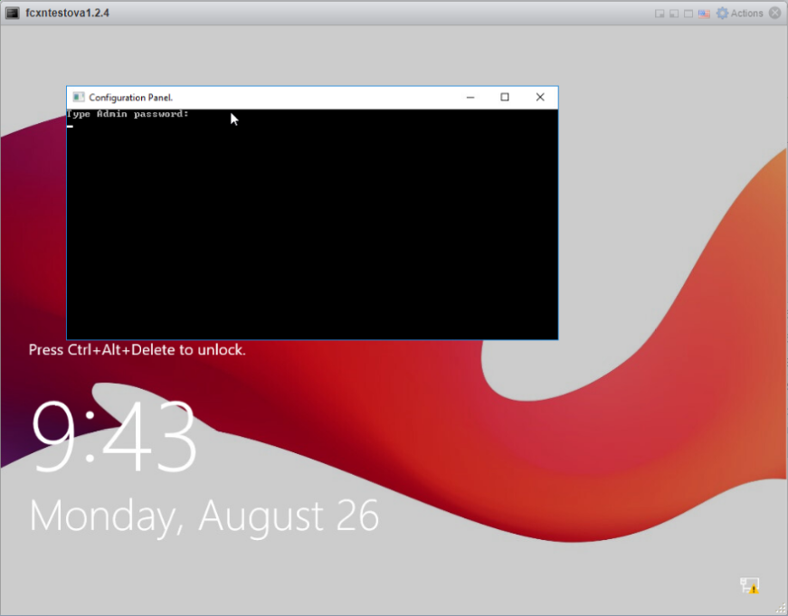

For Admin account, default password is: **FcxN12\#\$** (It is strongly recommended to change password later in GUI). Network configuration status and list of **CLI** commands will be displayed after successful login. The CLI commands are described in the documentation in the section **Command Line Interface**. Then it is possible to log in to FlowControl GUI via the browse to the administrator's account (user: admin, password: **FcxN12\#\$** )

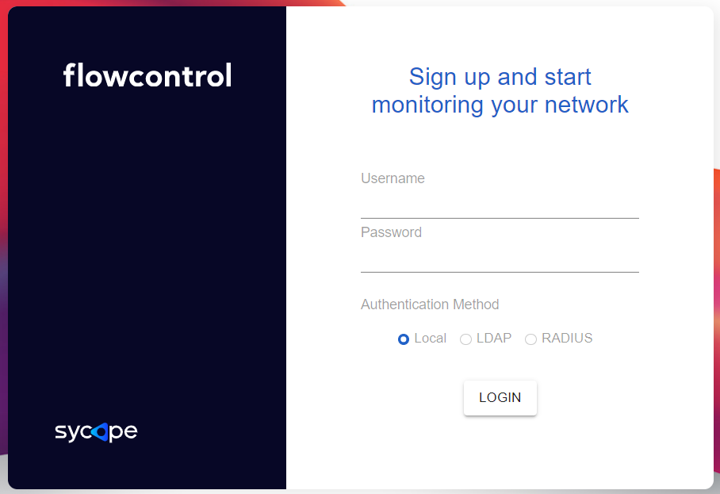

After logging in, the main window will appear. 

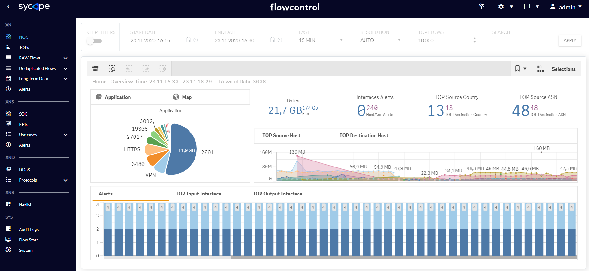

It is recommended to check or change the most important system options. To do this, click the button in the upper right corner of the screen and select the option Config. 

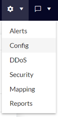

In the tab System it is possible to change the network configuration parameters of the system.

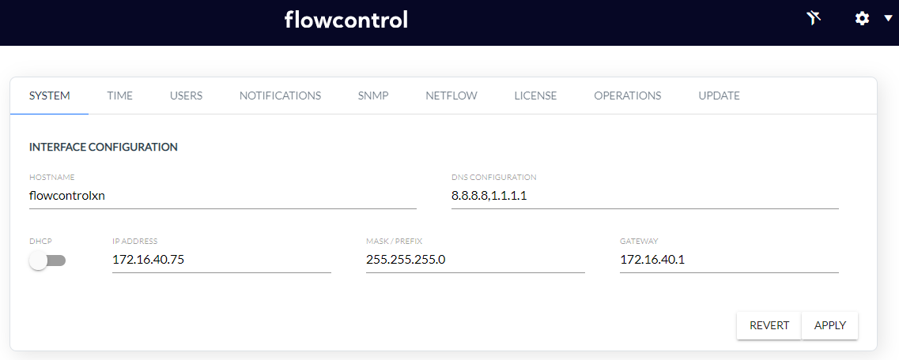

In the tab Notifications it is possible to change the system notifications.

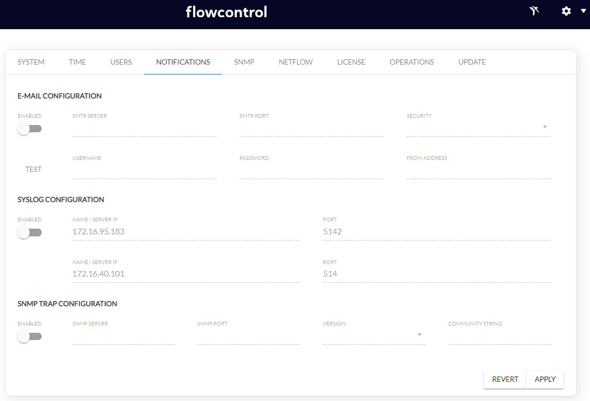

In the tab NetFlow it is possible to configure/change the system parameters related to the NetFlow collection .

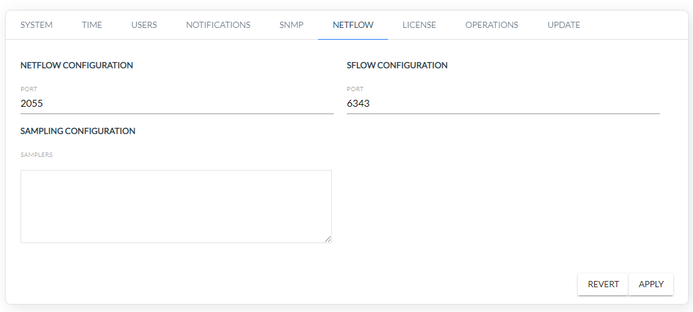

Creating users together with granting permissions and changing the password is done in the tab Users.

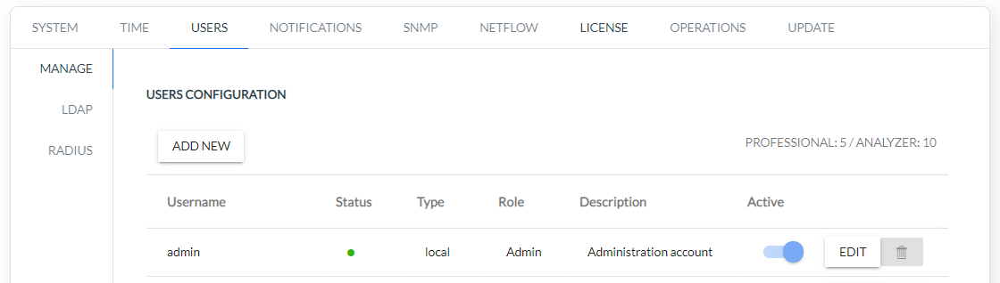

If there is a need to restart or shutdown one of the services, use the tab Operations.

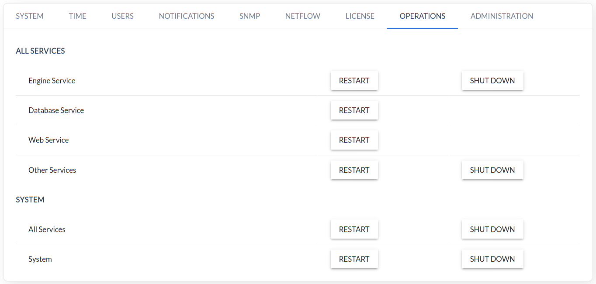

