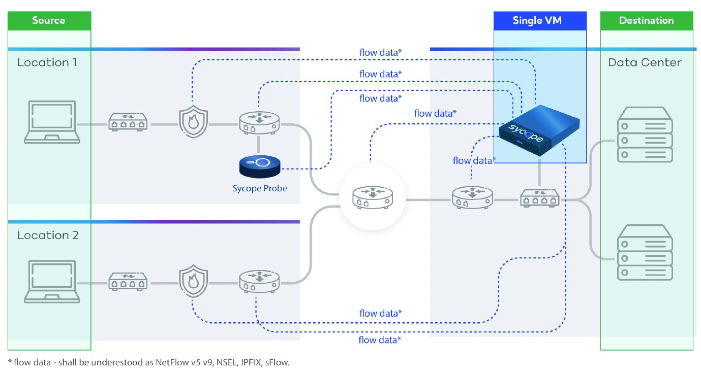

## Introduction

Sycope is a network monitoring tool using real-time flow analysis, enriched with business context to help businesses assess their performance and protect the IT infrastructure. It records, processes, and analyzes all parameters contained in flows, enhanced by SNMP, geolocation and security feeds. With a sharp-looking, intuitive, multi-purpose GUI which corresponds to its inner workings, driven by our own NQL, Sycope presents itself as a versatile and highly customizable tool for your flow control needs.

