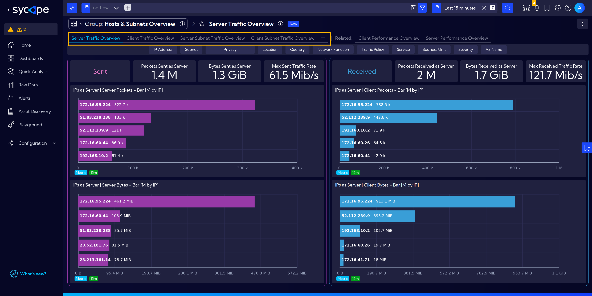
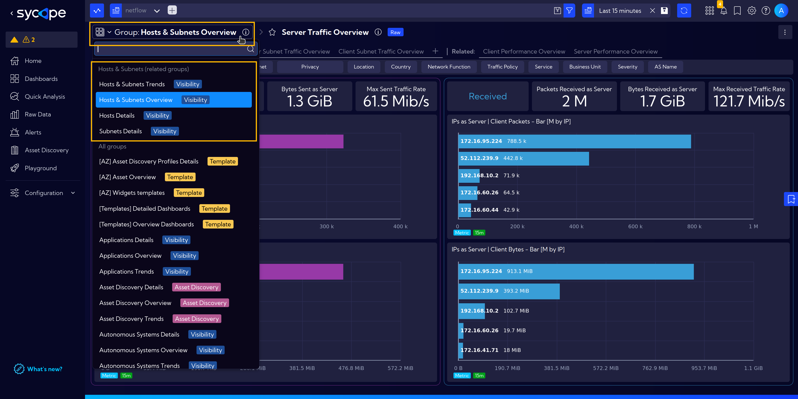
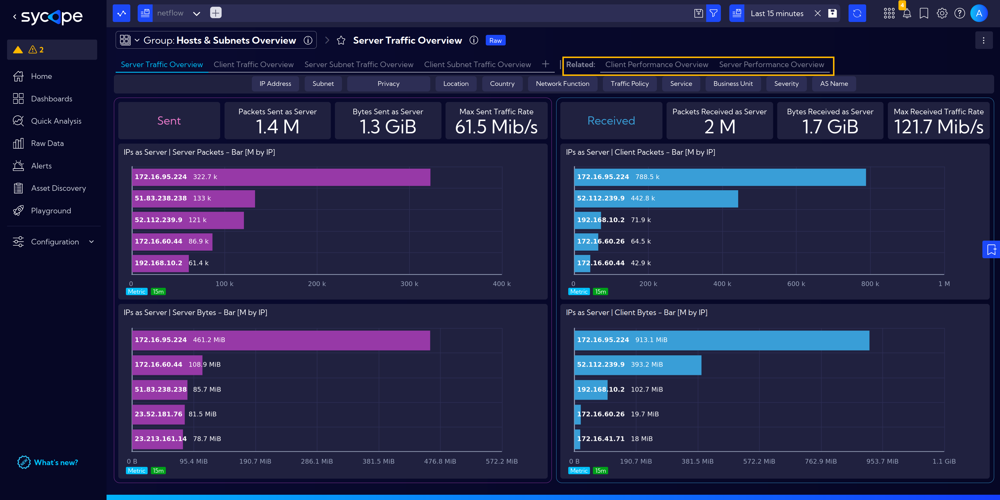
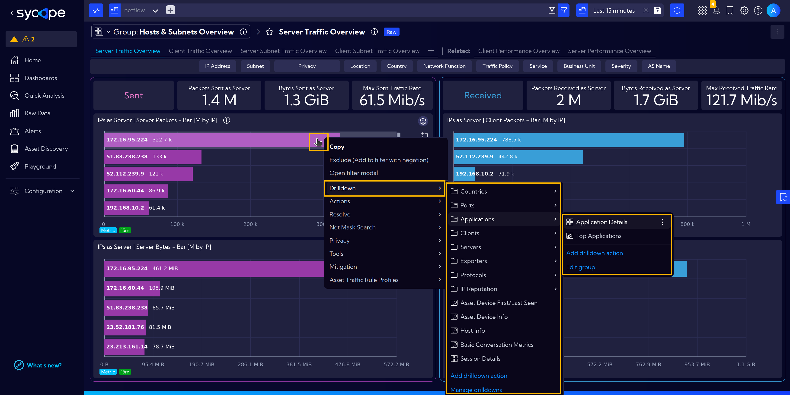
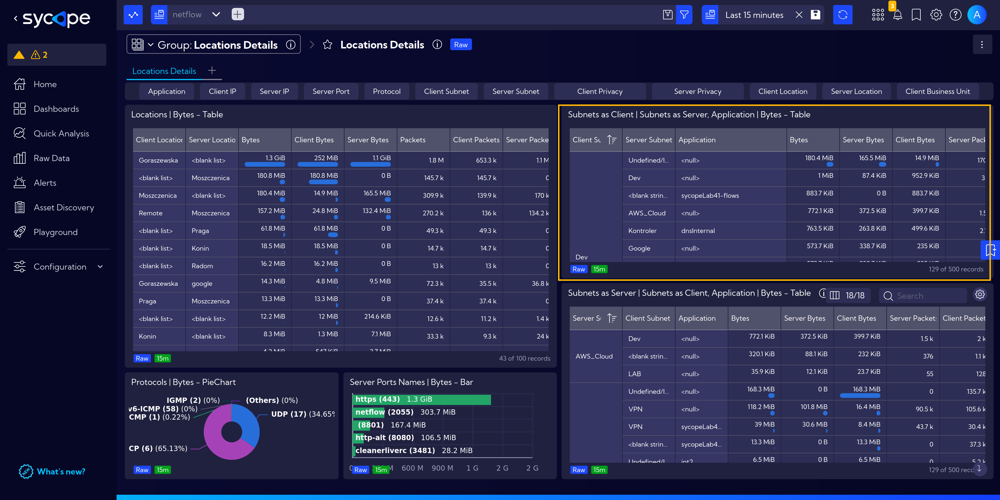
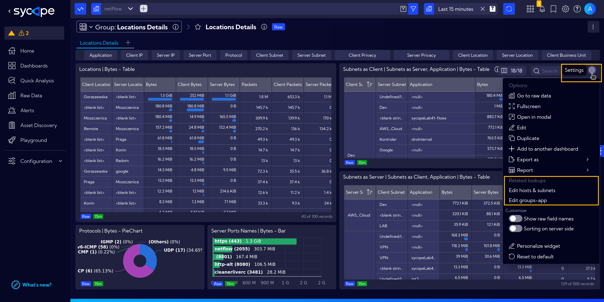
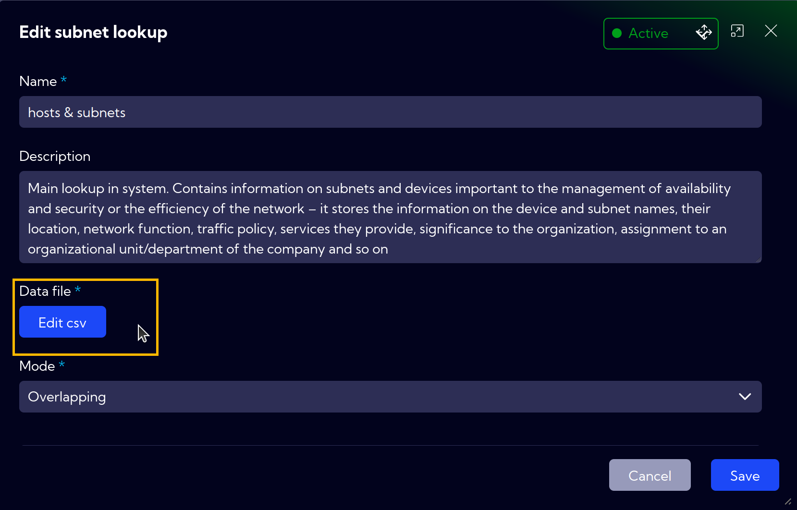
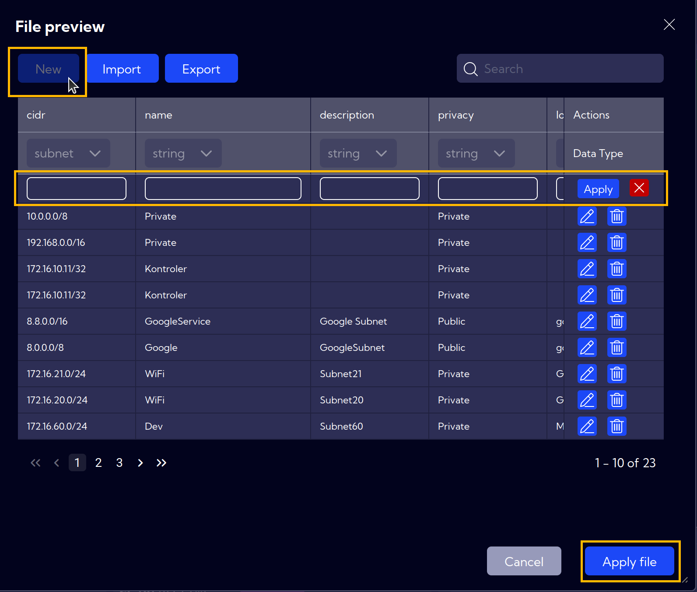

# Navigation

Below you can find the most important tips, that will allow you to navigate the Sycope system quickly and accurately.

The main view for selecting dashboard groups is designed with the concepts of categories, entities and licenses in mind so that we can very quickly find what we are looking for. This is the main entrance to the system, and we encourage you to go through it both at the start of your analysis and at any other time.

Although the main view is clear and convenient, Sycope provides several other paths to get directly to the destination: **related groups**, **related dashboards** and **context-menu drilldowns**.

In the built-in content dashboards that are within the same category and entity are put in one group.  
Whenerver you are viewing a dashboard in a group, all other dashboards in this group are quickly accessible.

## Related Groups

**Related Groups** allow users to quickly access other groups of dashboards that are contextually connected to the currently viewed dashboard group. 

For example, navigate to **`[Dashboards]`** and in **Visibility** section choose **Location Trends** dashboard from **Location** group.

Clicking on the **Group Menu** dropdown will open a list of available dashboard groups, with the Related groups displayed at the top. Below the related groups, users can find all other dashboard groups.

## Related Dashboards

Similarly, the **Related Dashboards** feature enables users to jump directly to other dashboards that are related to the one currently in view.

If the active dashboard has any related dashboards, the list of them will be located on the top bar. Clicking on a selected dashboard will take you to a new view.

## Drilldowns

The context-menu that appears when you click on different object is a multi-purpose tool which contets dynamically changes based on the type of the object you clicked on. Here we will focus on the navigation actions available through context menu but you should also read how it enhances analysis here.

When you right-click on an object, for example an IP address in a table or barchart and select Drilldown you will b presented with two types of links:  
- **widgets** ,
- and **dashboards** .  

Whenever you select a dashboard you will be redirected to its content. When you chose a widget it will appear in a model on top of current dashboard. As the contents is dependent on the type of the object you clicked-on it is very convinient tool for navigation. For example when you right-click on an IP address, select drilldown and select Clients or Servers two appropriate dashboards are available to select. However when you right-click on an application in drilldown, applications a link to a dashboard is present.

## Related Lookups

Another feature that simplifies navigation and enhances the user experience is **Related Lookups**.

If, during the [Quick Setup](/Installation-Guide/Quick-Setup), certain entries were missed, and later while working in the dashboard you notice missing information, it can be easily updated and completed.

For example, in the scenario below, we can see that for some entries, information about the application is missing.

To simplify navigation and avoid the need to go through the full **Quick Setup** again, the missing information can be completed in a simplified manner.

To do this, click on the **Settings** icon in the top-right corner of the widget.

In the dropdown menu, there is a section called **Related Lookups**. By clicking on **Edit Hosts & Subnets**, and then selecting **Edit CSV**, you are directed to a place where you can easily fill in the missing application information.

