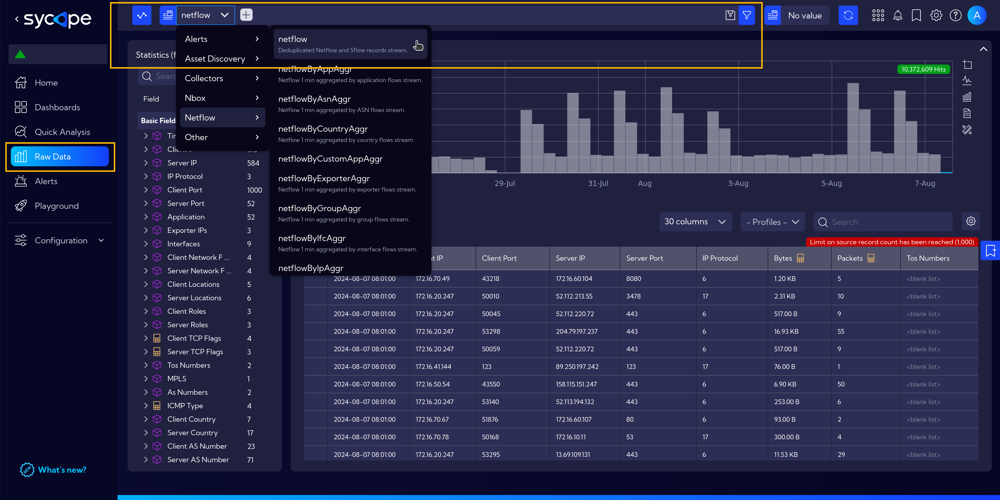

# Data Selection

The conditions that precisely define what data records are presented in widgets on the dashboard are controlled inside the search bar, where we can select the data stream, filter criteria and time range. 

:::info
Values set in the search bar persist in the system when you move between dashboards.
:::

Let's start with the time range. Clicking on the right side of the search bar shows a dialog for time range configuration. We can set a specific time range with minute accuracy by setting the start and end in absolute terms, use time range relative from current time or use the predefined options (previous hour, this day, last 7 days etc.). 

Time range can be also narrowed down directly from timeline charts. By Clicking on the zoom icon and then clicking (setting a start point) and dragging (setting an end point) on a chart the time range in the Sycope filter will be set after you release the mouse button. 

In the middle part of the [Search Bar](/Introduction/User-Interface#search-bar) we can define criteria for all available variables other than time. The system allows you to create and process very complex queries. However, let's begin with the simple ones. 

The simplest filtering we can do is to narrow the data to rows with a specific value in a column. We can do this with a single click on a bar in any bar chart. When we do this a filter will be immediately applied in the search bar.  

Similarly when we hover the cursor over a field in the table, a small window appears with several options: 
- *add to filter* (+), 
- *add negation to filter* (-), 
- and *open filter modal*.

For example, clicking the plus icon adds an entry to the filter at the top (just like clicking on a bar in a chart) with the values from the respective table cell. 

The funnel icon will open a filtering modal with a field and value already selected (which will allow us to expand or modify the filter). In this field we can use several operators, about which we write more [here](/User-Guide/Tips/Filtering)

Clicking directly on the (**+**) icon in the searchbar will open the filtering wizard, which will guide us through adding filters for any fields. Filters that already exist in the searchbar can be edited by clicking on individual elements of the current filter or by entering advanced editing with a double-click on an empty space in the searchbar. 

## Automatic Filter Update

When navigating between dashboards to check detailed information on a specific topic, we often apply **Filters**. 

Let's consider the example below:

While exploring the **Country Trends** dashboard, we decided to examine the traffic sent to the ***Czech Republic*** more closely. 

To do this, we applied a **filter** by clicking on the bar representing the Czech Republic, which made the filter visible on the top bar, enabling us to focus on the desired data.

However, when navigating to another dashboard, such as **Countries Details**, which operates on a different [stream](/Introduction/Streams), an issue can arise. Each stream may have a different set of fields, which makes it challenging to carry over filters between dashboards. In this case, the Countries Details dashboard uses a different data stream and does not include the exact field for filtering by country name, meaning the original filter cannot be applied directly.

Fortunately, the Sycope system is capable of automatically updating the filter to match the new data stream.

When transitioning to the new dashboard, a prompt will appear. By confirming this prompt, Sycope will update the filter to align with the new stream, allowing you to continue working with the previously selected filter and analyze the traffic without interruption.

Below is the view with the updated filter.

## Adding Conditions to Filters

In the **Introduction** section under **User Interface**, it was mentioned that the [Search Bar](/Introduction/User-Interface#search-bar) is one of the main components of the system. Here, it should be added that it is one of the main functions that controls the operation of the Sycope program and allows users to utilize its full potential.

One of the example actions is the quick filtering of data in the presented tables and charts.

As an example, let's use browsing data in the [Raw Data](/User-Guide/Raw-Data) section.  
Navigating to the Raw Data section in the menu opens the default view with the Netflow data [Stream](/Introduction/Streams) set.  
If necessary, the stream can be changed according to specific needs by clicking on the dropdown menu and selecting the stream of interest.  

For now, let's stay with the default view with Netflow stream selected.
The central part of the view is occupied by the data flowing from the stream.

When we hover the cursor over a field in the table, a small window appears with several options: 
- *add to filter* (+), 
- *add negation to filter* (-), 
- and *open filter modal*.

For example, clicking the plus icon adds an entry to the filter at the top with the values from the respective table cell.

However, clicking on Open Filter Modal opens an additional window with options to choose from, where the new filter can be adjusted more precisely.

t is worth mentioning at this point that the set filter is remembered in the Search Bar and is available even when we navigate to other parts of the system.  
As in the example below, we moved to another dashboard (Long Term Server Traffic Overview), which now displays information for the previously selected filter, not the default one.

