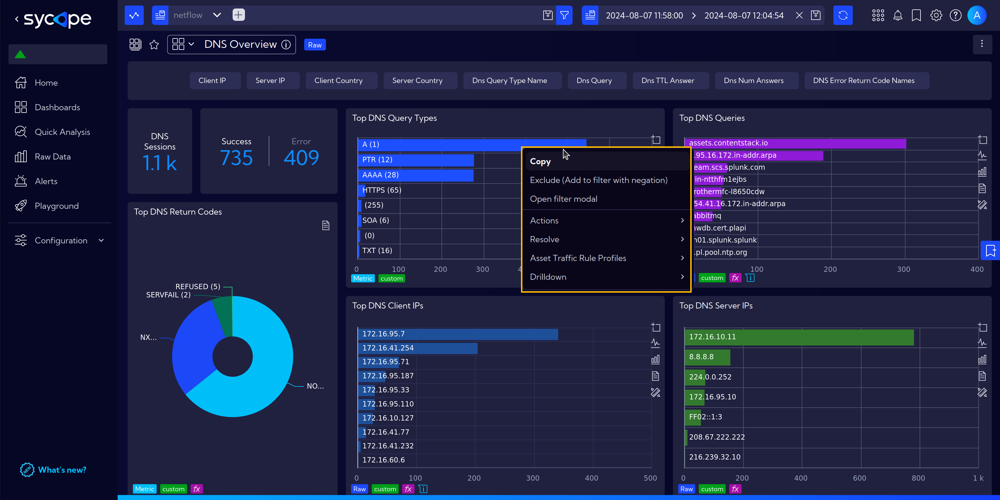
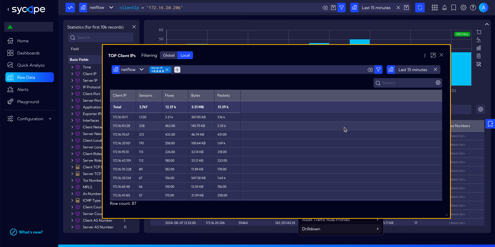
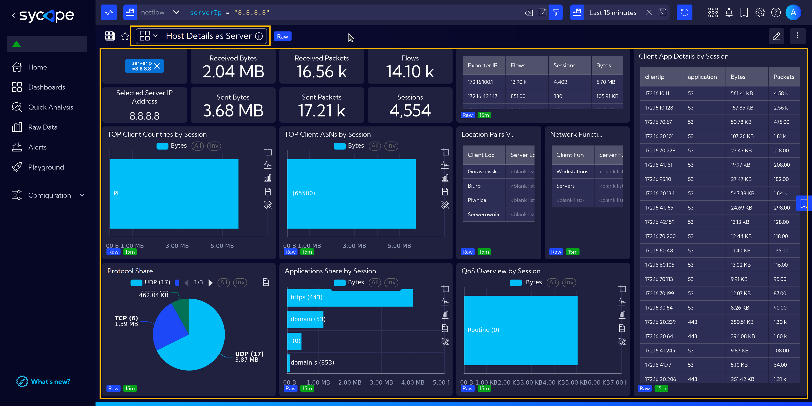

# Analysis

## Context Menu (Right Click Menu)

The context menu, accessible by right-clicking, contains different sets of possible actions depending on the type of data and the kind of field on which we click.

Let's look at the example below with the available options after clicking on the Time field in Raw Data.

And another example of the context menu available after clicking on the field with the server IP address.

The context menu also works when we click on widgets. Additional useful options are then revealed.

### Context Menu Features

The right-click menu is divided into options and sections:
- **Copy** - Simply copies the contents of the cell you right-clicked on.
- [**Quick Actions**](#quick-actions) - Allows you to execute previously defined Quick Actions. From this menu, you can also go directly to the editor to create a new Quick Action.
- [**Drilldown**](#drilldowns) -  Allows you to explore data in greater detail by navigating to more specific views based on selected values.
- [**Actions**](#actions) - Executes actions within the Sycope system - for example, it allows you to perform ad hoc Contextual Analysis or check information using a Lookup.
- **Send externally** - Redirects to external resources or performs a query to external services.
- [**Show**](#show) - Applies predefined filters to the visible data — for example, show only private IP addresses.
- **Tools** - Triggers actions in external programs — for example, executes a ping and displays the result.

### Quick Actions

Quick Actions provide a convenient way to execute predefined actions directly from the context menu (right-click) in various parts of the system. They help speed up analysis, enforce consistency, and allow flexible customization.

#### Accessing Quick Actions

To access Quick Actions:
- Right-click on any cell in a table or widget
- Choose Quick Actions from the menu
- You’ll see the list of available Quick Actions and an option to Edit quick actions

#### Editing Quick Actions

You can customize which actions appear in your Quick Actions menu:

1. Select **`Quick Actions`** and **`Edit quick actions`**.

2. Use the configuration window to:  
    - Filter available actions by category (e.g., Drilldown, Actions, Send externally, etc.).  
    - Move selected actions to the active Quick Action menu using the arrow buttons.  
    - Reorder actions using the up/down buttons.

3. Click **`Save`** to apply changes.

#### Example Use Case

You frequently analyze suspicious server traffic:
- Right-click on the server IP
- Select **`Quick Actions`** and **`Contextual analysis`**
- A filtered view opens automatically, ready for deep inspection

### Actions

#### Contextual Analysis

Contextual Analysis is one of many useful tools available in Sycope. It allows you to apply filters dynamically while browsing through data, making analysis more intuitive and efficient.

Let’s walk through an example.

Suppose you're interested in traffic directed to a specific server. Simply right-click on the relevant data point and select **`Actions > Contextual Analysis`** from the context menu.

A new window will open with a search bar pre-filled with a filter based on the selected server’s IP address.  

You can further refine the analysis by adjusting the following:
- **Time Range** – Set the time frame relevant to your investigation.
- **Chart Type** – For this scenario, select Table to view the data in a tabular format.
- **Columns** – Choose the specific data fields you want to display, such as the IP addresses of clients connecting to the selected server.

On the left side of the screen, a table appears with the filtered data based on your selected parameters.

By clicking the plus icon next to the Columns section, you can add additional data fields — for example, port numbers.  
The table updates automatically to reflect the changes.

Finally, if you think your analysis could be useful in the future, you can save it as a widget by clicking **`Save as Widget`**.

This will take you to the widget creation wizard, where you can define additional options related to widget configuration and display.  

:::info
Check the [Widget Examples](/Examples/Widget-Examples) page for more detailed instructions on how to create and configure widgets.
:::

#### NQL Resolve

***NQL Resolve*** is an additional feature available in the **Context Menu** under **Actions**. By selecting **`Add NQL Resolve`**, users can create new shortcuts using custom NQL queries. 

By default, the wizard assists in creating a search shortcut using existing Lookups. Users can specify the Lookup name, a single input key, and multiple output keys. The input key refers to any value found within the system, such as an IP address displayed in table widgets. The output keys correspond to the records retrieved from the specified Lookup.

:::info
Go to [**[Configuration > Shortcuts > NQL Resolve]**](/User-Guide/Configuration/Shortcuts#nql-resolve) for more information.
:::

### Show

The Show section contains options for applying predefined filters to the visible data.  
The available options include:
- **Only public IPs** – Applies a filter to display only public IP addresses.
- **Only private IPs** – Similar to the above, but filters for private IP addresses.
- **Net Mask** – Allows you to apply a network mask and display data within a selected IP address range.
- **Resolved DNS for all values** – Resolves DNS for all IP addresses in the column and displays the results.
- **Resolved DNS** – Resolves DNS for the selected IP address only.

As an example, we'll select Resolved DNS for all values:

After the operation is executed, server names appear in the column:

## Drilldowns

Drilldown is another navigation enhancement of the system. It allows discovering details that are not visible or accessible in the foreground view.  
Drilldowns are fully configurable. More about them can be found [here](/User-Guide/Configuration/Shortcuts#drilldown).   

However, for now, let's focus on two basic functionalities.

### Drilldowns assigned to widgets

To demonstrate this functionality, let's navigate to the **DNS overview** dashboard. Go to menu **`[Dashboards]`** and under **DNS Traffic Analysis** group find a **DNS Overview** dashboard.

Hovering over a widget reveals a small icon with an arrow in the bottom right corner of the widget.

Clicking the icon brings up a context menu with drilldowns to choose from. After clicking on one of them, in this case, *DNS Error Code Timeline*, an additional window with a detailed view appears.

### Right Click Menu Drilldowns

The second type of drilldowns are those assigned to fields in tables and are accessible by right-clicking on the selected field.  
The content of the menu under the Drilldown entry varies depending on the type of data and the kind of field in the table cell.

The example below shows the selection of available drilldowns for a field containing an *IP address* in the *Server IP* column.

By selecting a different field, we have different drilldowns to choose from.  
In the next example, for data in the *IP Protocol* column, only the *Session Details* drilldown is available.

Additionally, it should be mentioned that drilldowns also come in different types. Some open an additional window with a widget, while others may direct to subsequent dashboards.

Returning to the example of the drilldown for the *Server IP* column. When we select the *TOP Clients* drilldown, a popup window with the widget's content will appear.

After selecting the *Server IP Details* drilldown, we will navigate to the corresponding dashboard.

## Not Enough Data

The **Not Enough Data** notification appears in **`[Dashboards]`** or **`[Raw Data]`** views when there is insufficient data to generate full information for widgets within the selected time range.

For example, in the case below, we selected the time range from July 1 to July 31, 2024. The system is unable to display data for this period because, according to our current [Data Retention](/Installation-Guide/Quick-Setup#data-retention) settings, this data is no longer stored.

This is not the only case when such a notification is displayed.  
Another instance, shown below, more subtly indicates that we do not have all the necessary data to fully present the required information.  

The warning triangle icon indicates that we also lack sufficient data for the weekly baseline. When hovering the cursor over the icon, detailed information is displayed.

