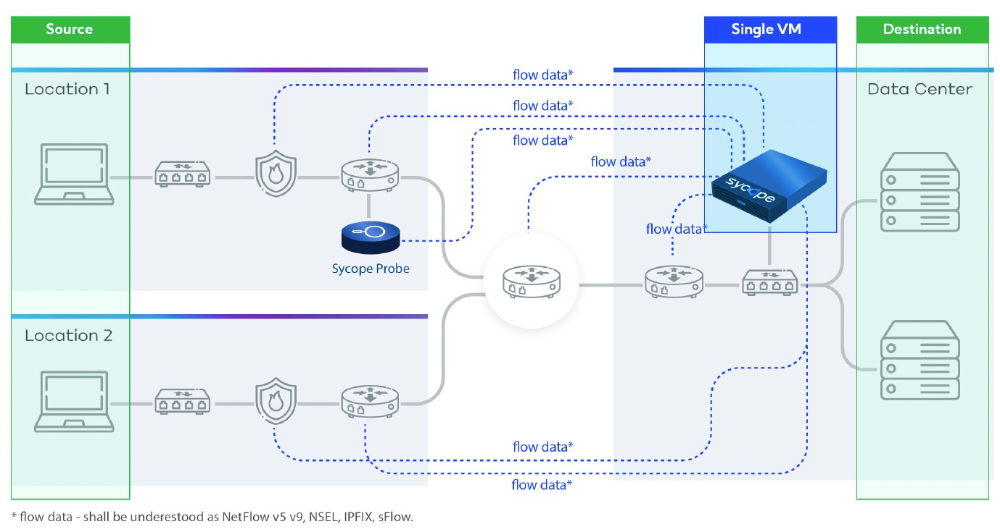

# Introduction

Sycope is a network monitoring tool using real-time flow analysis, enriched with business context to help businesses assess their performance and protect the IT infrastructure. It records, processes, and analyzes all parameters contained in flows, enhanced by SNMP, geolocation and security feeds. With a sharp-looking, intuitive, multi-purpose GUI which corresponds to its inner workings, driven by our own NQL, Sycope presents itself as a versatile and highly customizable tool for your flow control needs.

We have made every effort to make Sycope a system in which it is both easy to get started and find answers to questions and solve problems efficiently, as well as to have the ability to create your own dashboards using the full range of available data. We have prepared this introduction to enable users to familiarize themselves with the system efficiently. 




## System Elements

In this section, you will learn how to effectively use the system components. 

We assume that your Sycope system is already optimally configured and correctly collecting data from your network.  
Check the [Installation Guide](/Installation-Guide) section for explanations on installation and configuration.


```mdx-code-block
import DocCardList from '@theme/DocCardList';
import {useCurrentSidebarCategory} from '@docusaurus/theme-common';

<DocCardList items={useCurrentSidebarCategory().items}/>
```

---
\* This product includes GeoLite2 Data created by MaxMind, available from https://www.maxmind.com.
