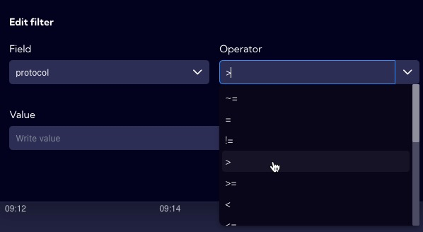

## Main window

After logging into the system the **Main window** looks like this:

The **Main menu** is located on the left sidebar. This sidebar can be rolled up or expanded by pressing the **< or >** symbol in the upper left corner next to the Sycope logo.

In the main home view you can add any **Dashboard** that is in the system and will be shown when the system is started.

On the left sidebar are, from the top:

- Icon area with system notifications
- Main menu with submenu
- User settings menu (at the bottom)

- User logout icon

The main menu consists of the following submenus and tabs:

- **Home**

- **Dashboard**

  - Favorites
  - Raw Data
  - Management
    - Dashboard tab
    - Widget tab

- **Alerts**

  - Rules Set
  - Alerts Table

- **Configuration**

  - General Settings
    - System Status tab
    - Notifications tab
    - Retention tab
  - Account Management
    - Accounts tab
    - User Roles tab
    - Auth Providers tab
  - Mapping
    - Lookups tab
    - Maintenance Windows tab
    - Business Hours tab
    - Tags tab
  - Objects
    - Fields tab
    - Metrics tab
    - Alert fields tab
    - Ranges tab
    - Collectors tab
    - Recipients tab
    - Right click actions tab
    - Email Templates tab
  - NetFlow
    - Netflow tab
    - SFlow tab

  - Security
    - Certificates tab
    - Audit Log tab

  - Integrations
    - NTP tab
    - SNMP tab
    - SMTP tab
    - Proxy tab
    - External Destinations tab

  - Update
    - Update tab
    - About tab

  - Licenses

In the bottom left corner there is a menu with options for the logged in user, in this case the user is Administrator.

The **Profile menu** allows you to change the system password. The **Personal Settings** allows you to personalize selected system parameters.

   - is used to log out of the system.

To the right of the **Main window** are three right sidebars:

 - Notifications

 - Favourite Dashboards

 - System help

---

##  RAW DATA menu - UI description

In the [Dashboard>**RAW Data**] menu, there are **Data streams** in table and chart form.

The **Graph** shows the NetFlow count for each minute.

The **Table** in the columns contains fields that are available in the selected **Data Stream** which is selected from the drop-down menu. 

Please note that **<u>only 1000 records are displayed in the Table</u>**, which is indicated by the red message at the top of the table.

User can select which fields are shown in the table. To do this, use the **Add field** button, which allows you to select or deselect fields.

## RAW Data Advanced View

To see more detailed information for the selected **Data stream**, the **Advanced View** option is built in. To open the **Advanced View**, click the magnifying glass icon in the first column of the **Table** and the Flyout with **Advanced information** appears on the right.          

You can add more rows to the **Advanced view** by pressing the **Control key** and clicking on the row you want to add.

## Search bar

At the top of the window you will find the **Search bar** to create advanced filters. The simplest filter type, which is the logical sum of the parameters, is created by clicking the plus sign (Add to filter) on a selected field or fields in the table.

The values appear in the search bar window and the result of the filter is shown in the table - in this case, the filtered IP server address is 172.16.10.11 and the filtered port, 53.

#### User filter

The User can build advanced filters by clicking **Add filter** button on the right side of the search bar.

The filter wizard appears.

You need to select the **Field** available for the selected **Data stream** from the drop-down list.

Next, you need to select an operator or function.

At the end you need to specify the **Value** that will be filtered

The created filter will appear in the search bar.

You can add additional filter modules by clicking **Add filter** again.

Frequently used filters can be added to favorites.

  A list of favorite filters is available at the beginning of the search bar.

## Time range

On the right side of the search bar, there is a bar to configure the **Time Range** for which the data will be analyzed.

When you click on the bar, the configuration window appears.

You can select a time interval for absolute as well as relative values. The most commonly used time intervals are also placed there. For relative times you can set an automatic refresh time or do it manually by clicking on the **Refresh button**.

Similarly to the filters, the user can save to favorites the configured **Time ranges** he uses frequently.

## Graph

In the example, the **Graph** shows the number of flows per unit time. In the **Sycope** system, the smallest granularity is 1 min.

On the right side of the **Graph** there are four buttons for formatting it.

These are:

- zoom
- line
- bar
- stack

**Zoom** - is used to select the area to zoom in on the graph.

**Line** - is used to change the graph from bars to line

**Bar** - is used to change the graph from line to bars 

