This section will cover various aspects of working with selected data. We will divide this section into different aspects that FlowControl uses to interpret data from the network. This will include various graphs, charts and tables as well as best practices on how to work with the data. 

### Date Range Tab

An important element of the UI is the data range tab at the top of the page that stays with the user at all times in both XN, XNS and XND tabs and XNR. By default the system shows data and statistics for the last 15 minutes after initial login. When starting work on FlowControl it is crucial to remember to change the time range accordingly. Use the data range tab in order to make  the changes listed below: 

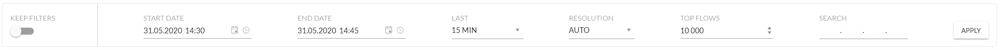

●   **Keep filters** – switching this option on, allows users to keep the filters and selections while switching between a different sections. y this option is turned off therefore switching to different section will reset all filters and selections. When enabled filters in different subsection views will be preserved. 

●   **Start date/End date** - choose time slots for which network traffic will be shown. Increasing a time slot might influence loading time for data and statistics. 

●   **Last** - this option will change displayed network traffic to the one from the chosen time period.

●   **Resolution** - choose for what period of time data will be merged.  

●   **Top flows** - choose how many top flows will be shown. By default, it is 10,000 flows. Increasing flows might influence loading time for data and statistics.

●   **Search** - specific IPv4 addresses can be searched for. Every widget will be automatically adjusted to show information regarding only the IPv4 address being searched for. 

> **Note:** In order to save your preferences, please click the **APPLY** button available on right-hand side. 

The FlowControl system allows advanced search with filters. The number of available filters depends on the selected database on which the filtering operation will be performed. The table below lists with a description all available filters for the given database.

| Filter description          | Filer name | Database/ RAW flows | Database/  Dedupplicated | Databese/  Utilization| Database/  Total traffic |
| ---------------------------- | ------------------ | ------------------------ | -------------------------------------- | ------------------------------------ | ----------------------------- |
| time                         | unix_secs          | X                        | X                                      | X                                    | X                             |
| byte                         | octets             | X                        | X                                      | X                                    |                               |
| packets                      | packets            | X                        | X                                      |                                      |                               |
| source IP address            | srcaddr            | X                        | X                                      |                                      |                               |
| destination IP address       | dstaddr            | X                        | X                                      |                                      |                               |
| scraddr or dstaddr           | addr               | X                        | X                                      |                                      |                               |
| protocol                     | proto              | X                        | X                                      |                                      |                               |
| source port number           | srcport            | X                        |                                        |                                      |                               |
| destination port number      | dstport            | X                        |                                        |                                      |                               |
| srcport or dstport           | port               | X                        | X                                      |                                      |                               |
| direction                    | direction          |                          | X                                      |                                      |                               |
| number of deduplicated Flows | counter            |                          | X                                      |                                      |                               |
| device                       | dev                | X                        |                                        | X                                    |                               |
| input interface              | inputint           | X                        |                                        | X                                    |                               |
| output interface             | outputint          | X                        |                                        | X                                    |                               |
| inputint or outputint        | int                | X                        |                                        | X                                    |                               |
| IP type of service           | tos                | X                        |                                        |                                      |                               |
| source network               | srcnet             | X                        | X                                      |                                      |                               |
| destination network          | dstnet             | X                        | X                                      |                                      |                               |
| srcnet or dstnet             | net                | X                        | X                                      |                                      |                               |

The available filters can be chained together to create any complicated search. Examples of complex searches are presented below.

**Example 1**

Filter fold: unix_secs=202010261000,202010261001;

Assuming that  **X1**=unix_secs, the filtration result is shown in the figure below.

**Example 2**

**Filter fold:** unix_secs=202010261000,202010261001&scraddr=1.1.1.1,2.2.2.2

Assuming that :

**X1**=unix_secs=202010261000,202010261001;

**X2**=scraddr=1.1.1.1,2.2.2.2;

then

**X1 & X2 = X3**.

The filtration result is shown in the figure below.

**Example 3**

**Filter fold:**  unix_secs=202010261000,202010261001&scraddr=1.1.1.1,2.2.2.2&dstaddr=3.3.3.3,4.4.4.4

Assuming that :

**X1**= unix_secs

**X2** =srcaddr

**X3**=dstaddr

then

**X1&X2&X3=X5**

The filtration result is shown in the figure below.

**Example 4**

**Filter fold:** unix_secs=202010261000,202010261001&addr=1.1.1.1,2.2.2.2

Assuming that :

**X1**= unix_secs

**X2** =srcaddr

**X3**=dstaddr

and

addr=srcaddr or dstaddr  (see table above)

then

**X1 & (X2 or X3) = X5+X6+X7**.

The filtration result is shown in the figure below.

 

### Data Specific Selection Tab

When creating any selections, the configuration output will be shown in a form of tabs. Each individual component of the tab can be managed separately. In order to deselect, press the  

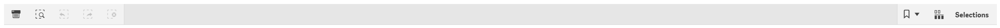

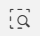  <b>Smart search </b> clicking this option will pop up a type in section, where any phrase can be typed in that is being looked for. This system automatically suggests options while typing.

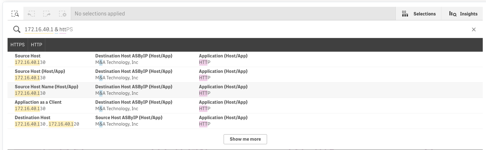

 <b> Step back </b> - clicking this option will take a step back in data selections.

  <b>Step forward </b> - clicking this option will take a step forward in data selections.

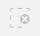  <b> Clear all selections </b> - this option will clear every data selection made.

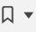**Bookmark** - this option is a shortcut to the users filter parameters

### Visualization Options

This system will present the data, metrics and outcome of a configured rule set in different graphical forms according to the data granularity and metric structure. The presentation layer is configured according to the best practice in the data presentation techniques.

### Visualization Drill Down

#### Drill Down Options

Depending on the specific dashboard and widget chosen, this system allows different drill down options. The universal method is clicking over any chart, graph or table where the user will be prompted with: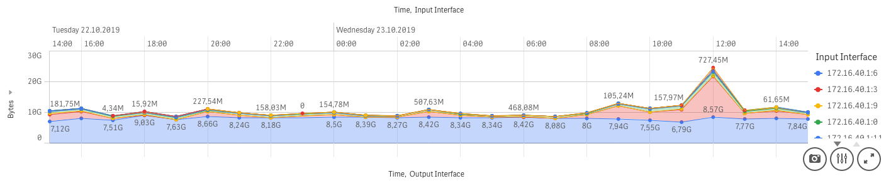

- **Exploration menu** - clicking this option will pop up an exploration menu. This is the place where users can adjust the graph, table or chart to their own needs. Options available for change are as follows: data to be shown, way of sorting data, presentation of given graph, chart or table, colors and legend.

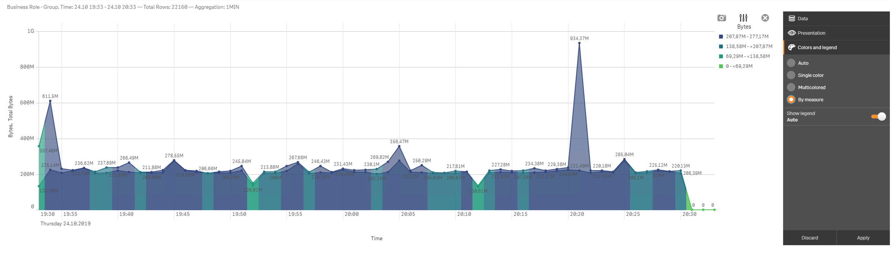

- **Full screen** - clicking this option, it will take user to the full screen mode of the graph, table or chart. This option is most widely used among mentioned three. This will allow to view more detailed information. In order to exit the full screen mode, press
screen mode.
- **Export** - Preconfigured export options:

  - Export as an image,

  - Export to PDF,

  - Export data.

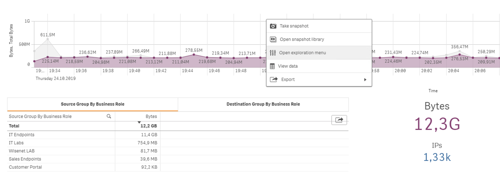

In some sections, there is a possibility to select data by choosing from drop down menus:

This system allows users to type in a searched phrase or select it from the drop down menu. Please remember that depending on the data chosen, fields will change color according to the data availability, suggesting to users which data types are aligned.

#### Visual Data Extraction

The first thing to notice when working with charts is that when users hover their mouse over any bar/data point it will show more details regarding that specific data.  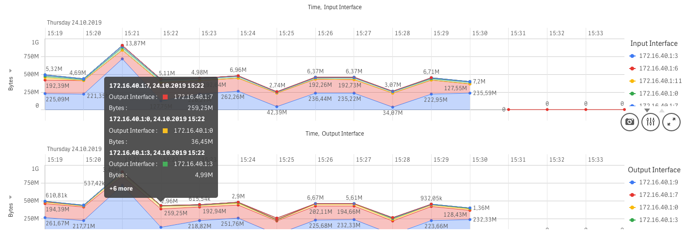

When clicking on bars, they will be selected. You can click on multiple bars in order to view only them in the chart. In order to confirm the selection, please press the green button on the top right corner. If data is presented on multiple elements of the dashboard, users’ selection on one plot will impact data presentation on others according to the selection made.

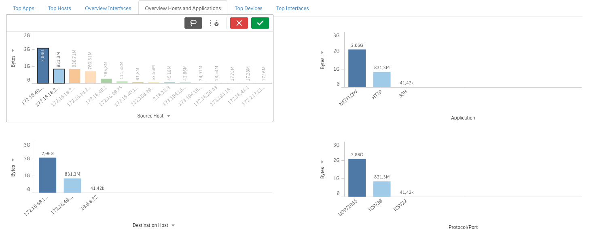

This system has drop down menus on the left-hand side and at the bottom of the chart (X/Y axes). They can be adjusted (if possible) to show different data types. There is also a lasso selection option available in the top right corner
draw a line which, when passing through data it will select it accordingly.

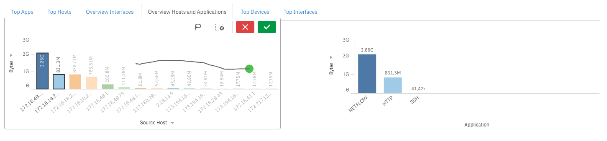

Data from graphs can be selected by clicking and dragging just below the x axis, i.e. vertically, to select narrowed, i.e. period of time.

 Data can also be selected just by clicking and dragging the y axis, i.e. horizontally. This will allow to check for the details of highest data used.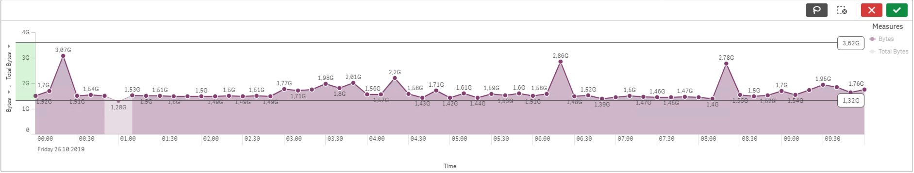

#### Exact Values Search

 Tables are the most precise way of presenting data gathered because it shows exact values and measures.

 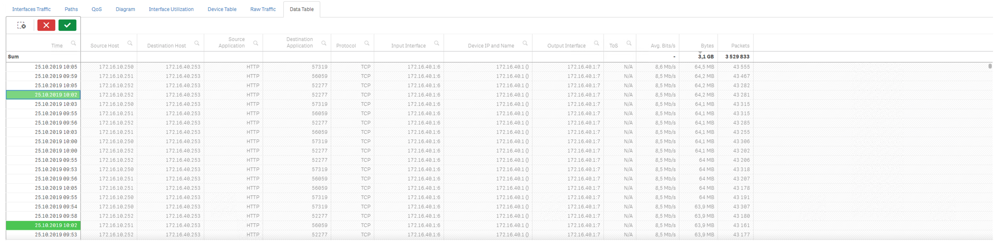

 

There are two ways of selecting data in tables. The first one is by clicking on the magnifier icon next to a chosen heading, e.g. Source Host. The drop down menu will pop up where users can either search for a desired source host or by simply scrolling down and looking for it manually, then by clicking it. In order to accept the selection, press the green button. After making a selection, all data will be adjusted. The second option is to simply click the desired data in the table.