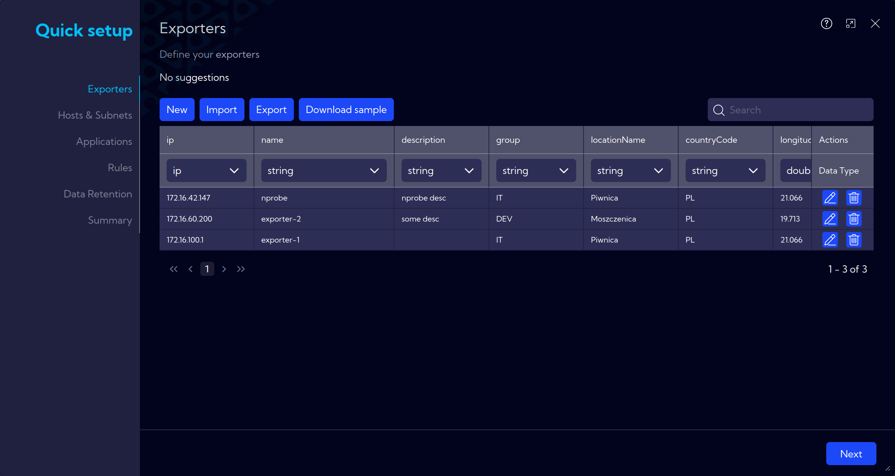
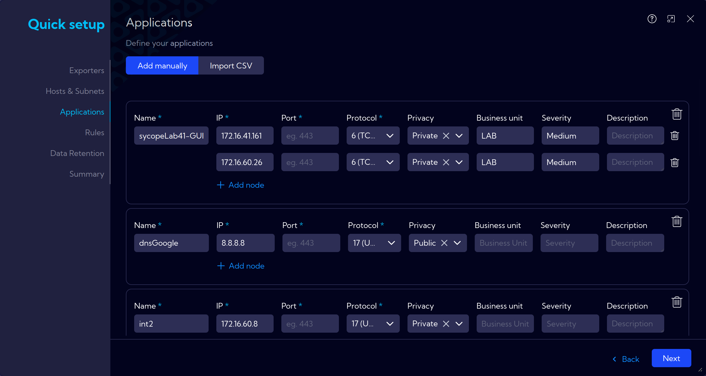

# Quick Setup

A setup wizard for initial system configuration, allowing you to start working immediately.

The completion of additional information is optional but recommended for smooth system operation.  

Furthermore, thorough completion enables immediate utilization of the Sycope system with a high level of customization tailored to our needs and access to its extensive functionality.

## Network Groups

`Add manually` or via `Import CSV`.

### **Subnets**

Defining hosts and subnets.

### **Locations**

Setting physical locations for specific hosts: place and country. For example, this is useful in data visualization on graphs.

### **Network Function**

Adding a network function description for quicker understanding of the purpose of a particular network.

### **Traffic policy**

Adding a description of internet traffic, which can be useful for creating alert rules, for example, when a network with *No Internet access* connects to the internet.

### **Service**

Add services functions (DHCP, DNS, etc.) to specific addresses or subnets

### **Business Unit**

Add business units (HR, Sales, etc.), and list subnets and assets for them.

### **Severity**

Assigning importance levels to host addresses or subnets.

:::tip
After entering the data manually, you can export it to a CSV file to save for future use. Under the `Import CSV` button at the top, there is the `Export` option.
:::

## Applications

`Add manually` or via `Import CSV`.

Information about applications running on specific hosts and assigned ports can be added. Additionally, details about the locations of additional instances of the application can also be included.

## Rules

In this section, there are built-in rules that we recommend you to install, based on the information from the previous steps.  
Alternatively, you can add your own rules at this point.
General information about Rules can be found at [**[Configuration > Rules]**](/User-Guide/Configuration/Rules)

## Data Retention

Here, we set how long collected data for **Netflow**, **Alerts**, and **Aggregations** will be stored on the machine. In the **Storage** window at the bottom row, you can see how much disk space is currently occupied, while the top row represents the prediction considering the number of flows and the capabilities of the purchased license.

## Finish

A summary window with a visualization of the introduced changes.
After review and ensuring that everything is set according to the assumptions, proceed with the `Go to app` button.
