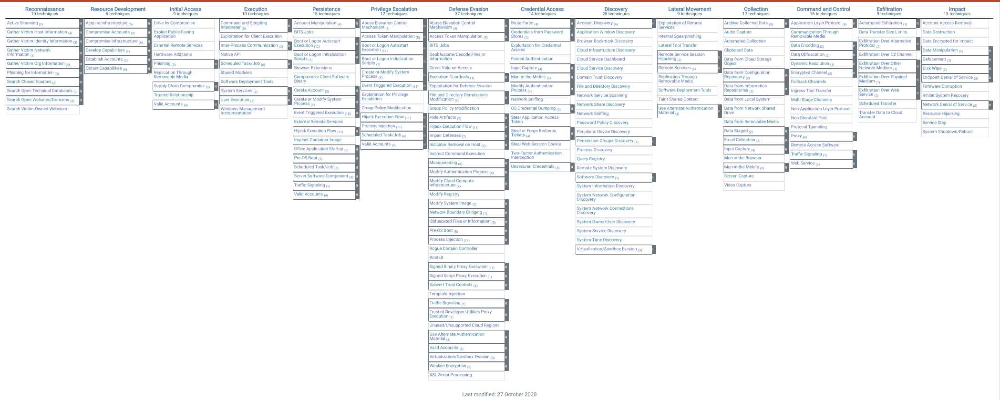
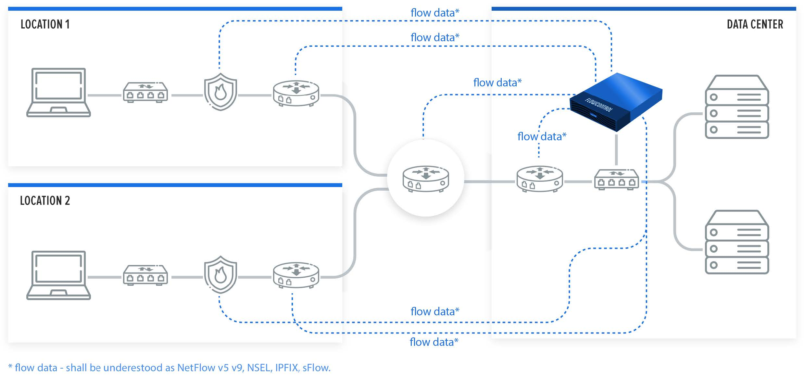

FlowControl XNS detects and analyses security threats and anomalies in a context of the entire organization based on network metadata (NetFlow) and reputation lists. For effective detection of abnormal activities, XNS uses two engines: 

•       Threat Intelligence (TI) 

•       Threat Detection (TD). 

The former detects malicious or illegal activity based on correlations with reputation lists of malicious IP addresses and suspicious countries. However, Threat Detection detects security threats and anomalies based on the correlation and aggregation of relationships between the values of various parameters of network artifacts within a specified period of time.

 A set of rules built into the system makes it easier to monitor prohibited and malicious activities in an organization. 

Key features of XNS include:

•       Using the ATT&CK MITRE methodology to enrich information on alerts and categorization of security threats detected in XNS

•       Using built-in threat detection mechanisms to discover malicious activities in the context of the whole organization

•       Limiting the number of false positives due to the ability to whitelist specific properties in security rules

•       Integrating with external databases to check the reputation of the host, e.g. Virustotal

•       Improving the visibility of threats in the context of individual parts of the organization, which is an added value for each SOC & NOC teams

•       Correlating multiple network artifacts to detect suspicious activity and security breaches

•       Improving the MTTD* indicator due to properly designed views, e.g. SOC Dashboard

•       Enrichment of data with valuable information facilitating threat analysis, e.g. ASN, geolocation, IoC

•       Helping CSO and Security Managers make decisions through KPI views

•       Supporting many security processes, such as for example incident handling, network forensics, threat hunting

•       Supporting process of meeting compliance with regulations and standards, e.g. [UoKSC (Ustawa o Krajowym Systemie Cyberbezpieczeństwa)](http://prawo.sejm.gov.pl/isap.nsf/download.xsp/WDU20180001560/T/D20181560L.pdf), 

•       Improving network and security troubleshooting process

•       Detecting correlations between systems thanks to integration with SIEMs

•       Updating security rules and IoC regularly.

 *MTTD (Mean Time To Detect) - amount of time it takes the Security Team to discover a potential security incident. 

FlowControl XNS generates security alerts which are categorized by tactics and techniques of the MITRE ATT&CK methodology. Below is a brief description of this methodology.

MITRE ATT&CK™ is a globally-accessible knowledge base of adversary tactics and techniques based on real-world observations. The ATT&CK knowledge base is used as a foundation for the development of specific threat models and methodologies in the private sector, in government, and in the cybersecurity product and service community. Full MITRE ATT&CK Matrice is available on the [MITRE ATT&CK Matrices]( https:/attack.mitre.org/ ) website. The MITRE ATT&CK Enterprise Matrice contains many techniques grouped into tactics (*Fig. I.1*).

*Fig.. I.1 MITRE ATT&CK Tactics. Source: [MITRE ATT&CK.]( https:/attack.mitre.org/ )*

 

Examples of security threats and anomalies detected by FlowControl XNS and categorized by MITRE ATT&CK are described in the *Tab I.1.*

| MITRE ATT&CK Tactic          | **Security Threats Examples**                                |
| ---------------------------- | ------------------------------------------------------------ |
| **Initial Access**           | Detection of unauthorized P2P network activities.            |
| **Credential Access**        | Detection of brute force attacks on various  services, e.g. HTTP(s), FTP, IMAP, SSH, RDP, LDAPS, MS SQL Detection of  unauthorized LLMNR / NetBIOS communications. |
| **Discovery**                | Detection of unauthorized access to certain services, e.g. DHCP, DNS, Mail Server Network scan detection, Host scan detection, Detecting malware spread, Detection of network anomalies that may be related to security. |
| **Lateral Movement**         | Detection of unauthorized RDP connections.                   |
| **Command And Control (C2)** | Detection of activity on suspicious ports  (based on Black and White-lists), Detection of unencrypted connections to critical servers or services, Detection of communication with suspicious IP addresses, e.g. Botnet, Malware, C2, Ransomware Detection of violations of security policies, e.g. TOR, Open DNS, Open Proxy. |
| **Exfiltration**             | Detection of DNS anomalies, e.g. Abnormal DNS Query Limit, Abnormal DNS Response Limit, DNS Transfer Limit Detecting a large number of unsolicited emails (SPAM), Detection of data exfiltration attempts, Detection of huge amounts of data transfers within a short period of time to / from an organization, Detection of anomalies in network protocols. |
| **Impact**                   | Detection of DoS attacks, e.g. ICMP Flood, TCP Flood, UDP Flood Detection of DDoS amplification attacks, e.g. DNS  Amplification |

*Tab. I.1 Examples of security threats and anomalies detected by FlowControl XNS and categorized by MITRE ATT&CK.*

FlowControl XNS analyses network flows to detect suspicious activity.

A flow is defined as a unidirectional sequence of packets with some common properties that pass through a network device. These collected flows are exported to an external device, the NetFlow collector. Network flows are highly granular; for example, flow records include details such as IP addresses, packet and byte counts, timestamps, Type of Service (ToS), application ports, input and output interfaces, etc.

Source: [RFC3954](https://www.ietf.org/rfc/rfc3954.txt)

The system supports the following flow protocol data sources: 

•       NetFlow v5

•       NetFlow v9

•       sFlow

•       IPFIX

•       NSEL.

**Note:** Specific options such as NSEL (Cisco ASA) or different sampling multipliers per device must be additionally configured. This system uses SNMP v1/2/3 to query devices. 

 

According to the RFC3964, FlowControl solution works as a Flow Collector (both hardware and software versions are available) which collects, analyses and visualizes the collected flows. Metrics are presented and examined from two perspectives: Network and Security giving the operator valuable input into network/application problems analysis as well as hunting security threats (*Fig. I.2*). 

*Fig. I.2 Netflow Collector – logical architecture.*

