FlowControl XNS contains four menus (*Fig. 1.1)* of views for effective analysis of detected security threats: 
•       SOC
•       KPIs
•       Use Cases
•       Alerts. 

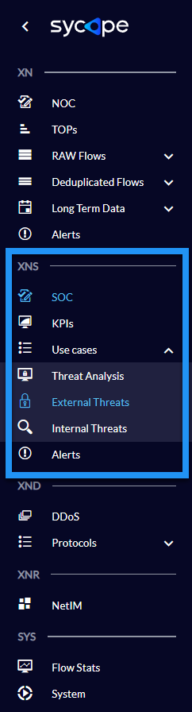

*Fig. 1.1 XNS menus*. 

Each of them has a set of dedicated tabs and dashboards that are appropriately used to monitor the security of the organization.

 *Tab. 1.1*. contains a summary description of each menu.

| View Name | Description                                                  |
| --------- | ------------------------------------------------------------ |
| SOC       | A set of dashboards presenting security threats in the context of Tactic, IP, Group, Direction, Application, Country and Technique for the last hour. These charts are great for security departments like SOC who deal with 24/7 security monitoring. |
| KPIs      | A set of KPIs to help security managers monitor security risk trends, risk analysis, and make key decisions. |
| Use Cases | A set of dashboards enabling a very detailed investigating of security threats. In order to precisely analyse specific threats, these dashboards have been divided into three Use Cases: Threat Analysis, External Threats and Internal Threats. |
| Alerts    | A set of dashboards containing a list of security alerts and a series of data enriching them through correlation with  ATT&CK MITRE knowledge base. |

*Tab. 1.1 Summary description of the XNS module menu*.

In the following sections, individual dashboards are discussed in more detail.

## SOC

The SOC dashboards are great for security departments like SOC who deal with 24/7 security monitoring. *Tab. 1.1.1* contains a summary description of each SOC tabs.

| Dashboard Name | Description                                                  |
| -------------- | ------------------------------------------------------------ |
| Overview       | A basic view for SOC analysts containing information about the last hour's threats in the context of Tactic, Group,  IP, Attack Directions and Applications. |
| TOP IPs        | Charts showing most common attributes, such as Source and Destination Hosts or Source-Destination IP Pairs, which are found in security alerts. |
| TOPs           | Charts containing statistics on network artifacts related to detected threats, such as the number of alerts in the  context of Source-Destination Group pairs, the number of individual security alerts and the number of alerts together with the number of unique Source Hostnames for each attack Technique. |

*Tab. 1.1.1 Summary description of the SOC tabs*.

*Fig. 1.1.1-1.1.3* shows the individual dashboards of the SOC menu.

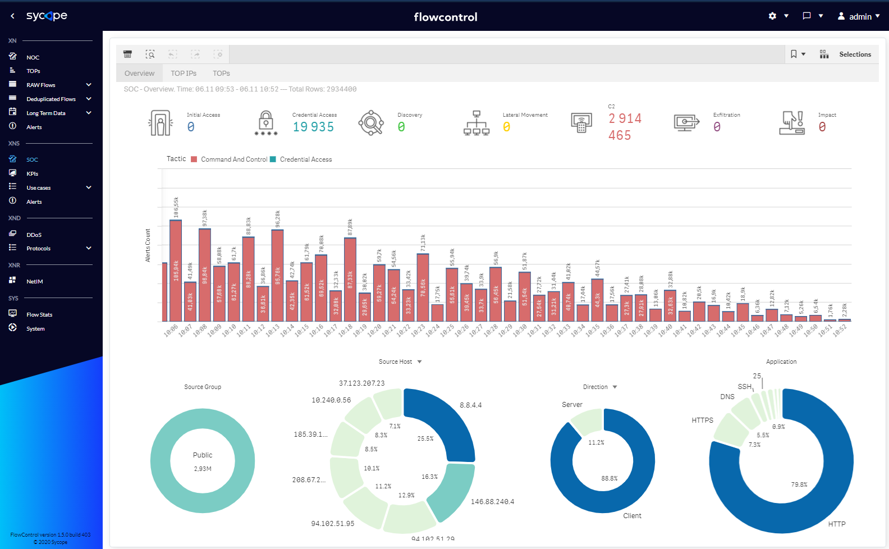

*Fig. 1.1.1 SOC menu Overview dashboard.*

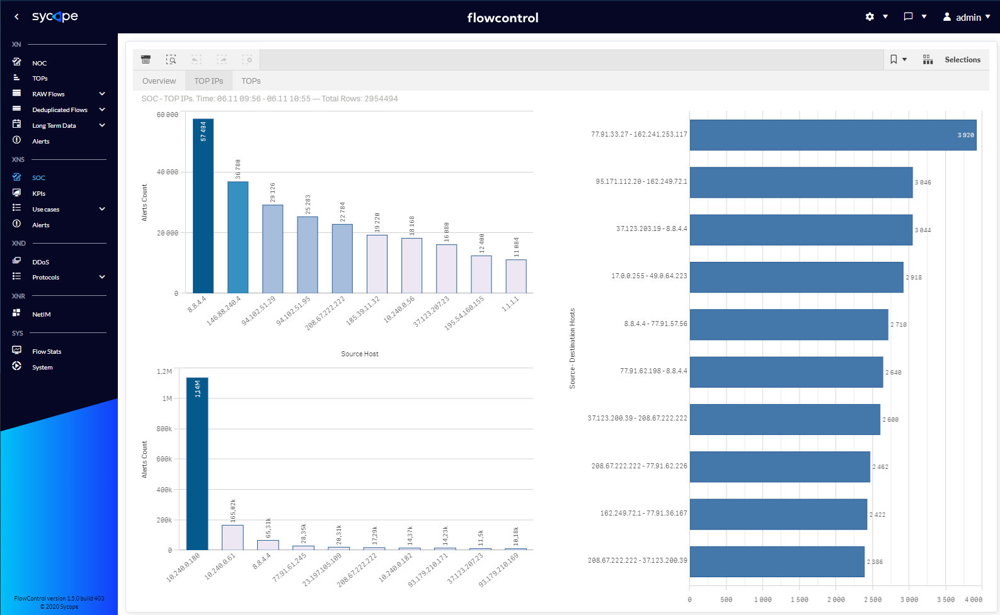

*Fig. 1.1.2 SOC menu TOP IPs dashboard.*

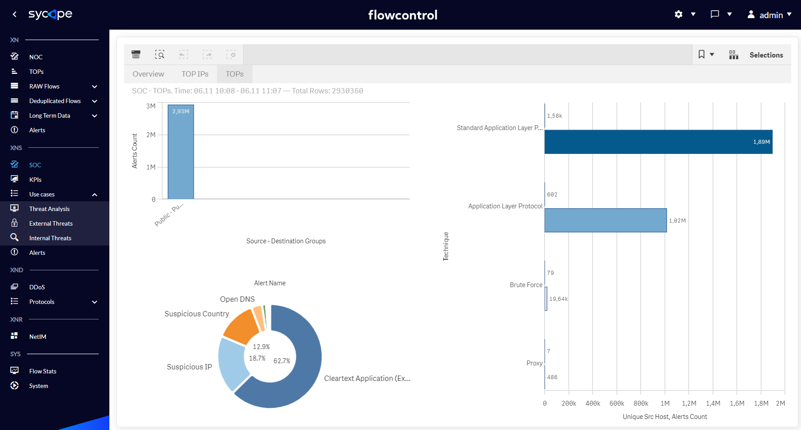

*Fig. 1.1.3 SOC menu TOPs dashboard.*

## KPIs

The KPIs dashboards facilitate the process of monitoring security risk trends based on the threats detected in the XNS module. These indicators are presented on a weekly basis, comparing specific attributes to specific days of the week. Tracking risk trends makes it easier to make decisions regarding remedial actions, which is an added value for security managers. 

The indicators have been grouped into four categories: Severity, Host, Tactic and Module. *Tab. 1.2.1* contains descriptions of each individual indicators.

| Dashboard Name   | Description                                                  |
| ---------------- | ------------------------------------------------------------ |
| Risk by Severity | KPIs for detecting security threat trends in the context of their criticality. |
| Risk by Host     | KPIs for detecting threat trends in the context of the number of affected hosts. |
| Risk by Tactic   | KPIs for detecting threat trends in the context of Tactics, Techniques and Alert Names. |
| Risk by Module   | KPIs for detecting threat trends in the context of both security engines: Threat Detection and Threat Intelligence. |

*Tab. 1.2.1 XNS KPIs individual indicators descriptions*.

*Fig. 1.2.1-1.2.6* shows the individual dashboards of the KPIs menu.

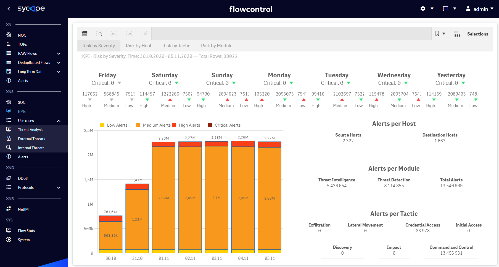

*Fig. 1.2.1 KPIs menu Risk by Severity dashboard.*

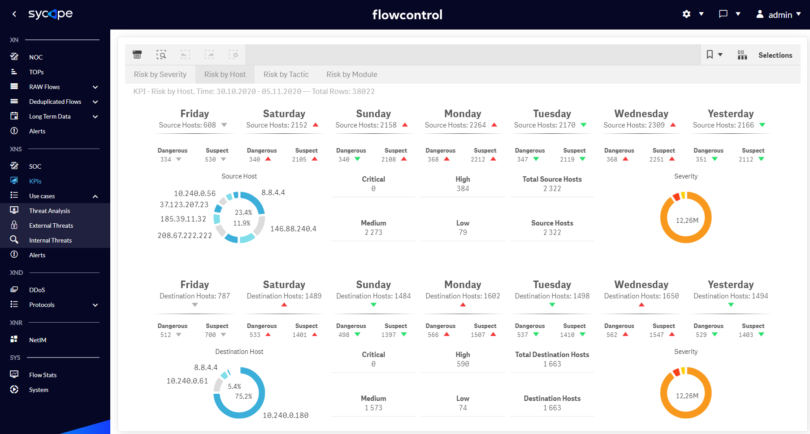

*Fig. 1.2.2 KPIs menu Risk by Host dashboard.*

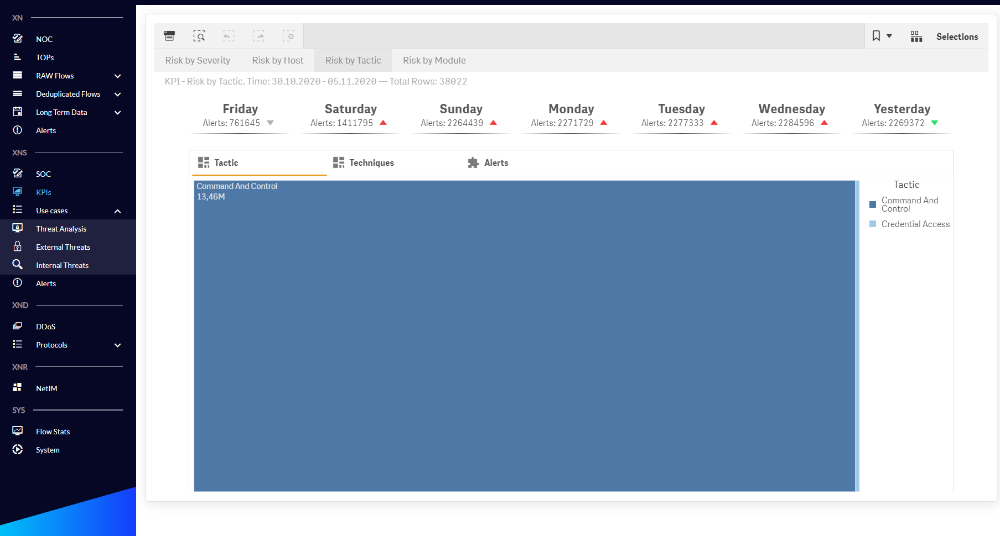

*Fig. 1.2.3  - KPIs menu Risk by Tactic / Tactic dashboard.* 

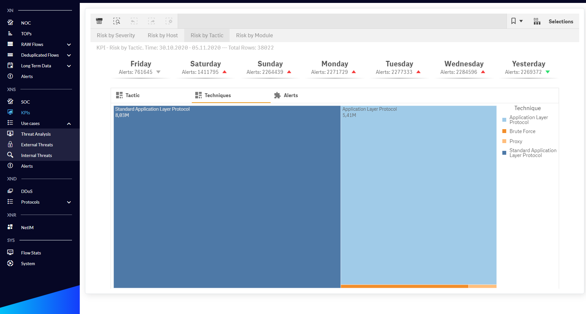

*Fig. 1.2.4 KPIs menu Risk by Tactic/Technique dashboard.*

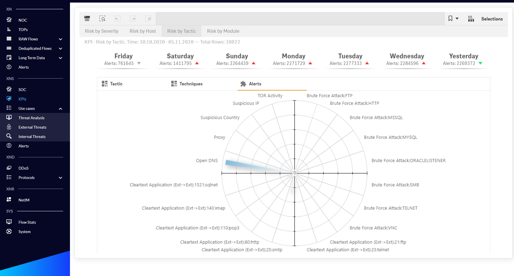

*Fig. 1.2.5 KPIs menu Risk by Tactic/Alerts dashboard.* 

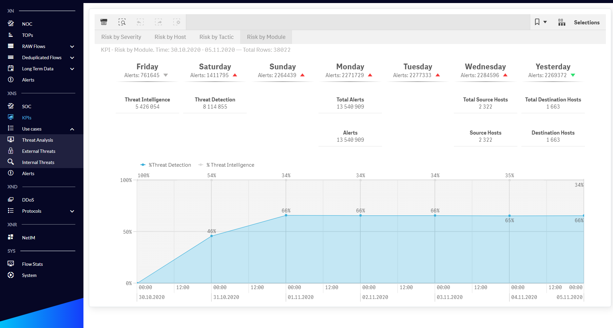

*Fig. 1.2.6 KPIs menu Risk by Module dashboard.*

## Use Cases

The scenarios implemented in the XNS module facilitate the process of analysis and drawing conclusions regarding the most important aspects related to the security of the monitored organization. The Use Cases menu is divided into the following three submenus: Threat Analysis, External Threats, Internal Threats which are described in the *Tab 1.3.1*. 

| Use Case         | Description                                                  |
| ---------------- | ------------------------------------------------------------ |
| Threat Analysis  | The threat analysis scenario allows you to identify the most suspicious IP addresses and then examine correlations with other addresses and network artifacts to conduct a deep analysis. |
| External Threats | The external threats scenario is used to analyse external attacks enabling multi-dimensional analysis of one or a group of suspicious IP addresses or countries, as well as other network artifacts. |
| Internal Threats | The internal threats scenario is used to analyse internal attacks enabling multi-dimensional analysis of one or a group of suspicious IP addresses, as well as other network artifacts. |

*Tab. 1.3.1 Use Cases submenu individual descriptions*.

### Threat Analysis

The Threat Analysis dashboards allow multi-level analysis of all security threats, regardless of whether they come from outside or inside the organization. They are described in the *Tab. 1.3.1.1*.

| Dashboard Name        | Description                                                  |
| --------------------- | ------------------------------------------------------------ |
| Alerts Drilldown      | An interactive dashboard containing a drilldown table with expandable attributes for criticality and IP addresses,  and a graph of connections between individual IP addresses. Security threats can be searched and analysed based on many attributes, such as Severity, Source Host, Destination Host, Security Module, Tactic, Technique, Alert Name, Threat Category, Application, Direction, Source Group, Destination Group, Source Country, Destination Country or Feed ID. Presenting threats in the context of these attributes facilitates an effective review of organizational security risks. |
| TOP Suspicious IPs    | Charts presenting the most suspicious hosts in an organization in the context of attackers and victims of attacks. The suspicion index is calculated based on a vendor internal algorithm. In addition, this dashboard contains the association of suspicious IP addresses with Alert Names. |
| IPs Correlation       | Graphic visualization of connections between Source and Destination Hosts, also in other attribute contexts, such as Alert Name or Application. |
| Groups Correlation    | Graphic visualization of connections between Source and Destination Groups, also in other attribute contexts, such  as Alert Name or Threat Category. |
| Countries Correlation | Graphic visualization of connections between Source and Destination Countries, also in other attribute contexts, such as Groups (Source and Destination) or Threat Categories. |
| BOTTOMs               | A set of views presenting information about threats in the context of the most rare parameters, e.g. Source-Destination pair of Groups, Source-Destination pair of Hosts, Applications and Alert Names. |
| Alerts Statistics     | A scatter plot of the relationship between the number of Alert Names and Destination Hosts. |

*Tab. 1.3.1.1 Threat Analysis submenu dashboard description.*

*Fig. 1.3.1.1 -1.3.1.7* Shows individual dashboards from Threat Analysis submenu.

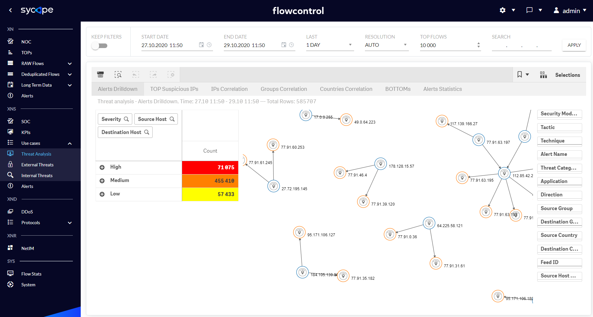

*Fig. 1.3.1.1 Threat Analysis - Alerts Drilldown dashboard.* 

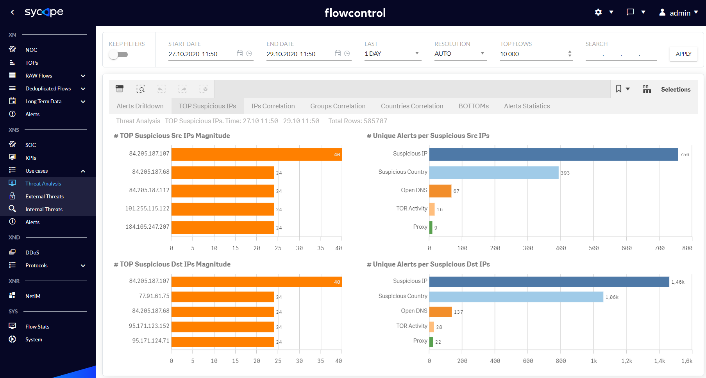

*Fig. 1.3.1.2  Threat Analysis - TOP Suspicious IPs dashboard.*

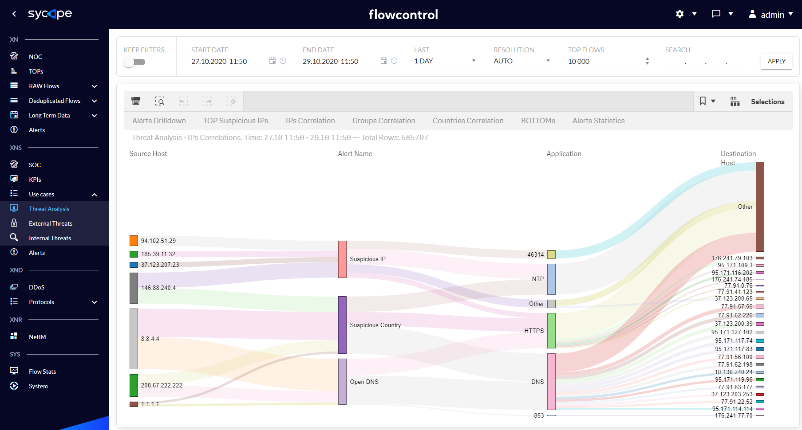

*Fig. 1.3.1.3 Threat Analysis - IPs Correlation dashboard.*

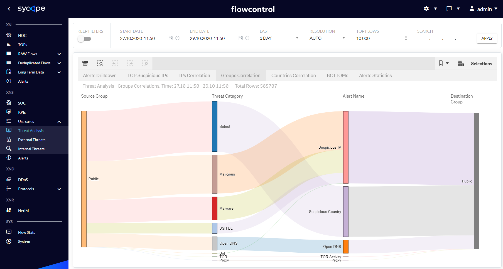

*Fig. 1.3.1.4 Threat Analysis - Groups Correlation dashboard.*

 

*Fig. 1.3.1.5 Threat Analysis - Countries Correlation dashboard*

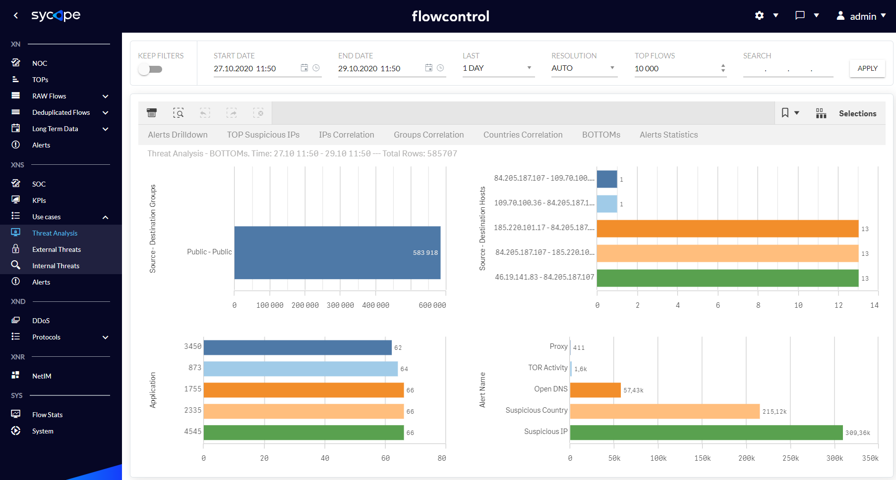

*Fig. 1.3.1.6 Threat Analysis - BOTTOMs dashboard.*

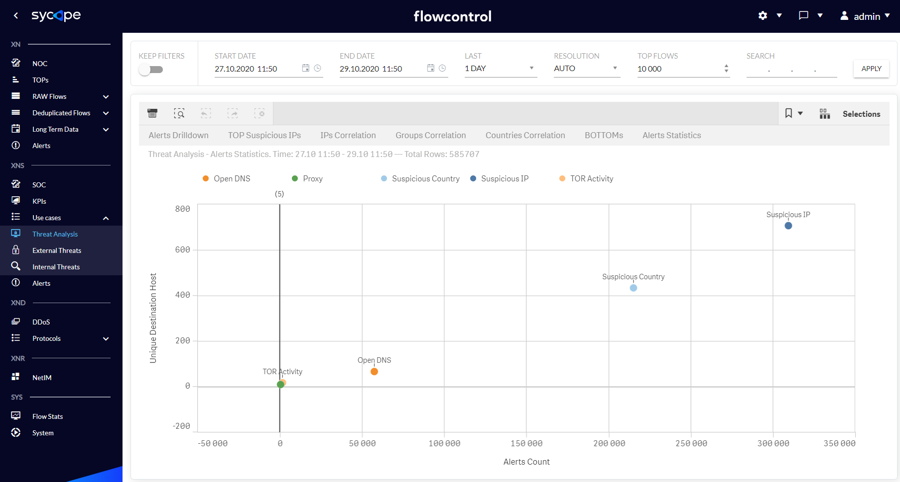

*Fig. 1.3.1.7 Threat Analysis - Alerts Statistics dashboard*.

### External Alerts

External Threats dashboards focus on presenting artifacts related to security threats from outside the organization. *Tab. 1.3.2.1* contains descriptions of individual dashboards. 

| Dashboard Name   | Description                                                  |
| ---------------- | ------------------------------------------------------------ |
| Alerts Drilldown | An interactive view containing a drilldown table with expandable attributes for criticality and IP addresses, and a  graph of connections between individual IP addresses. Security threats can be  searched and analysed based on many attributes, such as Severity, Source Host, Destination Host, Tactic, Technique, Alert Name, Direction,  Application, Source Country, Destination Country, Source Group and  Destination Group. |
| Alerts Data Size | A world map showing the amount of data sent in the context of individual Countries when security alerts are triggered. |
| Alerts Map       | A world map showing the number of individual Techniques in the context of the Country associated with the source of a specific Technique. |

*Tab. 1.3.2.1 Use Cases - External Threats*

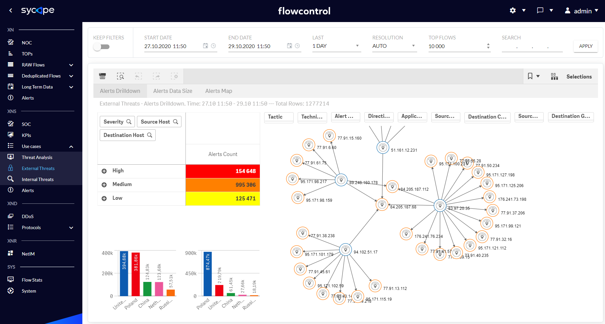

*Fig. 1.3.2.1 External Threats - Alerts Drilldown dashboard.*

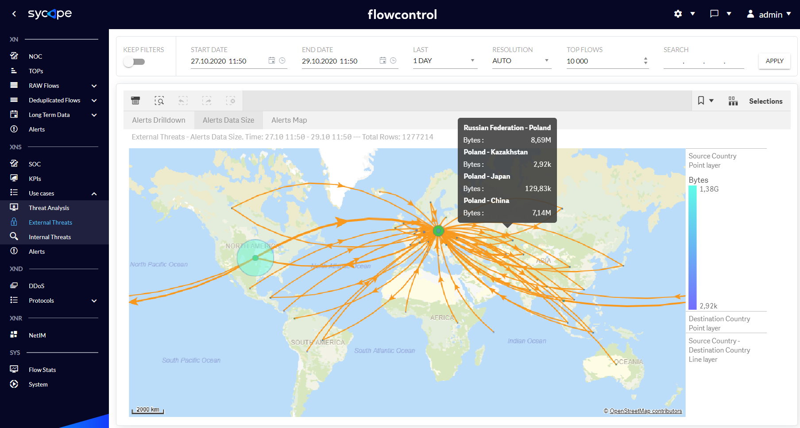

*Fig. 1.3.2.2 External Threats Alerts Data Size dashboard.*

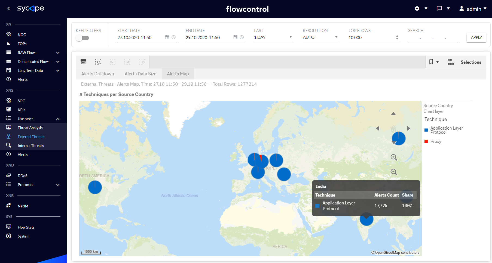

*Fig. 1.3.2.3 External Threats Alerts Map dashboard.*

### Internal Threats

Internal Threats dashboards focus on presenting artifacts related to security threats from within the organization. *Tab. 1.3.3.1* contains descriptions of Internal Threats submenu Alerts Drilldown dashboard.

| Dashboard Name   | Description                                                  |
| ---------------- | ------------------------------------------------------------ |
| Alerts Drilldown | An interactive view containing a drilldown table with expandable attributes for criticality and IP addresses, and a graph of connections between individual IP addresses. Security threats can be searched and analysed based on many attributes, such as Severity, Source Host, Destination Host, Tactic, Technique, Alert Name, Application, Direction, Source Group, Destination Group or Destination Country. |

*Tab. 1.3.3.1 Internal Threats - Alerts Drilldown dashboard description*.

In the *Fig. 1.3.3.1* you can see Alerts Drilldown dashboard.

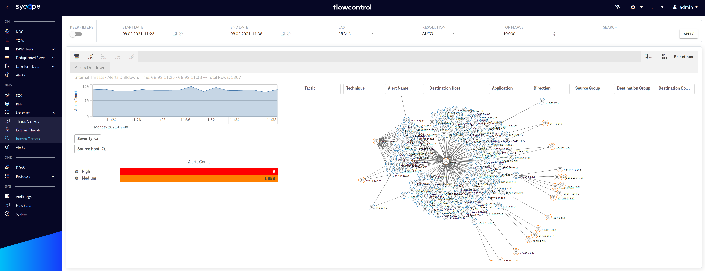

*Fig. 1.3.3.1 Internal Threats - Alerts Drilldown dashboard.*

## Alerts

The alert menu contains a list of detected alarms along with their occurrence times and other attributes. There are two dashboards: Overview and Mitre KB that are described in the *Tab. 1.4.1* and shown in *Fig. 1.4.1-1.4.2.* 

| Dashboard Name | Description                                                  |
| -------------- | ------------------------------------------------------------ |
| Overview       | A table of threats and security anomalies detected by the XNS module containing the attributes necessary for their analysis. |
| MITRE KB       | A dashboard showing the integration of the MITRE ATT&CK knowledge base with XNS alerts, which enriches them with additional information about a specific threat. |

*Tab. 1.4.1 Alerts menu dashboards description*.

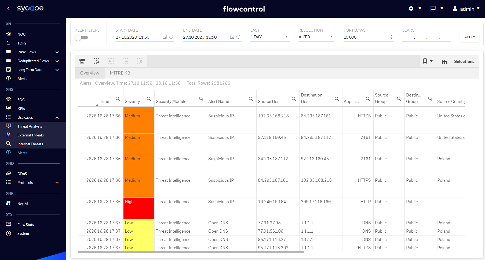

*Fig. 1.4.1 Alerts Overview dashboards.*

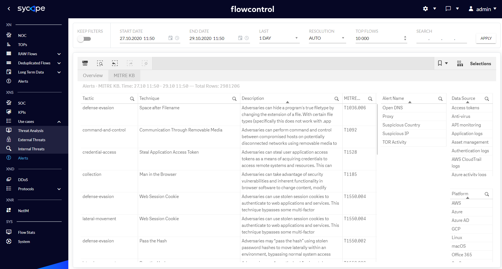

*Fig. 1.4.2 Alerts MITRE KB dashboard.*

If you need a full description of a given technique, use the redirect function to the appropriate page using the right mouse click on the **Id** attribute on the Alerts/MITRE KB dashboard (*Fig. 1.4.3*).

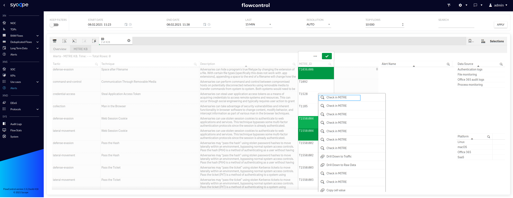

*Fig. 1.4.3 MITRE KB - Right click function*.