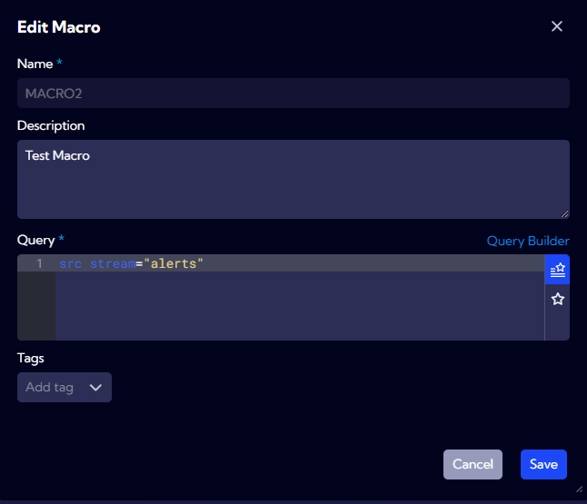

# Macros

The [**Dashboards->Favorites->Macros**] menu can be used to configure custom NQL language macros in the form of various variables.

A Macro is used to substitute a string of characters into an NQL expression using a variable.

:::info

Note that it does not add any additional set of logic, but only inserts the stored part of the expression in place of the variable. You have to make sure that the NQL syntax after inserting the macro is correct by maintaining proper spacing, punctuation marks and control expressions.

:::

Syntax:

`$MACRO_NAME$`

In order to use a macro, remember to precede and end its name with a `$` sign.


## Example1:

Having an NQL with a macro called MACRO1 to which the value **MACRO1=sometext** is assigned,

`src stream="alerts" | set fullName=concat("alertName", "$MACRO1$", "alertSeverity") | limit 1000`

during its execution, the character string "MACRO1" will be substituted with the MACRO1 value, so the produced NQL will read as follows:

```src stream="alerts" | set fullName=concat("alertName", "sometext", "alertSeverity") | limit 1000```

## Example 2:

Macro: MACRO2 = **src stream="alerts"**

NQL: `$MACRO2$ | where serverBytes>100 | sort serverBytes | limit 1000`

Result: `src stream="alerts" | where serverBytes>100 | sort serverBytes | limit 1000`

## Example 3:

Macro: 

MACRO31 = **aggr clientIpCount = count(clientIpCount)**

MACRO32 = **aggr maxTimeStamp = max(timestamp)**

NQL: `src stream="netflow" | fork ($MACRO31$), ($MACRO32$)`

Result: `src stream="netflow" | fork (aggr clientIpCount = count(clientIpCount)), (aggr maxTimeStamp = max(timestamp))`

## Macro definition in the Sycope

In order to define a new macro or edit an existing one, you must select the "Macros" tab in the [**Dashboards->Favorities**].


The `New Macro` button is used for adding a new macro.



Parameters:

- **Name** - Name of the macro
- **Description** - Description of the macro
- **Query** - Text of the macro
- **Tags** - Tags assigned to the macro object.

You can use a macro added in this manner, for example, in the **Playground**, in the Query field: `$MACRO2$ | sort id | limit 1000`


