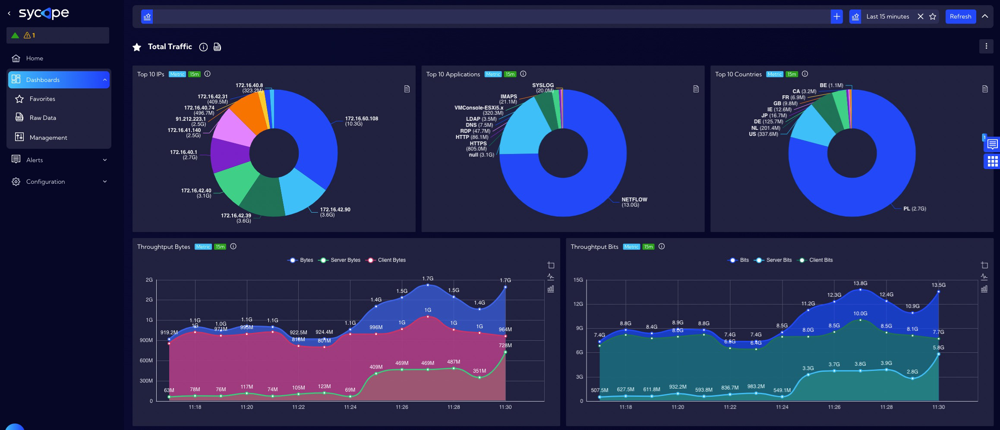
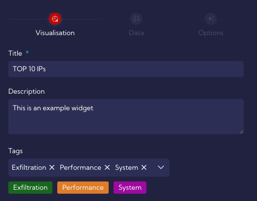

# Widgets

One of the most important elements of the system are Widgets. Widgets are designed to display information of a certain kind and source, which can be a summary, a value calculated from multiple data, a graph or a function, etc.

**Sycope** includes a lot of different types of widgets, designed to fulfill different data display needs. You can add, remove, and customize widgets to personalize your dashboard, displaying just the data you need. Widgets are used to create dashboards, which are views that contain multiple widgets.

---

## Adding custom widgets {#widgets-add}

Widgets are created and edited in this menu [Dashboard>Management>**Widgets**]. To add a widget, click on the **Add Widget** button, then the widget wizard will appear. The procedure for creating a widget consists of three or four steps depending on the visualization type selected in the first step.

The system includes the following types of visualization:

1. [Line](#Line)
2. [Scatter](#Scatter)
3. [Bar](#Bar)
4. [Gauge](#Gauge)
5. [Pie](#Pie)
6. [Graph](#Graph)
7. [Map](#Map)
8. [Sankey](#Sankey)
9. [Sunburst](#Sunburst)
10. [Tree](#Tree)
11. [Tree map](#Tree-map)
12. [KPI](#KPI)
13. [Table](#Table)
14. [Text Image](#Text)
15. [Filters](#Filters)
16. [Radar](#Radar)
17. [Threat Trajectory](#Threat)

##  Line Visualization

###  Visualization step

This step is the same for all visualization types. In this step you need to fill in two fields:

**Title** - unique widget name - required field

**Description** - short description of the widget (not required)

**Tags** - tags assigned to the **Widget**. You can add and remove them here

Then select **Type of Visualization**.

Depending on the selected visualization, the next step will differ.

Then you have to choose Type of Visualization.

---

### Data step

In this step, regardless of the previously selected **Type of Visualization**, there are two ways to configure it:  **Simple** wizard and **Advanced** wizard.

---

**SIMPLE OPTION WIZARD**

#### *Stream*

**Source** - you have to select a data stream from the list. You can display system data streams with all columns in [**Dashboard>Raw Data **] menu.

For ease of use, the streams are grouped into four categories:

- Alerts,

- Netflow,

- Collectors,

- Other.

  

---

#### *Time*

Here you can specify the time interval for which data should be analyzed - - by default **Last 15 minutes.**

---

#### *Values*

These are the values that will be displayed on a graph.

**Field** - You can choose **Fields** or **Metrics**.

You can add more fields by pressing the plus key.

- **Display name - ** Here you can enter your own name for the **Field** to be displayed on the chart. 

---

#### *Categories*

In this section you configure the category against which the Values will be displayed.

- Aggregation
  - Date Histogram
  - Ranges
  - Terms
  
- Use Function switch
  - Function - allows you to add your own function 
  
- Field - field relative to Value that will be visualized

  

---

### Option step

In this step, the graph parameters are defined.

#### *Limit*

- Hide if too many records - resolution limit (points on the chart), after exceeding the message set in the Message field (*Message if too many records* )  will be displayed. 
  - Limit - limit value
  - Message if too many records - message when the *Limit* value is exceeded

---

#### *Axes*

Tab for configuring graph axes, where the *Value axes* area corresponds to the y-axis and *Category axes* to the x-axis

- Switch axis switch - enable/disable axis Label

- Value axis (y-axis)

  - Show axis labels - enable/disable axis Label
    - Axis labels position - y-axis labels position
      - Left
      - Right
    - Label angle (-90deg to 90deg) - the angle by which the label will be rotated
    - Number formatting - how the numbers on the chart will be formatted *Date/Number/Off*
      - Date
      - Number
      - Off
  
- Custom axis name switch - enable/disable custom axis name

  - Custom name
  - Label Location - location of the label in relation to the axis
    - End
    - Center
    - Start
  - Name gap from chart - name pitch from the end of the axis
  - Name rotate deg - name rotation angle

- Log scale switch - enable/disable log scale

- Inverse switch - horizontal graph rotation

- Show data points switch  

  - Show value labels switch - shows values for data points

  - Value label position - label position (list)

  - Label angle (-90deg to 90deg) - label rotation angle

- Draw area switch - fill the area below the graph line with color

- Category axis (x-axis)

  - Show axis labels switch - enable/disable x-axis Label
  - Axis label position
    - Bottom
    - Top
  - Label angle (-90deg to 90deg) - the angle by which the label will be rotated
  - Number Formatting - how the numbers on the chart will be formatted *Date/Number/Off*
    - Date
    - Number
    - Off
  
- Show all labels

- Custom axis name  switch - enable/disable custom axis name

  - Custom name
  - Label location - location of the label in relation to the axis
    - Center
    - Left
    - Right
  - Name gap from chart -  name pitch from the end of the axis
  - Name rotate deg -  name rotation angle

---

#### *Others*

- NULL handling
  - Set zero
  - Connect
  - Show gap
- Show legend switch
  - Select legend position
    - Bottom
    - Left
    - Right
    - Top
- Data zoom switch
- Enable animation

---

#### Privacy

**Privacy** - assigning privileges to the **Widget**.

- **Private** - accessible to the owner

- **Public** - accessible to all but You can grand permission:
  - **DELETE**
  - **EDIT**
- **Shared** - accessible to one or more selected User roles. Available privileges are:
  - **Delete**
  - **Edit**
  - **View**

## Baseline (Dynamic Thresholds)

The user in the system can set static thresholds on **Widgets**. They allow the user to set static values in the form of markers or lines such as maximum, minimum or average values. **Baseline** functionality, on the other hand, allows the user to compare the same metric/field at different time offsets on a single **Widget** in order to perform comparative analysis in different time windows.

:::tip 

Thresholds for Widgets are configured in the **Data step** of the **Widget Creator**, and they are located in the <u>Advanced option/Value</u> so be sure to enable them. 

:::

### Reference point threshold

The first type of dynamic threshold is the Reference point. It works by showing a single value of a calculated metric for a period of time offset from the base metric as a horizontal line.

From the reference point default, it calculates the value of the metric for the given period specified in the **Time range** field. We can shift the **Time range** by a specified amount of time using the **Time shift** field - .

#### Custom threshold metric - OFF

Available by clicking .

- **Time range** - time interval for which the threshold will be calculated

- **Time shift** -  offset relative to **Time range** - available by clicking 

- **Single point** - a single threshold value is determined
   - **Line function** - measure used to determine the threshold value
     - Avg
     - Max
     - Min
     - Prc
     - Sum
   
   - **Deviation(%)** - percentage deviation for the calculated value
   
- **Range area** - two values are determined - a "tunnel" is created between them on the graph

   - **Area ceiling function** - measure used to determine the ceil threshold value
     - Avg
     - Max
     - Min
     - Prc
     - Sum

   - **Top deviation(%)** - percentage deviation for the ceil calculated value

   - **Bottom deviation function** - measure used to determine the floor threshold value

   - **Bottom deviation(%)** - percentage deviation for the ceil calculated value

---

**Number formatting - section**

- **Format type**
- Auto
  
- Currency
  
- Date
  
- Number
  
- Traffic

---

**Data - section**

- **Show data points** switch

- **Series line type** 
  - Solid
  
  - Dashed
  
  - Dotted
  
- **Line width**

- **Color**

---

**Markers - section**

- **MAX marker** switch
- **MIN marker** switch

---

**Line - section**

- **MAX line** switch
- **MIN line** switch
- **AVG line** switch

---

#### Custom threshold metric - ON

Available by clicking .

 - **Source** - here select the data source from which the metric is to be calculated

---

**Metric section**

- **Field** - here select **Field** or **Metric** for previously selected **Source**
  -   **Aggregation** - list of mathematical operations to choose:
      - Avg - returns average of field values.
      
      - Count - returns count of non empty fields.
      
      - First - returns value of first field returned.
      
      -  Join - returns concatenated value of fields values.
      
      -  Last - returns value of last field returned.
      
      -  Max - returns maximal value.
      
      - Min - returns minimal value.
      
      - Percentile - returns value below a X percentage of data falls.
      
      - Sum - returns sum of values.
      
      - Unique Count - returns countn of unique non empty fields
      
  
- **Display name** - name of the Field/Metric that will be shown on the chart, it can be changed with the **Use Custom** switch
- **Time range** - time interval for which the threshold will be calculated
- **Filtered by**
  - **Field** -  here select **Field** or **Metric** for previously selected **Source**
  - **Operator** - here choose a mathematical operator for example =, != , > ....
  - **Value** - here enter the value 
  - **Query Builder** - using this option, you can create your own advanced filter using the **Query Builder** wizard

---

### Reference line threshold

It works on the principle of time shifting, i.e. presenting is both a series of metrics/base field and a series of reference metrics on the same (selected in the widget configuration) time interval. Only the values for the reference metric are shifted by a certain period of time in the past.

#### Custom threshold metric - OFF 

Available by clicking .

- **Recurrent interval** ON/OFF [available by clicking ]
  - **Recurrent type**
    - **Daily**
    - **Weekly**
  - **Time range** - time interval for which the threshold will be calculated

- **Time shift** - offset relative to Time range - available by clicking 
- **Leading time** - here we can specify how many additional data point **Reference metrics** will be additionally visible to show the average value even though the values of the baseline metric at these time points do not yet exist - available by clicking 

- **Single point** - a single threshold value is determined
   - **Line Margin(%)** - percentage deviation for the calculated value

- **Range area** - two values are determined - a "tunnel" is created between them on the graph
- **Top deviation(%)** - percentage deviation for the ceil calculated value
  
- **Bottom deviation(%)** - percentage deviation for the ceil calculated value

---

**Number formatting - section**

- **Format type**

   - Auto

   - Currency

   - Date

   - Number

   - Traffic

---

**Data - section**

- **Show data points** switch

- **Series line type** 

   - Solid

   - Dashed

   - Dotted

- **Line width**

- **Color**

---

**Markers - section**

 - **MAX marker** switch
   - Optional label
   - Color
 - **MIN marker** switch
   - Optional label
   - Color

---

**Line - section**

 - **MAX line** switch
   - Optional label
   - Color
 - **MIN line** switch
   - Optional label
   - Color
 - **AVG line** switch
   - Optional label
   - Color

---

#### Custom threshold metric - ON

 Available by clicking .

 - **Source** - here select the data source from which the metric is to be calculated

---

**Metric section**

 - **Field** - here select **Field** or **Metric** for previously selected **Source**

  -   **Aggregation** - list of mathematical operations to choose:
      - Avg - returns average of field values.
      
      - Count - returns count of non empty fields.
      
      - First - returns value of first field returned.
      
      - Join - returns concatenated value of fields values
      
      - Last - returns value of last field returned.
      
      - Max - returns maximal value.
      
      - Min - returns minimal value.
      
      - Percentile - returns value below a X percentage of data falls.
      
      - Sum - returns sum of values.
      
      - Unique Count - returns countn of unique non empty fields
      
- **Display name** - name of the Field/Metric that will be shown on the chart, it can be changed with the **Use Custom** switch
- **Filtered by**
  - **Field** -  here, select **Field** or **Metric** for the previously selected **Source**
  - **Operator** - here, choose a mathematical operator, for example =, != , > ....
  - **Value** - here, enter the value 
  - **Query Builder** - using this option, you can create your own advanced filter using the **Query Builder** wizard

## Build-in Widgets

### Line **{#Line}**

### Scatter {#Scatter}

[Back to the widgets list](#widgets-add)

### Bar {#Bar}

[Back to the widgets list](#widgets-add)

### Gauge {#Gauge}

[Back to the widgets list](#widgets-add)

### Pie {#Pie}

[Back to the widgets list](#widgets-add)

### Graph {#Graph}

[Back to the widgets list](#widgets-add)

### Map {#Map}

[Back to the widgets list](#widgets-add)

### Sankey {#Sankey}

[Back to the widgets list](#widgets-add)

### Sunburst {#Sunburst}

[Back to the widgets list](#widgets-add)

### Tree {#Tree}

[Back to the widgets list](#widgets-add)

### Tree Map {#Tree-map}

[Back to the widgets list](#widgets-add)

### KPI {#KPI}

[Back to the widgets list](#widgets-add)

### Table {#Table}

[Back to the widgets list](#widgets-add)
### Text Image {#Text}
[Back to the widgets list](#widgets-add)
### Filters {#Filters}

[Back to the widgets list](#widgets-add)

### Radar {#Radar}

[Back to the widgets list](#widgets-add)

### Threat Trajectory {#Threat}

[Back to the widgets list](#widgets-add)

- [URL path to another document](./Dashboards)
- [file path to another document](./Dashboards.md)

http://onet.pl
