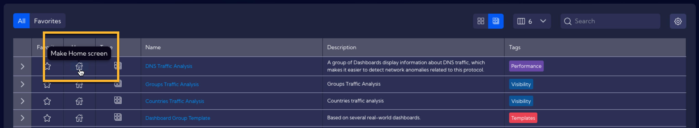
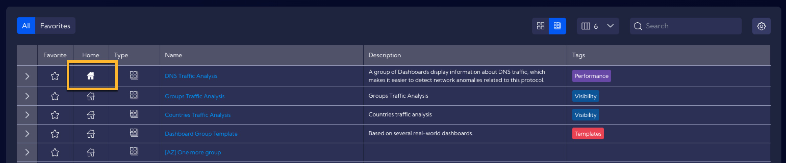

Here, you can place a **Dashboard** or **Dashboard Group** to be displayed on the home screen after logging into the System. To do this, go to the [**Dashboard**] menu and decide whether you want to use a **Dashboard** or a **Dashboard Group**.

 Select **Dashboard**/**Dashboard Group** from the table below and click the `Make home screen`  icon.

Then confirm your choice.

The white-filled `Make home screen ` icon indicates that the selected Dashboard/Group of Dashboards has been correctly added to the home screen.

