A **Dashboard** is a visual representation of data designed for quick analysis of the network traffic data and for informational awareness.

**Dashboards** consist of **Widgets** – objects with a graphical representation of specific data which can be added, edited, positioned, deleted or modified as you like. Sycope allows users to set up multiple **Dashboards**. 

**Dashboards** can be combined into **groups** depending on the user's needs while a single **Dashboard** can belong to multiple **groups**.

**Dashboards/Dashboard groups** are created and edited in the menu (**Dashboard>Management>Dashboard**).

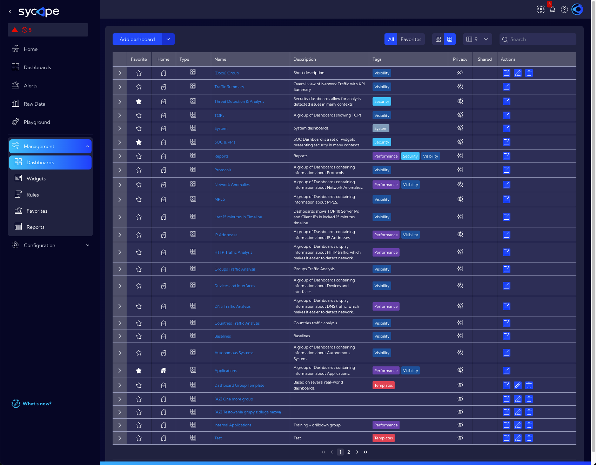

:::info

Use the `Dashboard` and `Dashboard groups` icons in the top menu to switch between table views (**Dashboard** view or **Dashboard groups** view).

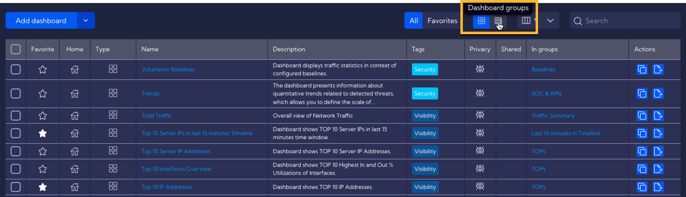

:::

When you enter this menu, you will see a table with default and/or previously created user **Dashboards**.

The table contains the following columns:

- **Select** - the checkbox button - used for selecting for further editing 
- **Favorite** - star icon - used for adding to favorites
- **Home** - home icon - used for adding to the home screen
- **Name** - unique Dashboard name
- **Tags** - assigned tags
- **Description** - short Dashboard description
- **Privacy** - privacy status icon
- **Shared** - the name of the user who shared the Dashboard
- **Created By** - the name of the user who created the Dashboard
- **Creation Time** - creation time
- **Modified By** - the name of the user who last modified the Dashboard
- **Modification Time** - last modification time
- **In group** -  group/groups to which the Dashboard belongs
- **Actions** - actions that can be performed on the created Dashboard
  - **Duplicate** - create an editable copy of the Dashboard
  - **Export** - save the Dashboard to a file in JSON format
  - **Edit** - edit the created Dashboard
  - **Delete** - delete the selected Dashboard

### Add/Edit Dashboard

To add a Dashboard, click on the **Add Dashboard** button and fill in the fields in the pop-up window. 

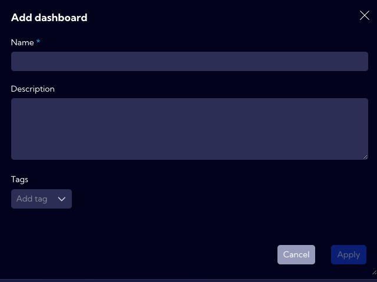

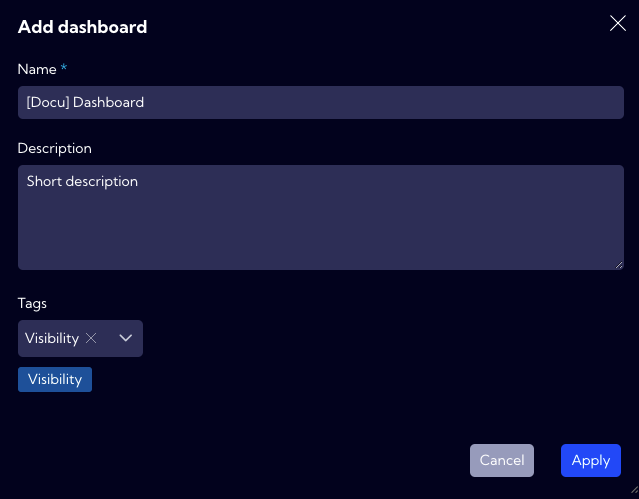

In the pop-up window there are the following fields to fill in:

- **Name** - Dashboard name (mandatory)
- **Description** - short dashboard description
- **Tags** - you can add tags related to the Dashboard being created

After clicking `Apply`, a grid board on which you can place **Widgets** will appear.

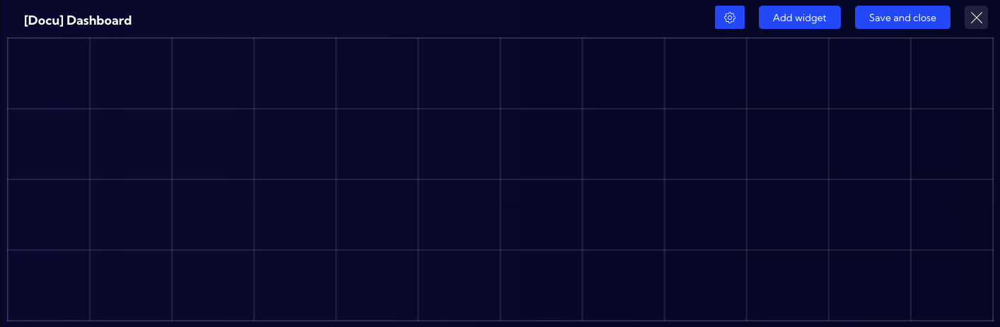

To configure the Dashboard use the **top menu**.

####  Settings menu

The settings menu has four options to choose from:

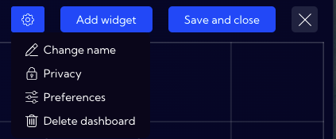

- **Change name** - you can rename the Dashboard

- **Privacy** - you can grant permissions for a **Dashboard**

  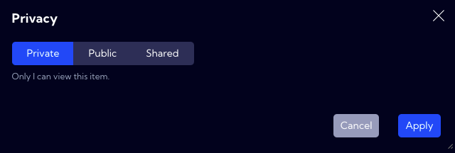

  - **Private** - accessible to the owner

  - **Public** - visible to all, but you can grant permission to:
    - **delete**
    - **edit**

  - Shared - accessible to one or more selected **User roles**. The available privileges are:
    - **delete**
    - **edit**

- **Preferences** - you can change settings related to the layout of elements and appearance
  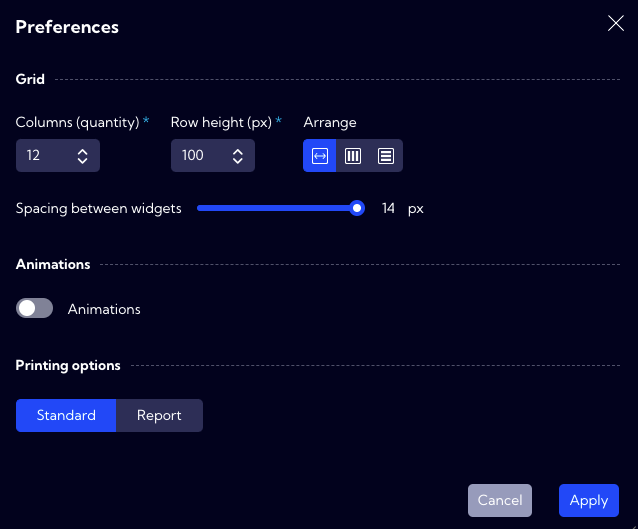

  - **Grid section** - used for configuring the grid on which the **Widgets** will be placed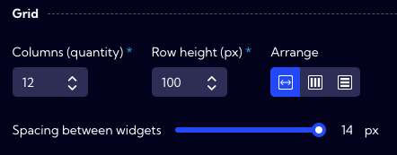

    - **Columns (quantity)** - you can specify the grid number of columns 
    - **Row height(px)** - you can specify the height of grid rows
    - **Arrange** - you can specify a page layout
      - **Auto/Vertical/Horizontal/**
    - **Spacing between widgets** - you can adjust the distance between **Widgets** placed on the **Dashboard**
    
  - **Animations** **section** 

    - **Enable/Disable** animations switch

  - **Printing options** - you can configure the printing settings

    - **Standard** - view adapted to the monitor screen

    - **Report** - view adapted for printing

      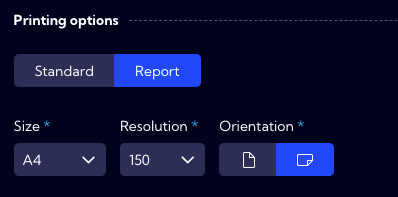

- **Delete Dashboard** - you can delete Dashboard

 - you can add **Widgets** from the list of **all** or **Favorites** Widgets in the System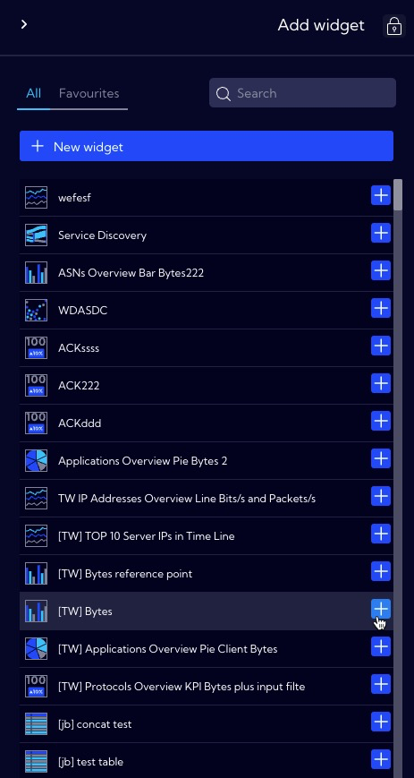

 - to complete a configuration and save a **Dashboard**.

A saved **Dashboard** is placed in the table with a list of dashboards, and it is launched by clicking on its name.

 

