# Widgets

One of the essential elements of the System are Widgets. Widgets are designed to display information of a certain kind and source, which can be a summary, a value calculated from multiple data, a graph or a function, etc.

The **Sycope** includes many different types of widgets designed to fulfill different data display needs. You can add, remove, and customize widgets to personalize your dashboard, displaying the data you need. Widgets are used to create dashboards, which are views that contain multiple widgets.

---

## Adding custom widgets {#widgets-add}

Widgets are created and edited in this menu [**Management>Widgets**]. To add a widget, click the Add Widget button, and the widget wizard will appear. Creating a widget consists of three or four steps, depending on the visualization type selected in the first step.

The system includes the following types of visualization:

1. [Line](#Line)
2. [Scatter](#Scatter)
3. [Bar](#Bar)
4. [Gauge](#Gauge)
5. [Pie](#Pie)
6. [Graph](#Graph)
7. [Map](#Map)
8. [Sankey](#Sankey)
9. [Sunburst](#Sunburst)
10. [Tree](#Tree)
11. [Tree map](#Tree-map)
12. [KPI](#KPI)
13. [Table](#Table)
14. [Text Image](#Text)
15. [Filters](#Filters)
16. [Radar](#Radar)
17. [Threat Trajector](#Threat)
18. [Heatmap](#Threat)

###  Visualization step

This step is the same for all visualization types. In this step, you need to fill in the following fields:

**Title** - unique widget name - required field

**Description** - short description of the widget (not required)

**Tags** - tags assigned to the **Widget**

Then you have to choose the Type of Visualization.

**Type of Visualization** - here, you choose one type of chart from the many available in the system 

Depending on the selected visualization, the next step will differ.

---

### Data step

:::info

The description of the next steps and options for creating the **Widget** refers to the **Line visualization** selected in the first step.

:::

In this step, regardless of the previously selected **Type of Visualization**, we have widget parameters to configure, divided into several groups. For example, for the **Line Visualization**, these are the following groups:

- **Stream**
- **Time**
- **Values**
- **Categories**

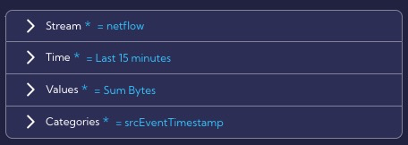

:::caution

After switching the **Show advanced options**, additional advanced configuration parameters are available, but using the advanced option mode is highly **not recommended!**

:::

---

#### Stream

**Source** - you have to select a data stream from the list. You can display system data streams with all columns in the [**Dashboard>Raw Data **] menu.

For ease of use, the streams are grouped into four categories:

- **Alerts**,
- **Netflow**,
- **Collectors**,
- **Other**.

  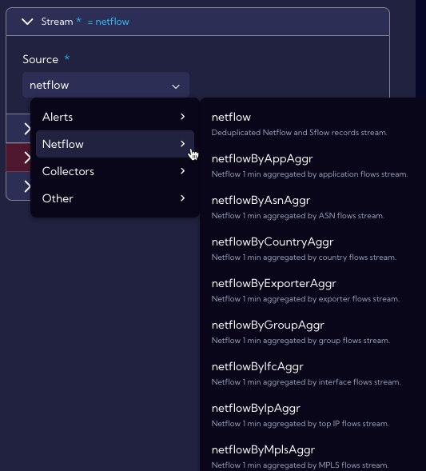

---

#### Time

**Time range** - here, you can specify the time interval for which data should be analyzed - by default **Last 15 minutes.**

---

#### Values

These are the values that will be displayed on a graph.

**Field** - You can choose **Fields** or **Metrics**.

You can add more fields by pressing the plus key.

- **Use custom** - You can enter your name [**Display name**] for the **Field** to be displayed on the chart. 

---

#### Categories

In this section, you configure the category against which the Values will be displayed.

- **Aggregation**
  
  - **Date Histogram**
  - **Ranges**
  - **Terms**
  
- **Field** - field relative to Value that will be visualized

  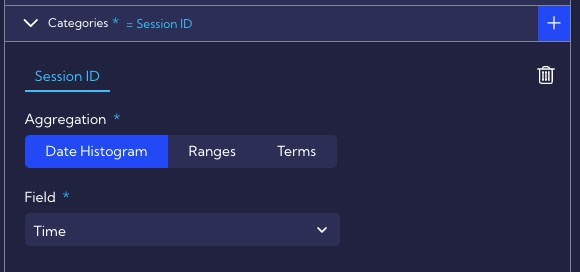

---

### Option step

In this step, the graph parameters are defined.

**Switch axes** - the switch that changes places of the X axis with the Y axis

---

#### Value axis (y-axis)

##### Axis position

 -  Left

 -  Right

    

##### Axis labels

- **Show axis labels**
  - **Rotate labels** - the angle by which the label will be rotated
  - **Max width**  
  - **Font weight**
    - Normal
    - Bold
    - Bolder
    - Light
  - **Font size**
  - **Format type**
    - Auto
    - Currency
    - Date
    - None
    - Number
    - Traffic

##### Axis name

- **Display axis name** - enable/disable axis name on a chart
  - **Axis name**
  - **Axis name position**
    - Start
    - Center
    - End
  - **Font weight**
    - Normal
    - Bold
    - Bolder
    - Light
  - **Font size**
  - **Distance from chart**
  - **Rotate axis name**

##### Others

- **Logarithmic scale**
- **Invert axis**
- **Data zoom**
  - Data zoom init range

---

#### Category axis (x-axis)

##### Axis position

 - Left
 - Right

##### Axis labels

- **Show axis labels**
  - **Rotate labels** - the angle by which the label will be rotated
  - **Max width** 
  - **Font weight**
    - Normal
    - Bold
    - Bolder
    - Light
  - **Font size**
  - **Format type**
    - Auto
    - Currency
    - Date
    - None
    - Number
    - Traffic

##### Axis name

- **Display axis name** - enable/disable axis name on a chart
  - **Axis name**
  - **Axis name position**
    - Start
    - Center
    - End
  - **Font weight**
    - Normal
    - Bold
    - Bolder
    - Light
  - **Font size**
  - **Distance from chart**
  - **Rotate axis name**

##### Others

- **Show all labels**
- **Data zoom**
  - Data zoom init range

---

#### Drilldown

- **Type of drilldown**
  - **Dashboard**
  - **Dashboard group**
  - **Filter**
  - **Widget**

---

#### Privacy

**Privacy** - you can grant permissions for a Widget

- **Private** - accessible to the owner

- **Public** - visible to all, but You can grant permission:
  - **DELETE**
  - **EDIT**

- Shared - accessible to one or more selected **User roles**. Available privileges are:
  - **Delete**
  - **Edit**
  - **View**

---

#### Others

- **NULL handling**
  - **Connect**
  - **Set zero**
  - **Show gap**
- **Show chart in a single mode**
- **Show legend** 
  - **Legend position**
    - Bottom
    - Left
    - Right
    - Top
  - **Hide metric name**
- **Hide if too many records** -  resolution limit (points on the chart), after exceeding the message set in the Message field (Message if too many records) will be displayed.
  - **Limit** - limit value
  - **Message if too many records** - message when the **Limit** value is exceeded
- **Animation** - enable/disable animation effects 

## Thresholds

The following types of thresholds for Widgets are available in the Sycope system:

- **Static Thresholds**,
- **Dynamic Thresholds** (Baseline).

:::tip 

Thresholds for Widgets are configured in the **Data step** of the **Widget Creator**, and they are located in the **Advanced option/Thresholds**. 

:::

---

### Static Thresholds

The user in the system can set **Static Thresholds** on **Widgets**. They allow the user to set static values lines at the **Value** parameter's specified level.

Available parameters for configuration:

- **Value** - threshold value,
- **Label** - threshold name,
- **Active** - enable/disable threshold. 

---

### Dynamic Thresholds (Baseline)

**Dynamic Thresholds** (**Baseline**) functionality allows the user to compare the same metric/field at different time offsets on a single **Widget** to perform comparative analysis in different time windows.

Two types of **Dynamic Thresholds** are implemented in the system:

- **Reference point threshold**,
- **Reference line threshold**.

#### Reference point threshold

The first type of dynamic threshold is the Reference point. It shows a single value of a calculated metric for a period of time offset from the base metric as a horizontal line or range area.

The reference point default calculates the metric's value for the period specified in the **Time & Input filters** section. You can shift the time range by a set amount of time using the **Time shift** field - .

- **Time shift** -  offset relative to time range - available by clicking 
- **Single point** - a single threshold value is determined
   - **Line function** - a measure used to determine the threshold value
     - **Avg** - average value
     - **Max** - maximum value
     - **Min** - minimum value
     - **Prc** - percentile
     - **Sum** - the sum of the values in the set period of time

   - **Deviation(%)** - percentage deviation for the calculated value

- **Color** - threshold color on the chart

  

- **Range area** - two values are determined - a "tunnel" is created between them on the graph

   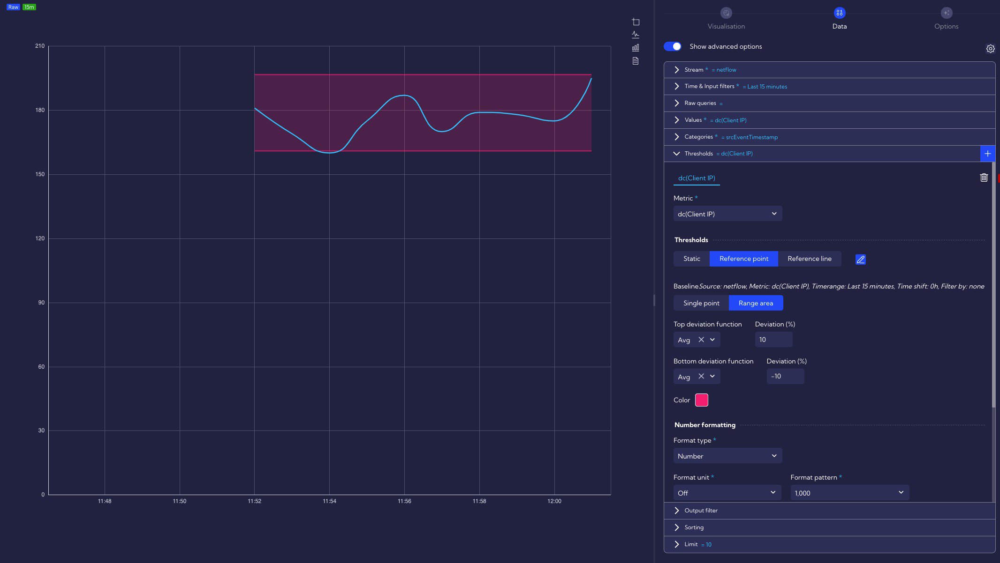

   - **Top deviation function** - a measure used to determine the top threshold value
     - **Avg** - average value
     - **Max** - maximum value
     - **Min** - minimum value
     - **Prc** - percentile
     - **Sum** - the sum of the values in the set period of time

   - **Top deviation(%)** - percentage deviation for the top calculated value

   - **Bottom deviation function** - a measure used to determine the bottom threshold value

   - **Bottom deviation(%)** - percentage deviation for the bottom calculated value

---

**Number formatting **

- **Format type**
  - Auto

  - Currency

  - Date

  - Number

  - Traffic

---

**Data **

- **Show data points** - enable/disable the display of points on the threshold chart

- **Series line type** - the type of line used to display the threshold on the chart
  
  - Solid
  
  - Dashed
  
  - Dotted
  
- **Line width** - here, you can choose the width of the line on the graph for the threshold

  

---

##### Custom threshold metric

Available by clicking .

 - **Source** - here, select the data source from which the metric will be calculated

---

**Metric**

- **Field** - here, select **Field** or **Metric** for the previously selected **Source**

- **Display name** - the name of the Field/Metric that will be shown on the chart; it can be changed with the **Use Custom** switch
- **Time range** - time interval for which the threshold will be calculated
- **Filtered by**
  - **Field** -  here, select **Field** or **Metric** for the previously selected **Source**
  - **Operator** - here, choose a mathematical operator, for example =, !=, >...
  - **Value** - here, enter the value 
  - **Query Builder** - using this option, you can create your own advanced filter using the **Query Builder** wizard
- **Time shift** -   offset relative to the time range 

---

#### Reference line threshold

It works on the principle of time shifting, i.e., presenting both a series of metrics/base fields and a series of reference metrics on the same (selected in the widget configuration) time interval. Only the values for the reference metric are shifted by a certain period of time in the past.

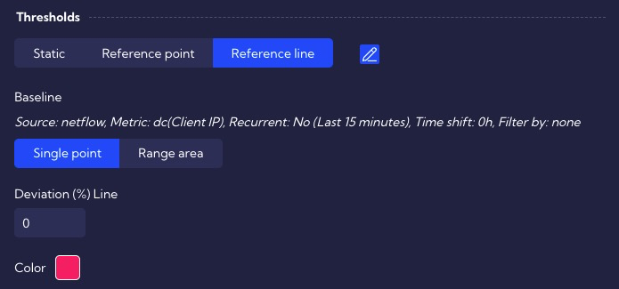

Available by clicking .

- **Custom threshold metric** - enable/disable wizard to use custom metrics for threshold 
  
- **Recurrent interval** ON/OFF [available by clicking ]
  
  - **Recurrent type**
    - **Daily**
    - **Weekly**
  - **Time range** - time interval for which the threshold will be calculated
  
- **Time shift** - offset relative to time range - available by clicking 

- **Leading values** - here, we can specify how many additional data point **Reference metrics** will be additionally visible to show the average value even though the values of the baseline metric at these time points do not yet exist - available by clicking 

   ---

   

- **Single point** - a single threshold value is determined
  
   - **Deviation (%) Line** - percentage deviation for the calculated value

- **Range area** - two values are determined - a "tunnel" is created between them on the graph

   - **Top deviation(%)** - percentage deviation for the ceil calculated value

   - **Bottom deviation(%)** - percentage deviation for the ceil calculated value

     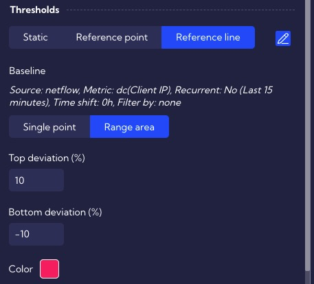

     

- **Color** - threshold color on the chart

---

**Number formatting **

- **Format type**
  - Auto

  - Currency

  - Date

  - Number

  - Traffic

---

**Data **

- **Show data points** - enable/disable the display of points on the threshold chart

- **Series line type** - the type of line used to display the threshold on the chart

  - Solid

  - Dashed

  - Dotted

- **Line width** - here, you can choose the width of the line on the graph for the threshold

---

##### Custom threshold metric

 Available by clicking .

 - **Source** - here, select the data source from which the metric is to be calculated

---

**Metric section**

 - **Field** - here, select **Field** or **Metric** for the previously selected **Source**
- **Display name** - the name of the Field/Metric that will be shown on the chart; it can be changed with the **Use Custom** switch
- **Filtered by**
  - **Field** -  here, select **Field** or **Metric** for the previously selected **Source**
  - **Operator** - here, choose a mathematical operator, for example, =, !=, > ....
  - **Value** - here, enter the value 
  - **Query Builder** - using this option, you can create your own advanced filter using the **Query Builder** wizard

## Build-in Widgets

### Line **{#Line}**

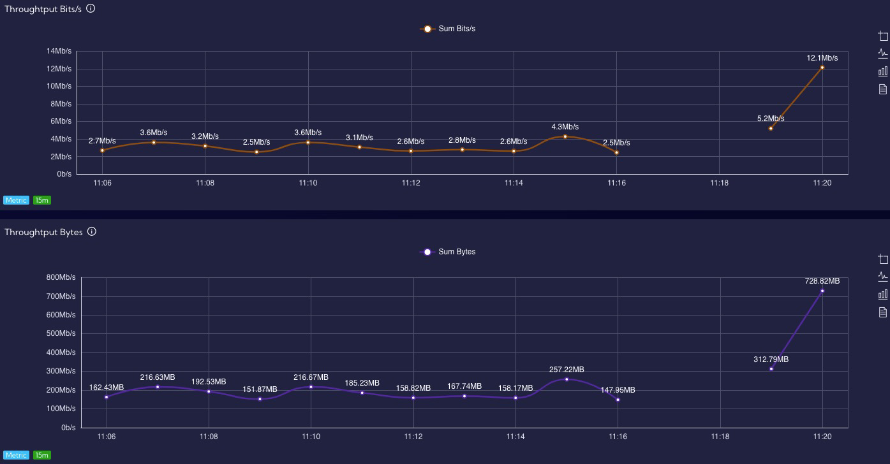

[Back to the widgets list](#widgets-add)

---

### Scatter {#Scatter}

[Back to the widgets list](#widgets-add)

---

### Bar {#Bar}

[Back to the widgets list](#widgets-add)

---

### Gauge {#Gauge}

[Back to the widgets list](#widgets-add)

---

### Pie {#Pie}

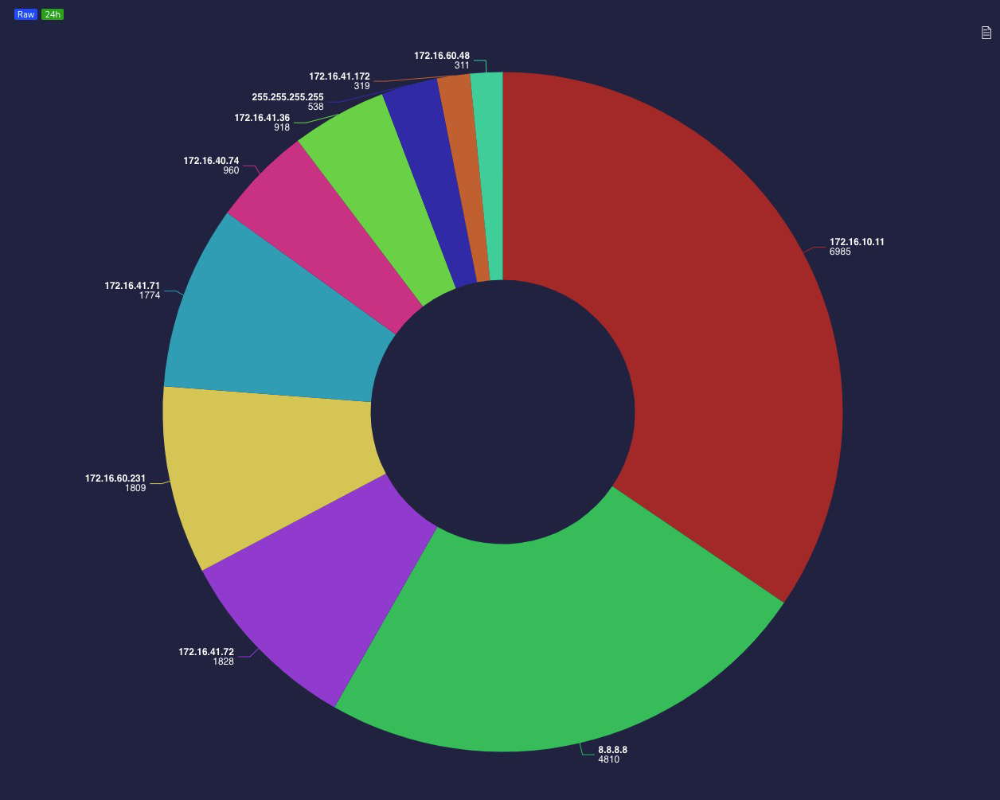

[Back to the widgets list](#widgets-add)

---

### Graph {#Graph}

[Back to the widgets list](#widgets-add)

---

### Map {#Map}

[Back to the widgets list](#widgets-add)

---

### Sankey {#Sankey}

[Back to the widgets list](#widgets-add)

---

### Sunburst {#Sunburst}

[Back to the widgets list](#widgets-add)

---

### Tree {#Tree}

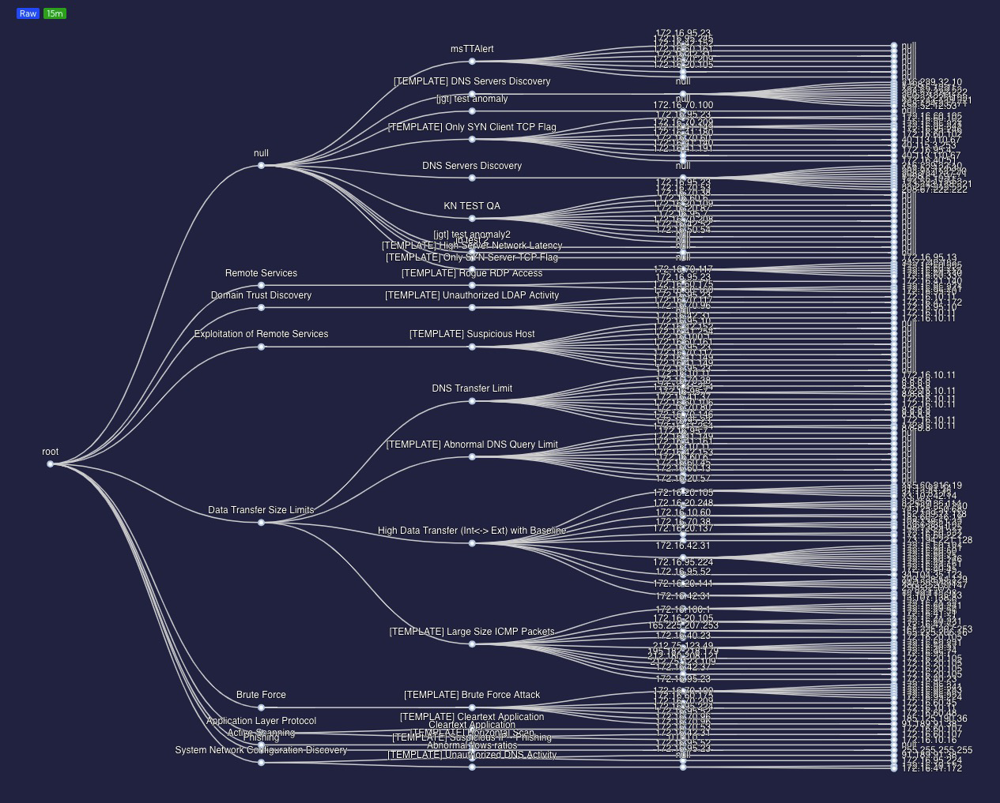

[Back to the widgets list](#widgets-add)

---

### Tree Map {#Tree-map}

[Back to the widgets list](#widgets-add)

---

### KPI {#KPI}

[Back to the widgets list](#widgets-add)

---

### Table {#Table}

[Back to the widgets list](#widgets-add)

---

### Text Image {#Text}

[Back to the widgets list](#widgets-add)

---

### Filters {#Filters}

The filters function is a special **Widget** (**Filters Widget**) allowing for the creation of a preliminary filter for each field in the selected data stream and the placing it in the **Dashboard**. By creating a **Filters Widget** for the key fields, you can drastically simplify the process of data analysis and therefore raise its effectiveness. This is due to the fact that the utilized filters are always available and can be connected with each other creating longer query strings.

#### Example of creating a Filters Widget

In order to create a new Filters Widget, click the [**Management->Widgets**] menu, then click the `Add widget` button. A standard Widget creation wizard will appear.

In the `Visualisation` tab, fill in the `Title` field and, optionally, the `Description` and `Tags` fields, in the `Type of Visualisation` section, select Filters.

After filling out the required fields, you can move on to the Data section, which in this case is crucial. This example will be realized for the testdata stream that is typically implemented in the system and all users can utilize it for the purpose of learning and performing examples on their own.

:::tip

Test data were implemented into the Sycope system in the form of the testdata stream. It is simple data that are easily accessible after installing the system and may be used for the purpose of learning and performing the examples included in the documentation.

Please note that the test data has a time stamp within the period from 2023-01-01 to 2023-01-31 and therefore proper settings of the time filter should be used.

:::

In the Data section, use the Simple mode (without using the `Show advanced options` slider). The following image shows the required configuration within the individual tabs of the Data section. 

- **Stream Tab -> Source -> Other->** `testdata` 
  (select the testdata stream)

- **Time Tab -> 2023-01-01 to 2023-02-01** (this is because the same time period is used for the data in the testdata stream)

  

- **Dimension Tab** 

  In this tab, you select the field or fields which are supposed to be filtered. Let us assume that this example aims to provide the ability of quick filtering of the testdata stream in the fName, age country and Time fields. Therefore, add them and select them from the list.

  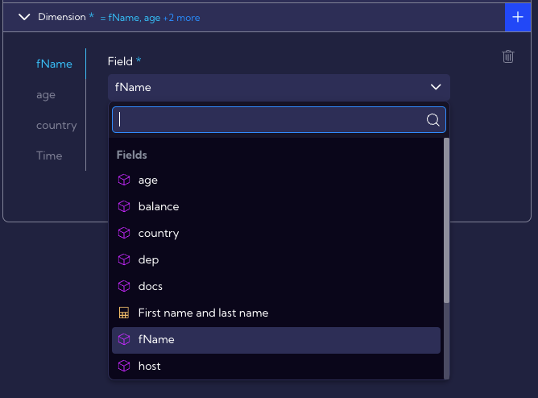

  After selecting appropriate fields, they will appear on the left side of the creator.

  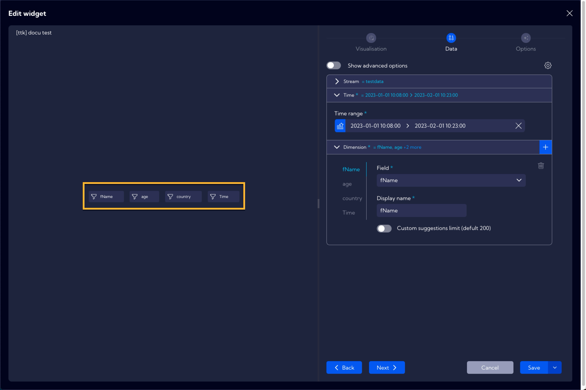

  By clicking on a given filter, you can see if it has been properly configured and if it works in accordance with its desired setting.

  

Now, the Widget is ready and it needs to be saved by clicking the Save button. After saving, the widget will appear in the Widget list in the [**Management>Widgets**] menu. 

#### Example of use

In order to use the previously created Filters Widget in the System, you need to place it in the Dashboard. For this purpose, navigate to the [**Dashboard**] menu and create a new or select a previously created Dashboard from the list.

For the purposes of this example, a Dashboard was created previously containing a Widget with a table of selected data from the testdata stream. After selecting the Dashboard, click on the Edit Dashboard icon and then on the Add Widget button and introduce the previously created Filters Widget.

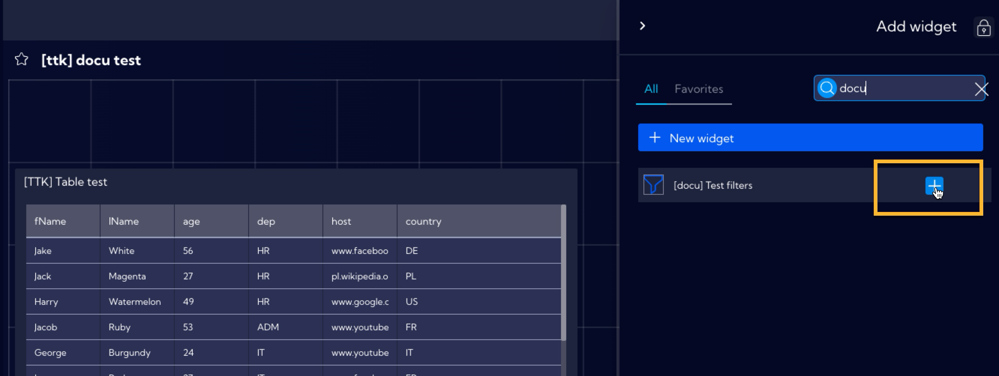

After adding a Filters Widget, you can adjust its shape and placement in the Dashboard by clicking on the lower right active corner of the Widget. After that, save the configuration of the Dashboard.

##### Using of a single Filter

For this example, let us assume that you want to display the people who are exactly 60 years old in a table. For this reason, use the Filter that was created for the age field.

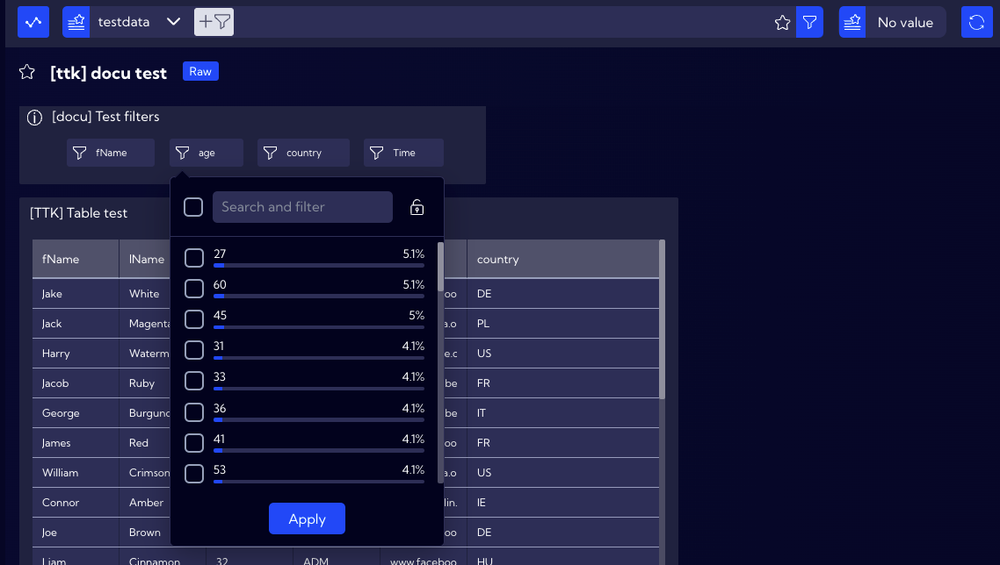

By clicking on it, you can see the percentage of people of a specific age. On the list, locate, select and confirm the number 60.

Now, the table will display only the data of people aged 60, as assumed before.

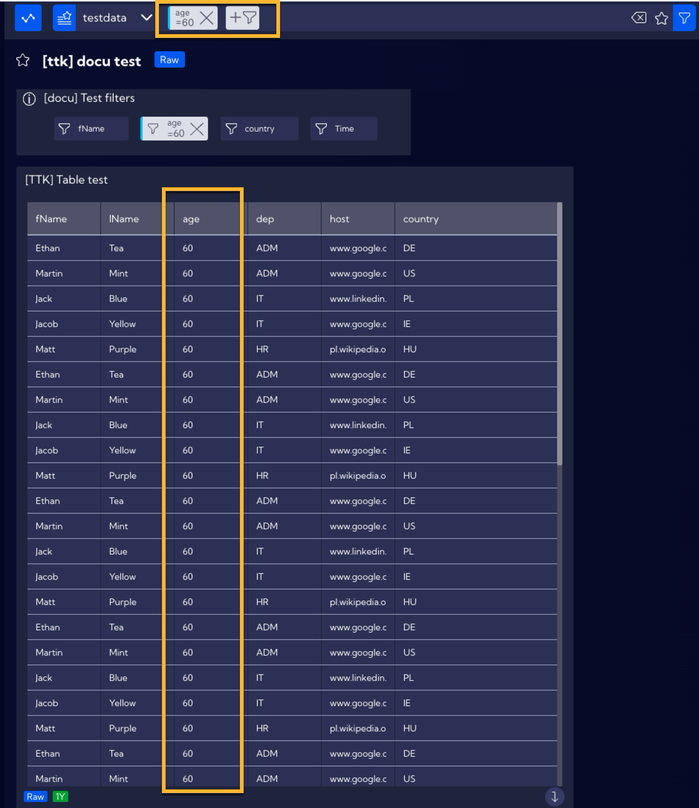

Please note that the Filter will appear in the search bar. 

By using a single Filter, there is no limit of selecting a single value, you can select multiple valuse, for example, add people aged 27 to the existing table. Click on the age Filter and select an additional field next to the value of 27.

The table will now also contain data of people aged 27.

Now, let us consider a case where you would like the table to show people of all ages except for the age of 60. For this purpose, click on the age Filter and double-click the field next to the number 60, and the  (does not contain) sign will appear next to it.

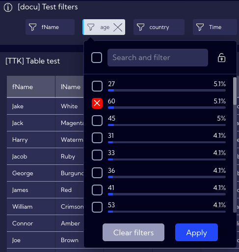

As you can see, now the list does not show the data of people aged 60.

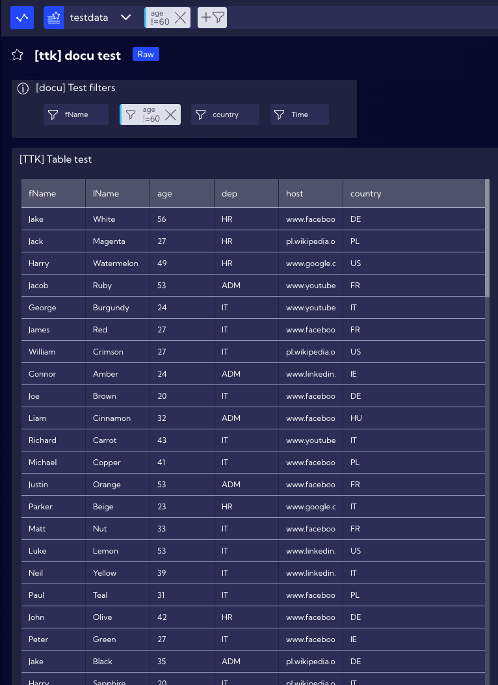

By using a single Filter you can also create more advanced filtration with the use of operators listed in the table below.

| Syntax            | Description                                                  | Example                                                      |
| ----------------- | ------------------------------------------------------------ | ------------------------------------------------------------ |
| `abc`;`*abc*`     | The search string is compared to every word in the field value, disregarding case sensitivity. | 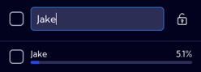 |
| `abc*`            | The search string is matched by any string that begins with an `abc` string and is followed by zero or more characters of any type. |  |
| `*abc`            | The search string is matched by any string that ends with an `abc` string and is preceded by zero or more characters of any kind. |  |
| `"abc"`           | The search string is matched by a string including only the exact word or phrase enclosed within the quotation marks. |  |
| `>value`          | For numeric fields, the search string returns all records with a value greater than the specified `value`. | 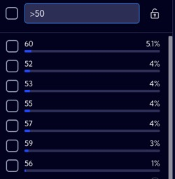 |
| `>=value`         | For numeric fields, the search string returns all records with a value equal to or greater than the specified `value`. |  |
| `<value`          | For numeric fields, the search string returns all records with a value lower than the specified `value`. | 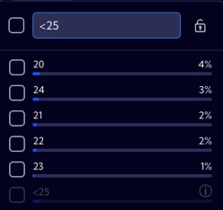 |
| `<=value`         | For numeric fields, the search string returns all records with a value equal to or lower than the specified `value`. |  |
| `>date`           | For numeric fields, the search string returns all date records with a value greater than the specified `data`. | 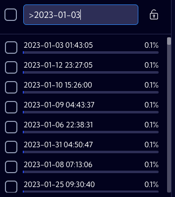 |
| `>=date`          | For numeric fields, the search string returns all date records with a value equal to or greater than the specified `data`. |  |
| `<date`           | For numeric fields, the search string returns all date records with a value lower than the specified `data`. |  |
| `<=date`          | For numeric fields, the search string returns all date records with a value equal to or lower than the specified `data`. |  |
| `<value1 >value2` | Combination of two values in one search. For numeric fields, the search string returns all records with a value lower than the specified `value1` **and** greater than `value2`. It works analogously for the other operators and their combinations (`<=;>=`) |  |
| `<date1 >date2`   | Combination of two date values in one search. For data value fields, the search string returns all records with a date value lower than the specified `date1` **and** greater than `date2`. It works analogously for the other operators and their combinations (`<=;>=`), | 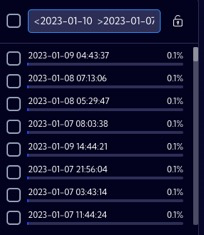 |

Now, try to make the table display the data of people aged 20 to 25. In order to do so, you need to apply the `>20 <25` expression in the age Filter (please remember that you need to put a space between the conditions) and tick the selection field next to the expression (Apply pattern to query bar).

The table will now display only the data of people aged 20 to 25 and the filtering syntax will appear in the search bar, similarly to the previous examples.

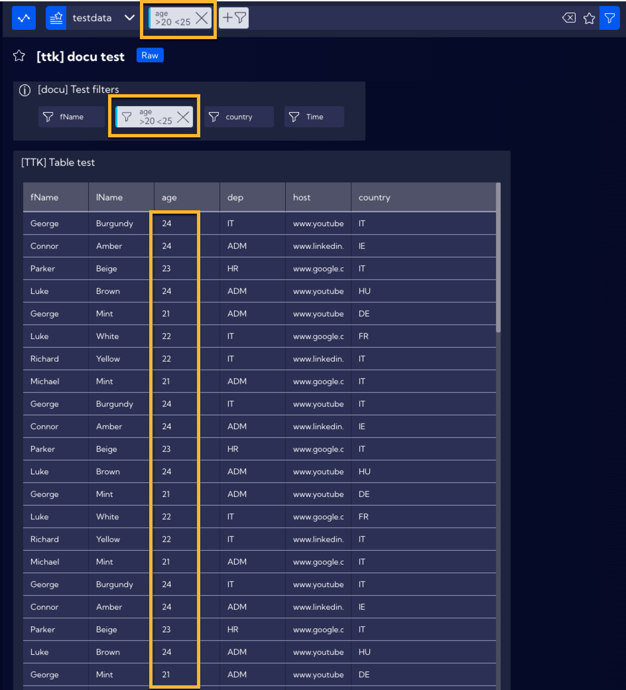

##### Using more than one filter

By using the Filters Widget, you can use a greater number of filters to create more complex filtration of data. In this example, the goal is to display the data of people aged 22 and coming from Italy (IT). In order to do so, use the age and country Filters, by selecting accordingly the values 22 and IT. the table will now display only the data of Italians aged 22.

Additionally, please note that in the search bar, a query has been created which shows that individual filters from the Filters Widget are combined with the use of the AND operator.

[Back to the widgets list](#widgets-add)

---

### Radar {#Radar}

[Back to the widgets list](#widgets-add)

---

### Threat Trajectory {#Threat}

[Back to the widgets list](#widgets-add)

---

### Heatmap{#Heat}

[Back to the widgets list](#widgets-add)
