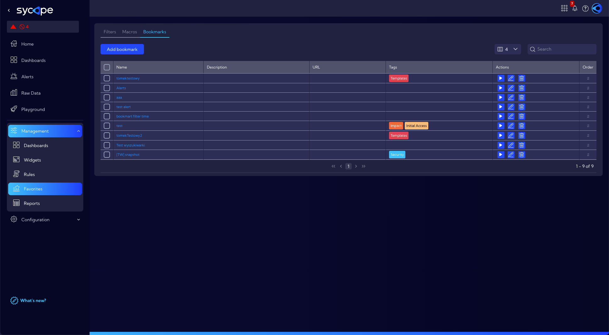
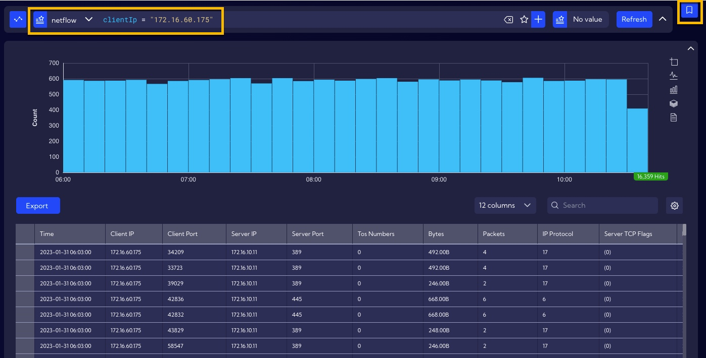
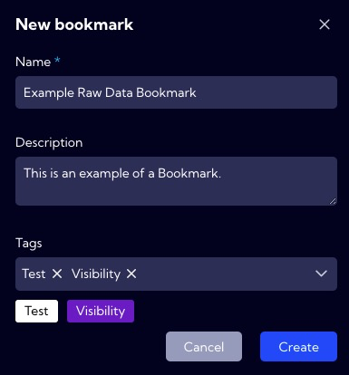
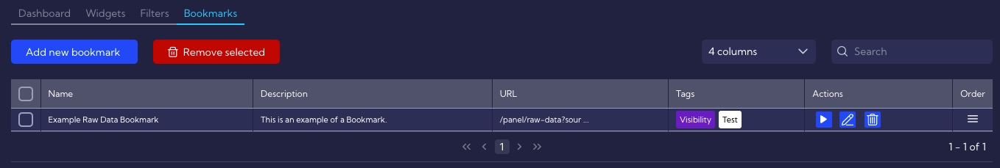
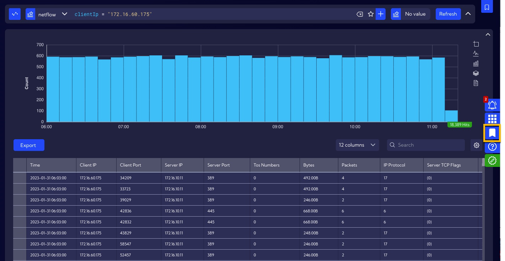
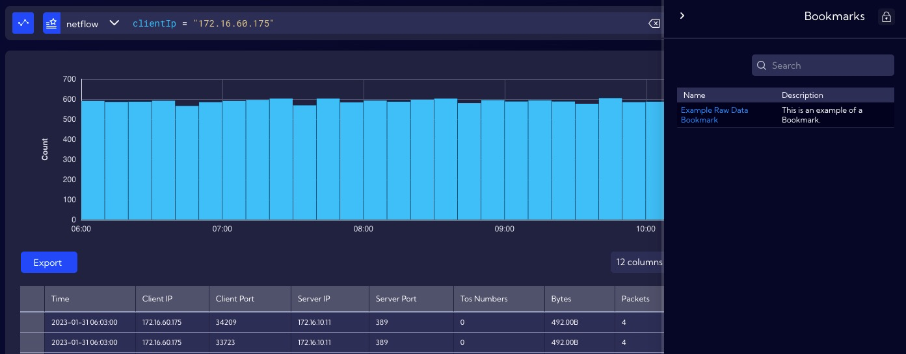
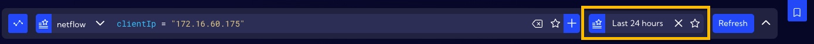
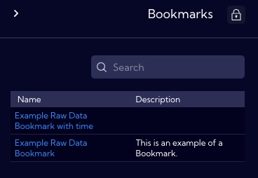

This menu [**Dashboards>Favorites>Bookmarks**] can be used to store favorite Bookmarks.

A **Bookmark** in the Sycope system is a link to the system element with a search bar that includes the time and filter. **Bookmarks** can be created for elements such as **Dashboard**, **Alerts table,** or **Raw data**. To create a **Bookmark,** use the   button in the upper right corner of the screen.

**Example: Bookmark to Raw Data with a clientIP filter**

We want to create a **Bookmark** to **Raw Data** with a clientIP filter without specifying a time period. After entering the correct filter in the search bar, click on the Create Bookmark icon in the upper right corner of the screen.

In the window, fill in the **Name** (required) and **Description** and **Tags** fields and press **Create**.

After this action, Bookamark will appear in the list of Bookmarks in the [**Management>Favorites>Bookmarks**] menu.

In the **Action** column, there are buttons with which you can Launch, Edit or Delete the selected Bookmark.

The **Bookmarks** created in the System are also available from the pop-up menu located on the screen's right side.

**Example: Bookmark to Raw Data with a clientIP filter and time filter**

In addition to the filter, the **Bookmark** can store information about the period of time on which to operate a particular element of the System.  The procedure for creating **Bookmark** is the same as in the earlier example, only the time filter needs to be additionally completed.

Once the Bookmark is created, it will appear in the list.

