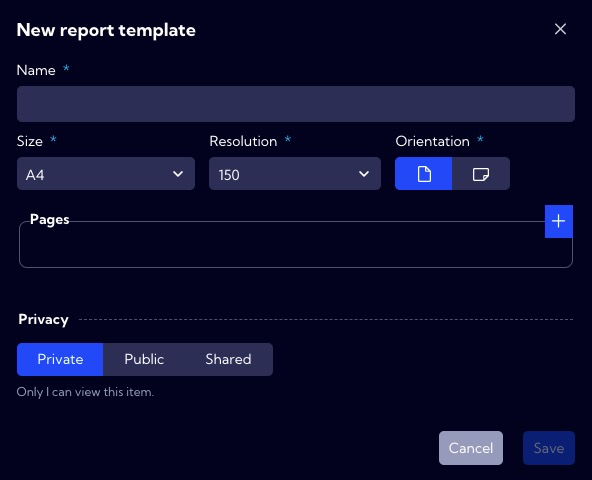

This menu [**Management>Reports>Reports**] can be used to create `reports`. Reports in the system are built based on **Dashboards**. Still, it is necessary to define a filter for the report (**Report filter** - [Management>Reports>**Report filters**] tab) to specify the **time range** to be analyzed in the report. In addition to specifying a time range in the filter report, you can create advanced NQL expressions that operate on selected data streams.

:::caution

To create a new report, you must first create a **Dashboard** ([**Management>Dashboard**] tab), which will be the **type of report** on which it will be based.

:::

:::info

Report scheduling can be configured in the [**Configuration>Object>Report schedule**] menu.

:::

The list of `reports`  is in the table with the following columns:

- **Name** - unique `report` name
- **Privacy** - privacy status
- **Shared** - share status
- **Created** - creation time
- **Creator** - creator user name
- **Action**
  - **Duplicate** -  creating an editable copy of the selected  `report`
  - **Edit**
  - **Delete**

:::info 

The predefined fields in the system are not editable but can be duplicated and then edited. 

:::

To add a new `Report,` click the New report button, and then the report wizard will appear. 

In the wizard window, there are the following fields:

- **Name** - the name of the report in the system (use

- **Size** [A1/A2/A3/A4/A5] - report page size

- **Orientation** [portrait/landscape] - report page orientation

- **Pages** - here, you configure the contents of the pages in the report

  - **File name** - report file name
  - **Dashboard name** - the name of the Dashboard with which the report is created
  - **Report filter** - selected `report filter`

  

---

- **Privacy** - you can grant permissions for a field
  - **Private** - accessible to the owner
  - **Public** - visible to all, but You can grant permission:
    - **DELETE**
    - **EDIT**
  - Shared - accessible to one or more selected **User roles**. Available privileges are:
    - **Delete**
    - **Edit**
    - **View**

