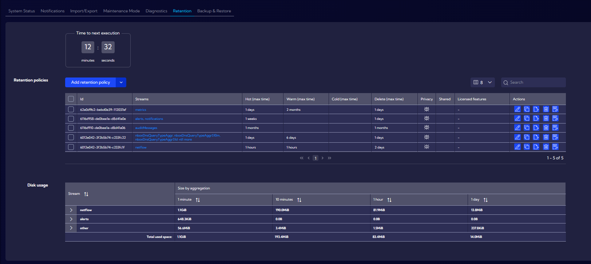
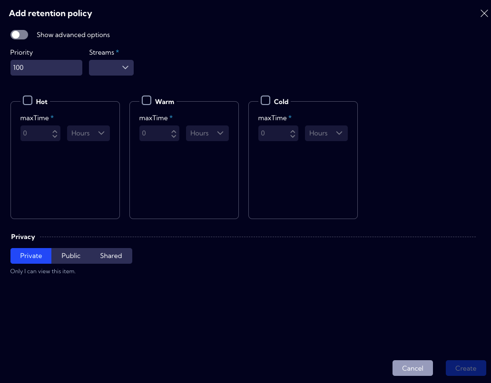
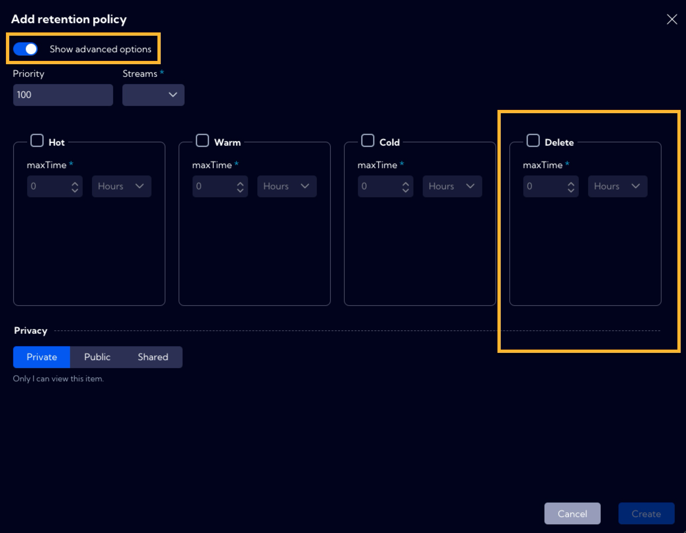
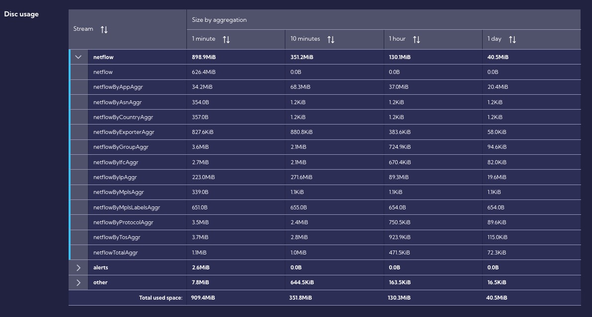

# Retention

The [**Configuration>General Settings >Retention**] menu can be used to manage data retention. 

The Retention Mechanism allows automated management of data life, considering factors such as performance and data size.

Data streams are stored on partitions of which there are four types in the system:

- **Hot** - data just written, updated - maximum read and write speeds, high disk
  utilization.
- **Warm** - deferred data that is no longer written while they can be read and searched.
- **Cold** - low read and speed, low disk utilization.
- **Delete** - data to be deleted. The **Delete** partition has been hidden and is available after using the **Show advanced option** switch. 

You can change the storage location of a particular **Data Stream** in the context of the partition type. The **maxTime** parameter is used for this purpose and it is the **<u>minimum</u>** time after which the partition type will be changed to another.

When the **maxTime** condition is met, the partition type is changed in the following order:

:::info

It is impossible to change partitions for a particular data stream from a type with a lower status to a type with a higher status, e.g., **Cold** -> **Warm** or **Warm** -> **Hot**.

:::

## Retention policy

Data retention takes place in the system based on user-configurable **Retention policies**. It is required to define at least two types of partitions for the policy. Policies are executed periodically in the order specified in the **Priority** field. The moment of execution is indicated by the **Time to next execution** field. The value in the **Priority** field must be within the range of 1-100, where 1 is the highest priority, and 100 is the lowest. When creating policies, care should be taken to ensure that policies do not overlap or duplicate because all defined policies will be executed.

:::caution

If you operate the maxTime parameter in hourly units, the system since version 2.3 stores data up to 1 hour longer, for example: 1 Hour Hot + 1 Hour Warm means that data is stored a **minimum** 2 hours and a **maximum** 3 hours.

:::

:::caution

After the installation, the system has four built-in **Retention policies**. Please check them and adjust them to your needs. They can be used as a template to create new user policies.

:::

:::danger

If you do not define a **Delete** partition in the **Retention policy** the data to which the policy applies will never be erased.

:::

### Default Retention policy

#### 1. Built-in policy parameters for the netflow data stream.

| Partition type | maxTime |
| -------------- | ------- |
| Hot            | 1 hour  |
| Warm           | 1 hour  |
| Cold           | -       |
| Delete         | 2 days  |

This means that the data from the **netflow** stream is stored in the system for two hours, within the first hour the data will be stored with the **Hot** index, and within the next hour - with the **Warm** index. Than the data will have the **Delete** status for two days, which means that only certain metadata will still be stored and it is not possible to restore the original data to the System.

:::danger

Please do **not change** the data storage **time (maxTime)** on the **Hot** partition for the **netflow** data stream. Changes may affect system stability and performance and may cause data loss.
Please use **Warm** and **Cold** partitions for flexible data space management.

:::

#### 2. Built-in policy parameters for the aggregated data stream.

| Partition type | maxTime |
| -------------- | ------- |
| Hot            | 1 day   |
| Warm           | 6 days  |
| Cold           | -       |
| Delete         | 1 day   |

This means that the data from the above-mentioned aggregated streams is stored in the system for seven days, within the first day the data will be stored with the **Hot** index, and within the next six days - with the **Warm** index. After seven days, the data will have the **Delete** status for one day, which means that only certain metadata will still be stored and it is not possible to restore the original data to the system.

:::danger

Please do **not change** the data storage **time (maxTime)** on the **Hot** partition for the **aggregated data streams**. Changes may affect system stability and performance and may cause data loss.
Please use **Warm** and **Cold** partitions for flexible data space management.

:::

#### 3. Built-in policy parameters for the alerts and notifications.

| Partition type | maxTime |
| -------------- | ------- |
| Hot            | 1 week  |
| Warm           | -       |
| Cold           | -       |
| Delete         | 1 day   |

This means that the alerts are stored in the system for one week, with the **Hot** index. After one week, the data will have the **Delete** status for one day, which means that only certain metadata will be stored and it is not possible to restore the original data to the System.

#### 4. Built-in policy parameters for audit messages.

| Partition type | maxTime |
| -------------- | ------- |
| Hot            | 1 month |
| Warm           | -       |
| Cold           | -       |
| Delete         | 1 month |

This means that the data is stored in the system for one month. After one month, the data will have the **Delete** status for one month, which means that only certain metadata will be stored and it is not possible to restore the original data to the System.

#### 5. Built-in policy parameters for metrics.

| Partition type | maxTime  |
| -------------- | -------- |
| Hot            | 1 day    |
| Warm           | 2 months |
| Cold           | -        |
| Delete         | 1 day    |

This means that the data is stored in the system for two months and one day. First one day with the **Hot** index and the second two months with the **Warm** status. After two months and one day, the data will have the **Delete** status for one day, which means that only certain metadata will be stored and it is not possible to restore the original data to the System.

## Disk usage

In this section, the table indicates how much space the data takes up in the system.

