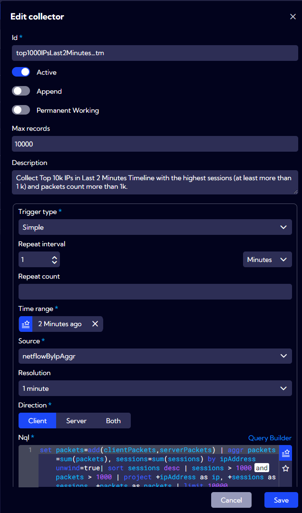
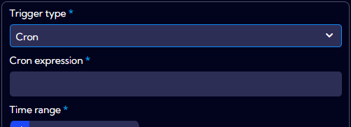

# Collectors

The [**Configuration>Objects>Collectors**] menu can be used to create a kind of container/database into which you can collect and store data from data streams defined using NQL expressions.

The **Collectors** created in the system are listed in a table with the following columns:

- **ID** - unique Collector ID
- **Description** - Collector description entered by the user
- **NQL** - NQL expression that creates a collector
- **Status** - active/inactive
- **Privacy** - privacy status icon
- **Created By** - the name of the user who created the Metric
- **Creation Time** - creation time
- **Modified By** - the name of the user who last modified the Metric
- **Modification Time** - the last modification time
- **Shared** - the name of the user who shared the Metric
- **Action** - 
  - Edit - edits the collector parameters
  - Duplicate - duplicates the collector
  - Export - exports the collector to a json file
  - Delete - deletes the collector

# Building a collector

Add/Edit a new collector which is fed with data in the scheduled time.

***

## Collector attributes:

**ID** - the collector's name.

**Active**

- **Switched off** - the collector is not active.

- **Switched on** - the collector is active and collects data.

**Append**

- **Switched off** - every next scheduled run will replace all existing data in the collector.

- **Switched on** - the data will be appended to the collector in every next scheduled run. 
  If objects in the appended data are duplicated in the collector current data, they will not be replaced (updated). They will be duplicated, tripled etc. in every run.

**Permanent Working**

- **Switched off** - the collector stops collecting data when UI window shown collector data has been closed.

- **Switched on** -  collects data constantly (in backend), even is it not used/shown in UI.

**Max records** - The number of objects/records kept in the collector. The collector contains **the latest** n objects (n = Max records).

**Description** - The description of the collector.

**Trigger type**

- **Simple** - the scheduler settings are available in the current form.

- **Cron** - the scheduler settings are defined by the CRON expression.

**Cron expression** - the expression which is used to define the scheduling in the standard unix/linux cron tool ([Linux Cron](https://en.wikipedia.org/wiki/Cron)).

**Repeat interval** - the interval of each iteration run. For example, "4 Hours" means that the NQL will be executed every 4 hours.

**Repeat count**  - the number of times the NQL will feed the collector with data. For example, the value of 10 means that the NQL will be executed 10 times, every `Repeat interval` value will be started and stopped.

**Time range** - a time range for the data retrieved in each scheduled run iteration.

**Nql** - the NQL expression used to load the data into the collector.

**Test** - the button to test the NQL and to see its result (first 5 records/objects).

**Privacy** - you can grant the following permissions to the collector:

- **Private** - accessible to the owner

- **Public** - visible to all, but you can grant permission:

- - **DELETE**
  - **EDIT**

- **Shared** - accessible to one or more selected **User roles**. The available privileges are:

- - **Delete**
  - **Edit**
  - **View**
