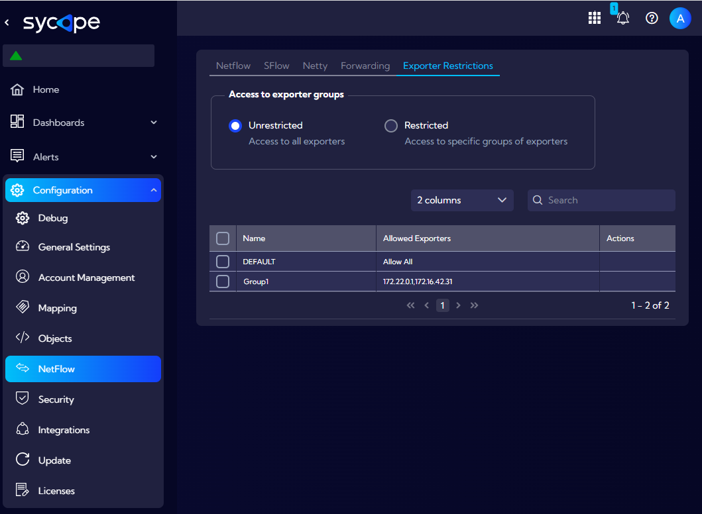
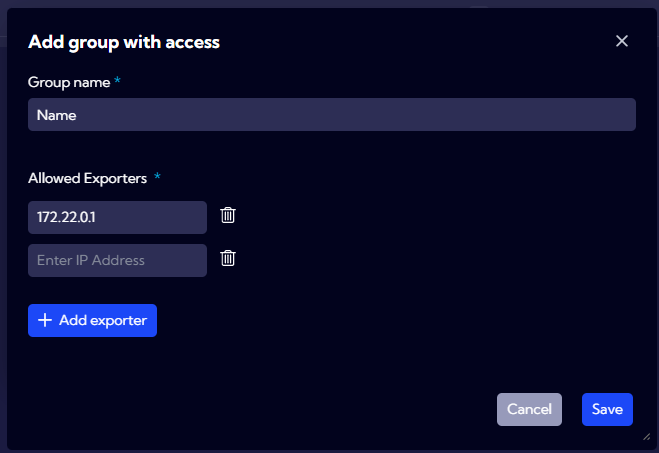
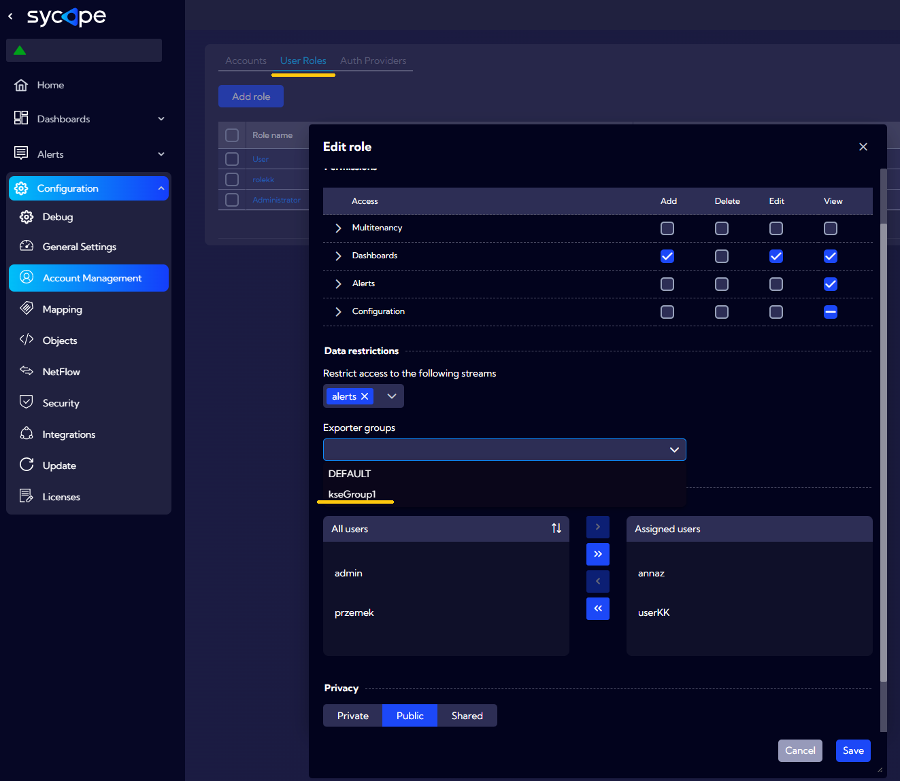

# Exporter Restrictions

This menu [Configuration>NetFlow>**Exporter Restrictions**] can be used to configure NetFlow Exporter Restriction group functionality.

:::danger

After enabling the <u>**Restricted**</u> option, it is firmly not recommended to reconfigure this system's functionality and check the <u>**All**</u> option.

:::

The aim of the **Exporter Restrictions** configuration is to create groups restricting data download from streams to other data from specific sources.

## Parameters:

**Unrestricted** - the activation of this setting will prevent the **Exporter Restrictions** mechanism from working. It will not be taken into consideration by the processes in the Sycope system.

**Restricted** - the activation of this setting will make the Sycope system restrict access only to the data from sources within the assigned groups during processing of the data from the stream.

**Add group with access** - after choosing **Restricted**, a button allowing for defining a group will appear. After clicking the button, the group name and the list of data sources assigned to this group must be provided.

Groups created in this manner can be used while editing the User role in the "Data restrictions" section.

The activation of the **Restricted** option and using groups in User roles may cause a decrease of efficiency of the Sycope system. All processes within the Sycope system downloading data from a given stream, e.g. those counting aggregations, will monitor and filter the data from the source while taking into consideration the group assigned to the User.

