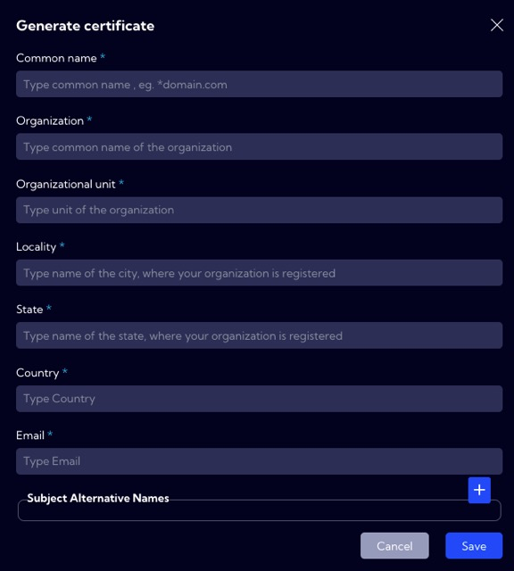
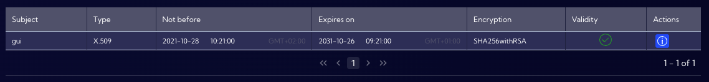
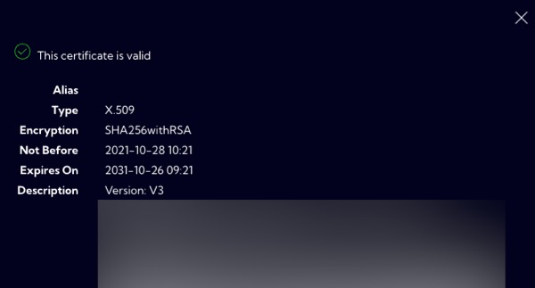

This menu [Configuration>Security>**Certificate**]  can be used to generate and edit  SSL certificates for the Sycope application web server.

You can generate or upload an SSL certificate in the system using three buttons:

- **Generate CSR** button

  Generate a certificate request (Certificate Request CSR). At the same time, a key is generated and stored on the server in a temporary location. This operation can be repeated several times before the final upload of the certificate. At this step, all files are created on the server in a temporary location. Each time you click on this button, it overwrites the
  temporary files.

  

  

- **Download CSR** button

  Downloading the generated CSR in PEM format. The downloaded file is used to create the certificate and should be sent to the support team to generate the certificate.

- **Upload signed cert** button

  Once the certificate is created based on the downloaded CSR, it can be uploaded to the server using this button. 
  Once uploaded, the certificate along with the private key is installed in the configuration of the Sycope application web server. This means that all files containing the certificate and paired keys are moved from a temporary location to the server's configuration directory.

The list of certificates in the system is shown in a table. Due to the fact that the server only uses one certificate at a time, the table will always have only one row.

By clicking on the icon in the **Action** column you can see detailed information about the certificate.

