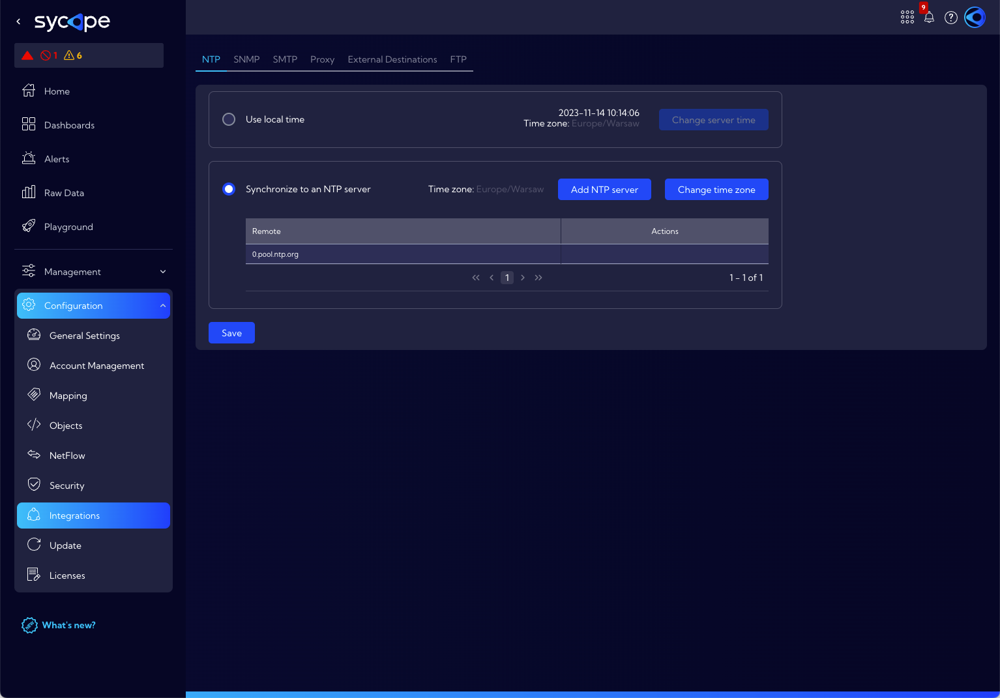
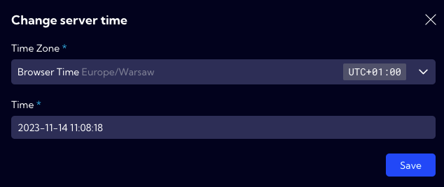
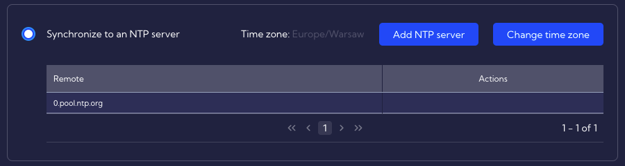
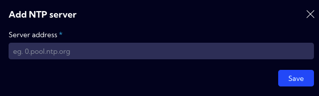
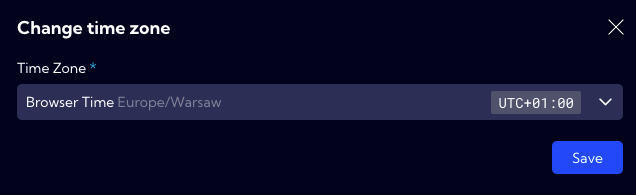
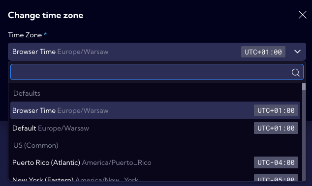

In the [**Configuration>Integrations>NTP**] menu, the System time settings are placed.

We can choose two ways to set the time in the system:

- **Use local time** 
- **Synchronize to an NTP server**

## Use local time

This option allows you to manually enter the date, time and time zone. To manually set the time parameters, use the Change server time button. 

In the pop-up window, enter the **Time Zone** and current Time respectively then **Save** the setting.

## **Synchronize to an NTP server**

With this option, you can set the System time synchronization with an external NTP server.

To add a new NTP server click the **Add NTP server** button and then enter the NTP web server address.

To change the time zone, use the **Change time zone** button, select a time zone from the list, and then **Save** the setting.

