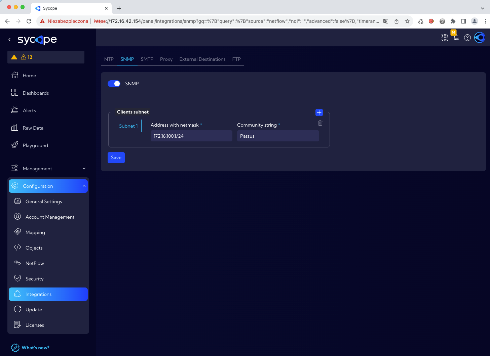
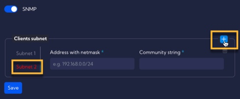

The [**Configuration>Integrations>SNMP**] menu can be used to configure SNMP protocol parameters.

In this menu there are the following components:

- **SNMP switch** - to enable or disable the SNMP server.

- **Client subnet** section where you can configure SNMP clients
  - **Address with Netmask**  - client IP address witch netmask 
  - **Community String** - SNMP community String
- **Save button** - only after pressing this key the configuration will be saved.

You can add multiple SNMP clients by pressing the plus key in the upper right corner of the **Client subnet** section.

