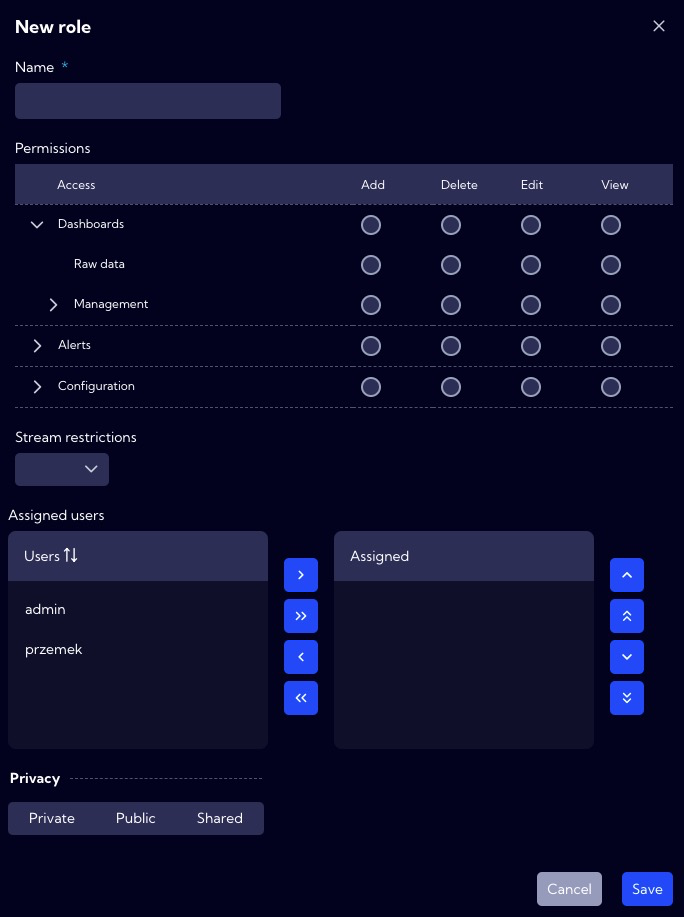
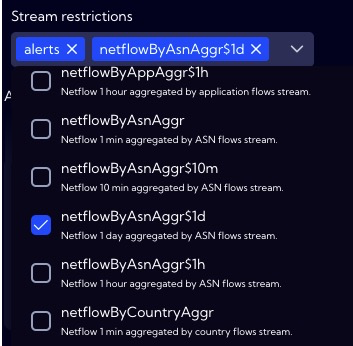

This menu [Configuration>Account Management>**User Roles**] can be used to manage users roles in the System.

A role is a set of permissions for actions available within the system  (example: create a widget, delete a Rule, view a Notification Table...). A role can be assigned to one or several users. One user can have one or several roles. Two roles are predefined in the system: `Administrator`, `User`.

For roles, permissions can be assigned to selected endpoints that are available in the Access column. The user can grant the following access rights:

- **Add**
- **Delete**
- **Edit**
- **View**

:::tip**Example 1** 

To create a role that only views the list of **Widgets**, the role must have the View permission.

:::

:::tip**Example 2** 

To create a role that can edit **Widgets**, the role must have the Edit and View permissions

:::

**Stream restriction** - allows blocking access to source data to protect data. It is possible to restrict the user's access to any Data streams that are in the System.

:::tip

For the built-in **admin** role, you cannot add restrictions on data access. The **admin** role always has everything allowed.

:::

:::info

 All user roles by default do not have restrictions on data access. 

:::

---

 - - **Privacy** - you can grant permissions for **User Role**
     - **Private** - accessible to the owner
     - **Public** - accessible to all but You can grand permission:
       - **DELETE**
       - **EDIT**
     - **Shared** - accessible to one or more selected roles. Available privileges are:
       - **Delete**
       - **Edit**
       - **View**

---

