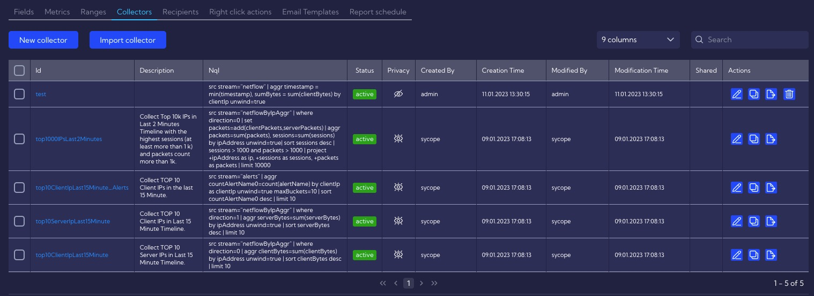

# Colectors

This menu [Configuration>Objects>**Collectors**] can be used to create a kind of container/database into which you can collect and store data from data streams defined using NQL expressions.

The **Collectors** created in the system are listed in a table with the following columns:

- **Id** - unique Collector id
- **Description** - Collector description entered by a user
- **NQL** - NQL expression that creates a collector
- **Status** - active/inactive
- **Privacy** - privacy status icon
- **Created By** - the name of the user who created the Metric
- **Creation Time** - creation time
- **Modified By** - the name of the user who last modified the Metric
- **Modification Time** - last modification time
- **Shared** - the name of the user who shared the Metric
- **Action** - 
  - Edit - edit collector parameters
  - Duplicate - duplicate collector
  - Export - export collector to json file
  - Delete - delete collector

# Building a collector

Add/Edit a new collector, which is fed with data in the scheduled time.

***

## Collector attributes:

**Id** - the collector's name.

**Append**

- **Switched off** - every next scheduled run will replace all existing data in the collector.

- **Switched on** - the data will be appended to the collector in every next scheduled run. 
  If objects in appended data are duplicated in collector current data, they will not be replaced (updated). They will be duplicated, tripled etc... in every run.

**Max records** - The number of objects/records kept in the collector. The collector contains **the latest** n objects (n = Max records).

**Description** - The description of the collector.

**Trigger type**

- **Simple** - the scheduler settings are available in the current form.

- **Cron** - the scheduler settings are defined by CRON expression.

**Cron expression** - the expression which is used to define scheduling in the standard unix/linux cron tool ([Linux Cron](https://en.wikipedia.org/wiki/Cron)).

**Repeate interval** - the interval of each iteration run. For example, "4 Hours" means that the NQL will be executed every 4 hours.

**Repeate count**  - a number of times the NQL to feed a collector data will be executed. For example, the value of 10 means that NQL will be executed 10 times, start every "Repeat interval" value and stop.

**Time range** - a time range for data retrieved in each scheduled run iteration.

**Nql** - the NQL expression used to load data into the collector.

**Test** - the button to test NQL and to see its result (first 5 records/objects).

**Privacy** - you can grant permissions to collector

- **Private** - accessible to the owner

- **Public** - visible to all, but You can grant permission:

- - **DELETE**
  - **EDIT**

- **Shared** - accessible to one or more selected **User roles**. Available privileges are:

- - **Delete**
  - **Edit**
  - **View**
