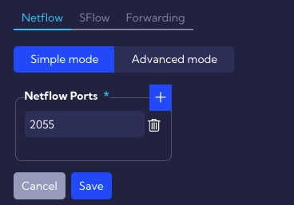
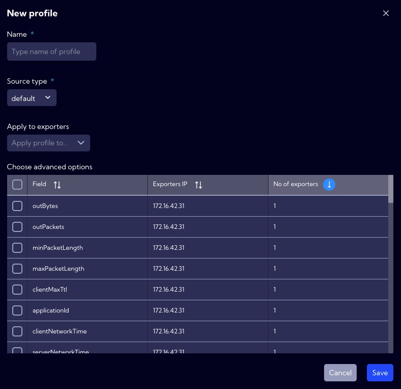

This menu [Configuration>NetFlow>**Netflow**] can be used to configure NetFlow parameters.

---

## Simple mode

In this menu, enter the port number for the NetFlow (**Netflow Port**), the default port is 2055.

---

## Advanced mode

Available when the **Show advanced options switch** is activated.

**Netflow Ports** - the default port is 2055. You can change it or add a new port by pressing the plus button.

---

### Traffic profiles

**New profile** - you can add a new Netflow profile with this button. When creating it, you have to complete the following elements:

- **Name** - profile name.

- **Source type**
  - **asa**
  - **default**
  - **nbox**
  
- **Select custom fields** - here you can select from the table custom Netflow fields.

- **Apply to exporters** - here you can assign a profile to the exporter.

  

The list of created **Profiles** is in the table with the following columns:

- **Profile** - profile name.
- **Type** - exporter type [**default**, **asa**, **nbox**].
- **Exporters IP** - exporter IP address.
- **Action**
  - Edit - edit selected **Profile**.
  - Delete - delete the selected **Profile**.

---

### Exporters IP

**Add exporter** - here you can manually add an exporter.  After clicking, a new row will be added to the table where you need to complete the **IP address** and assign Trafic profiles. 

After completing and pressing the **Save** button new exporter will be added to the System.

---

### Custom fields

---

### Custom pre aggrs

---

## Creating new profile

Profiles allow defining fields of the NetFlow protocol to be analyzed by Sycope. You can create your own profiles depending on your needs.

Create a new profile by pressing the **New profile** button then the profile creation wizard will appear.

**Name** - unique profile name.

**Source type** [**default**/**asa**] - The source from which the stream of neftlow comes - it may be characteristic and differ for a particular device. In the system, in addition to the default source, the CISCO ASA device is defined. 

**Apply to exporters** - Here we assign a profile to the selected exporters.

**Choose advanced options** - In the table we can select additional non-standard NetFlow fields that are available to the selected exporter. 

To finish creating a new profile, press the **Save** button. The new profile will appear on the list of available profiles in the system. 
