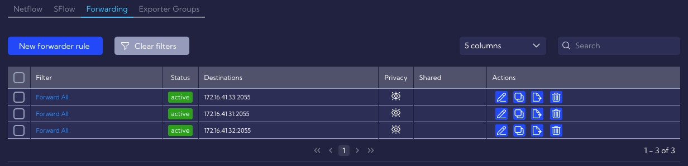
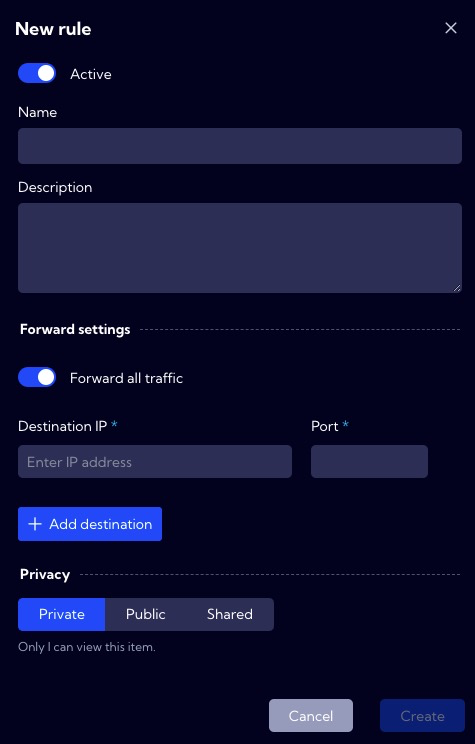
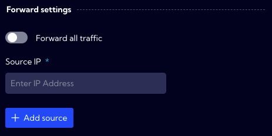

This menu [Configuration>NetFlow>**Forwarding**] can be used to configure NetFlow packets forwarding functionality.

---

The table shows the configured Exporters. The table contains the following fields:

- **Filter** - filters used in the rule
- **Status** - active/inactive - rule status 
- **Destination** - place where packets are forwarded (IP address and port)
- **Privacy** - an icon that indicates the privacy status of the rule
- **Shared** - users to whom the rule has been made accessible
- **Action**
  - **Edit** - edit an existing schedule
  - **Duplicate** - can be used as a template for a new schedule
  - **Export** - downloading the rule configuration in JSON format
  - **Delete** - delete the task

---

### Creating a new rule

To create a new forwarder rule, click on the New forwarder rule button then the wizard for creating a new rule will appear.

The wizard has the following fields/options:

- **Active/inactive** switch 
- **Name** - rule name
- **Description** - rule description

---

#### Forward settings

- **Forward all traffic** switch - when on, all traffic is redirected to the configured location. When off, the **Source IP** field appears, where you can specify the exporters' IP addresses from which data will be forwarded
  
- **Destination IP** - IP address to which data will be forwarded
- **Port** - port number to which data will be forwarded

---

#### Privacy

**Privacy** - you can grant permissions for a **forwarder rule**

- **Private** - accessible to the owner

- **Public** - visible to all, but You can grant permission:
  - **DELETE**
  - **EDIT**

- Shared - accessible to one or more selected **User roles**. Available privileges are:
  - **Delete**
  - **Edit**
  - **View**

