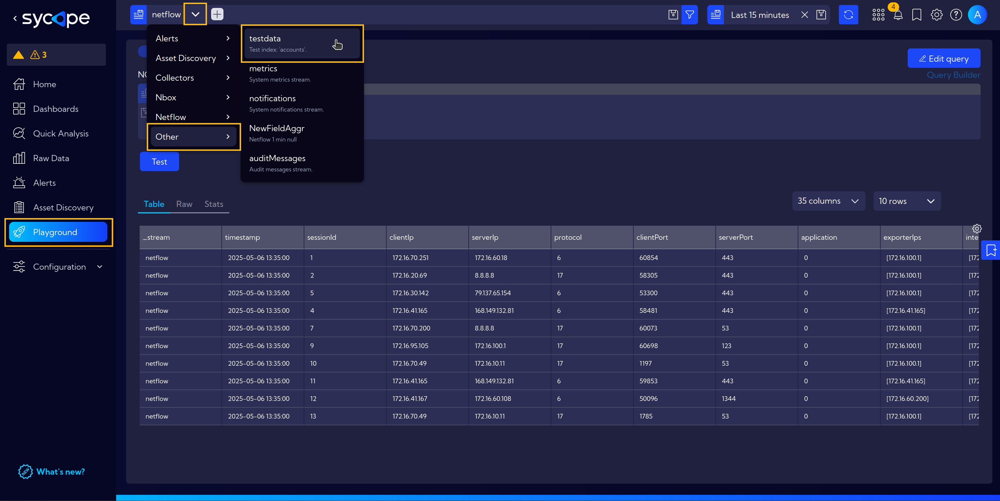
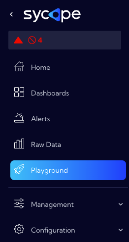
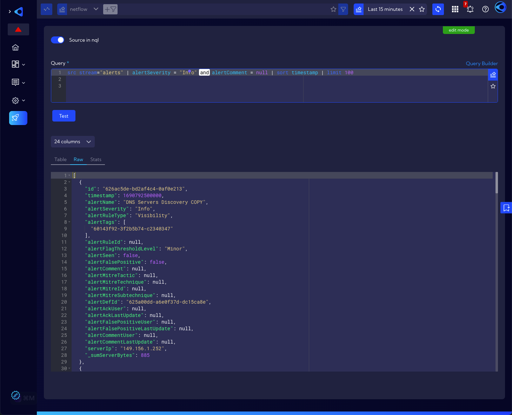

# Playground

The **Playground** functionality is used to test the **NQL** language. You can now easily test how your search bar query looks and what results it produces. 

You can either create plain NQL code from scratch or use examples from the [NQL examples](/NQL/NQL_examples) page by copying them one-to-one to the playground window and observe the result by clicking the **test** button.

For learning purposes, we have prepared a special test stream called `testdata` so that the user can more easily understand the syntax and commands of the NQL language.

The **Playground** is accessible from the **Dashboards** menu but also from the **Search Bar**.





The **Playground's** main window looks like in the image below:



#### Stats tab

In the Stats tab you will find the statistics of the query.


## Read-only mode

When launched, the **Playground** components are in read-only mode. This means that the NQL that shows up in the **Query** field is built through the **Search Bar** at the top of the window. By changing the data source with the  option or by adding more filters via the  icon they will be added to the created NQL.


To execute the NQL code, click on the `Test` button. The result will be shown in two variants: as a table (`Table`) and in JSON format (`Raw`). When selecting a table, there is an option to select the columns to be shown. It is also possible to export the table by clicking . 


## Manual mode

When you click the `Edit query` button, the playground goes into **manual mode**. The **Search Bar** field is now inactive while the contents of the `Query` field can be edited and the `Source in nql` switch is active.
In this mode, you can enter the NQL code "by hand" or copy it from the ready examples in the documentation [NQL examples](/NQL/NQL_examples) and execute it by clicking on `Test` button. 

The `Source in nql` switch in enabled mode means that the `Query` field contains the full NQL code, along with the specified source. Disabling it makes it necessary to select the data source from the drop-down menu and the NQL code itself in the `Query` field must start with another command after selecting the source (you should omit the `source` command in this case).


**<u>Example</u>**

​	NQL code with the `Source in nql` switch enabled can look like this:

​	```src stream="alerts" | alertSeverity = "High" and alertComment = null | sort timestamp | limit 100```

​	When the `Source in nql` switch is disabled and the `alerts` source is selected in the source selection field, it must look like this:

​	`alertSeverity = "High" and alertComment = null | sort timestamp | limit 100`

​	In both cases, after clicking on the `Test` button, the results should be the same.
