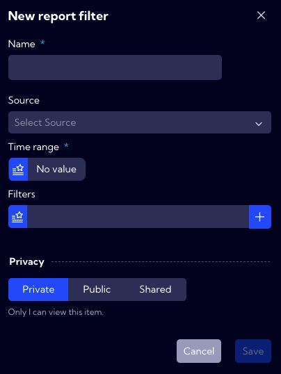

# Report Filters

This menu **[Configuration > Reports > Report filters]** can be used to create a `report filter`. These are needed to create reports; you configure here, for example, a time filter that defines the **Time range** for the generated report, but not only that.

:::info

Report scheduling can be configured in the menu **[Configuration > Reports > Report schedule]**.

:::

The list of `report filters`  is in the table with the following columns:

- **Name** - unique `report filter` name
- **Tags** - assigned tags
- **Time range** - specified time range
- **NQL** - NQL query used
- **Privacy** - privacy status
- **Shared** - share status
- **Created** - creation time
- **Creator** - creator user name
- **Action**
  - **Duplicate** -  creating an editable copy of the selected  `report filter`
  - **Edit** - editing the `report filter`
  - **Delete** - deleting the `report filter`

:::info 

The predefined **Report filters** in the system are not editable but can be duplicated and then edited.

:::

To add a new `report filter`, click the New report filter button, and the filter wizard will appear. 

In the wizard window, there are the following fields:

- **Name** - the name of the report filter in the system 
- **Source**  - data stream to be used in the filter - <u>field not required</u>
- **Time range** - time range for the report - <u>required field</u> !
- **Filters**
  - **Field** -  here select **Field** or **Metric** for the previously selected **Source**
  - **Operator** - here, choose a mathematical operator, for example, =, != , > ....
  - **Value** - here, enter the value 
  - **Query Builder** - using this option, you can create your own advanced filter using the **Query Builder** wizard

---

- **Privacy** - you can grant permissions for a **Report filter**
  - **Private** - accessible to the owner
  - **Public** - visible to all, but You can grant permission:
    - **DELETE**
    - **EDIT**
  - Shared - accessible to one or more selected **User roles**. Available privileges are:
    - **Delete**
    - **Edit**
    - **View**

