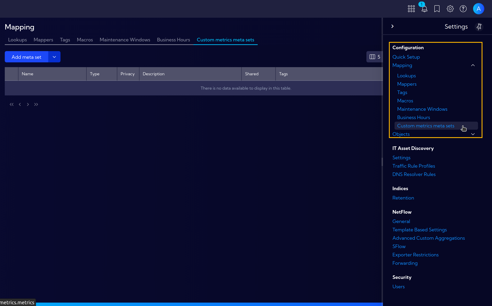

# Custom Metrics Meta Sets

Custom Metrics Meta Sets allow you to define collections of metrics within metric streams. A Meta Set groups related metrics together, enabling structured data collection and organization for specific use cases.

The menu **[Settings > Configuration > Mapping > Custom Metrics Meta Sets]** can be used to manage Meta Sets. Here you can create new Meta Sets, edit existing ones, and delete Meta Sets that are no longer needed.

:::note
Currently, Custom Metrics Meta Sets are available exclusively for the **Asset Devices** metric stream, which requires the Asset Discovery license. Support for additional metric streams is planned for future releases.
:::
