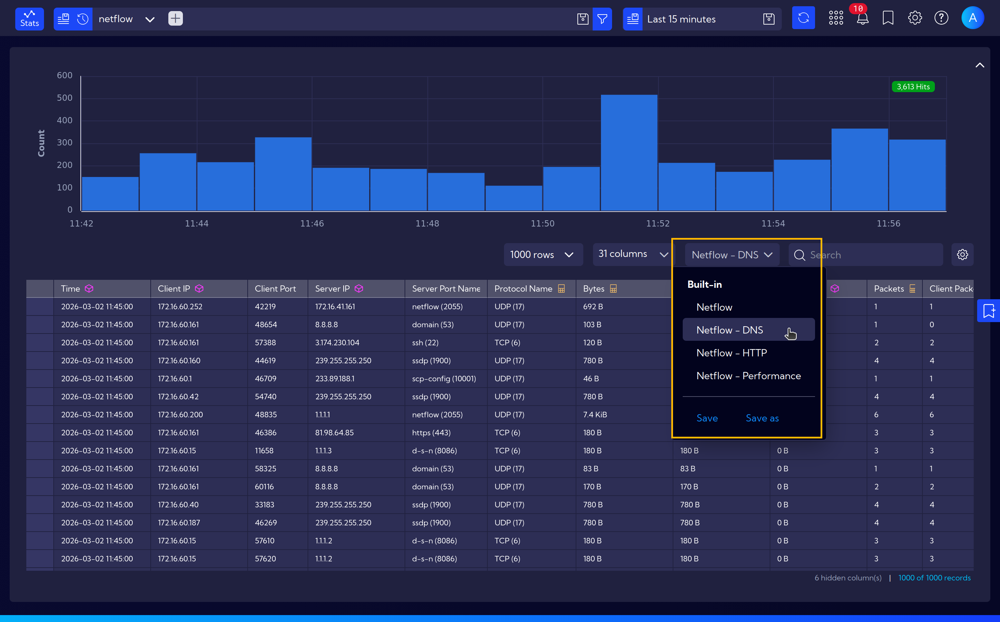
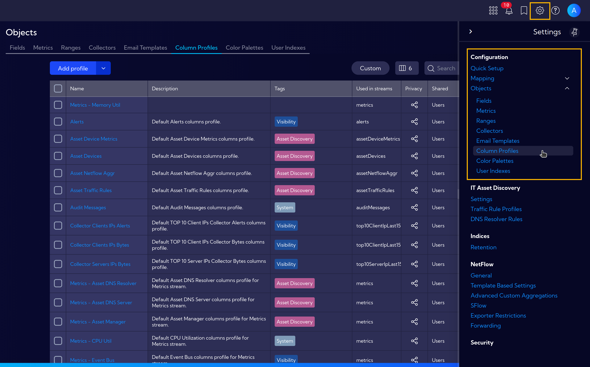
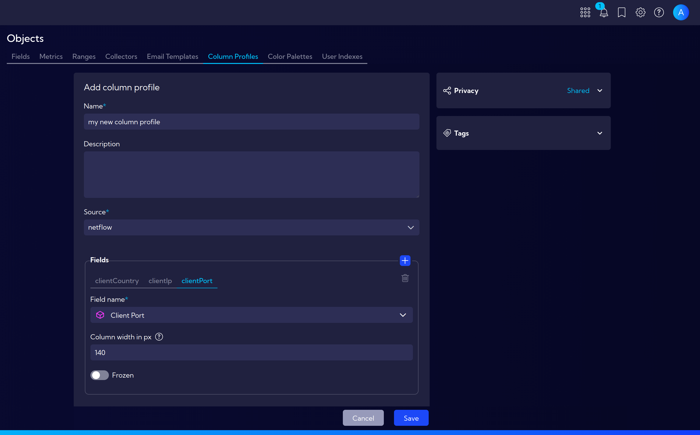

# Column Profiles

Column Profiles allow you to quickly switch between predefined sets of columns displayed in table views. 
Each profile defines a selection of columns for a specific data stream, enabling fast toggling between different views without manually selecting columns each time.

The menu **[Settings > Configuration > Objects > Column Profiles]** can be used to manage Column Profiles. Here you can create new profiles, edit existing ones, and delete profiles that are no longer needed.

## Creating a New Column Profile

To create a new Column Profile, click the **Add profile** button. The profile creation wizard will appear with the following fields:

- **Name** - a unique name for the new profile
- **Source** - the data stream to which the profile applies
- **Fields** - select the fields (columns) to be visible when the profile is active

After completing the configuration, click **Save**. The new profile will be available for selection in the stream table view.

