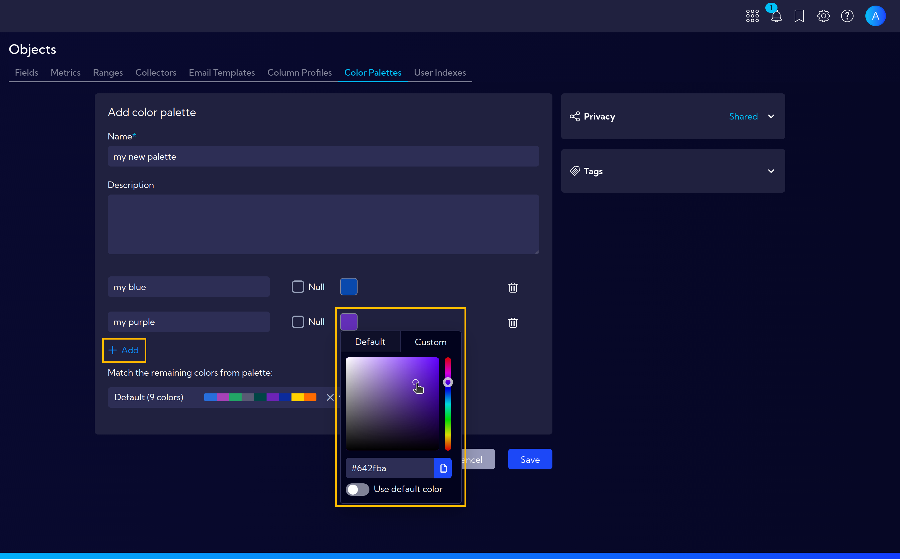
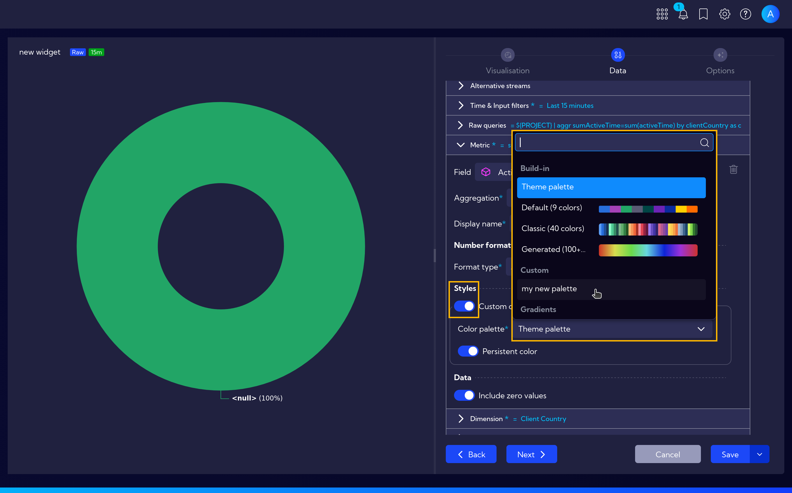

# Color Palettes

Color Palettes are sets of colors used across widgets for data visualization. They define how series, categories, and values are visually distinguished in charts, graphs, and other widget types. The system includes several predefined palettes ready to use, but you can also create custom palettes tailored to your needs.

The menu **[Settings > Configuration > Objects > Color Palettes]** can be used to manage Color Palettes. Here you can create new palettes, edit existing ones, and delete palettes that are no longer needed.

## Creating a New Color Palette

To create a new Color Palette, click the **Add color palette** button. The palette creation wizard will appear with the following fields:

- **Name** - a unique name for the new palette
- **Description** - an optional description of the palette

Below, you can define individual colors in the palette. Click **+Add** to add a new color entry with the following options:

- **Color name** - a label for the color
- **Color value** - choose a color from the **Default** presets or define a **Custom** value

After completing the configuration, click **Save**. The new palette will be available when creating or editing widgets - in the metric style settings, you can select your custom color palette for data visualization.

