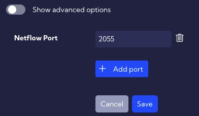

# General

This menu **[Settings > NetFlow > General]** can be used to configure NetFlow parameters.

---

## Netflow ports

In this menu, enter the port number for the NetFlow (**Netflow Port**), the default port is 2055.

## Netflow deduplication

Netflow deduplication On/Off switch.

