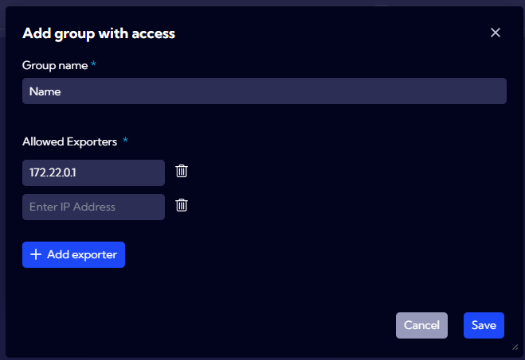

# Exporter Restrictions

This menu **[Settings > NetFlow > Exporter Restrictions]** can be used to configure NetFlow Exporter Restriction group functionality.

:::info

This functionality is available for licenses with the `AdvancedFeatures` function activated in the `Netflow` module.

:::

:::danger

After enabling the <u>**Restricted**</u> option, it is firmly not recommended to reconfigure this system's functionality and check the <u>**All**</u> option.

:::

The aim of the **Exporter Restrictions** configuration is to create groups restricting data download from streams to other data from specific sources.

## Parameters:

**Unrestricted** - the activation of this setting will prevent the **Exporter Restrictions** mechanism from working. It will not be taken into consideration by the processes in the Sycope system.

**Restricted** - the activation of this setting will make the Sycope system restrict access only to the data from sources within the assigned groups during processing of the data from the stream.

**Add group with access** - after choosing **Restricted**, a button allowing for defining a group will appear. After clicking the button, the group name and the list of data sources assigned to this group must be provided.

Groups created in this manner can be used while editing the User role in the "Data restrictions" section.

## Configuration of restricted acces to exporter groups

Using the restricted acces to exporter groups causes an automatic filter to be applied for the data received from the streams in which objects have an `exporterIps` field. 

To activate the functionality, click `Restricted` in the `Acces to exporter group section` .

:::caution

The activation of the **Restricted** option and using groups in User roles may cause a decrease of efficiency of the Sycope system. All processes within the Sycope system downloading data from a given stream, e.g. those counting aggregations, will monitor and filter the data from the source while taking into consideration the group assigned to the User.

:::

A group includes a list of IP addresses and such a group is assigned to a Role. Then, if the Role is assigned to a user, each query, calculation, aggregation or enumeration of the preAggregation done by the user on the stream data will include filtering by the `exporterIps` field. 
If a given stream does not have the `exporterIps` field, the data from that stream is not filtered. The filtering is processed during the reading of data from the streams.

If a preAggregation is being processed, it will add the value of the `exporterIps` field to the aggregated data.
If there are several defined groups, separate preAggregations are calculated for each group.
If the stream does not have the `exporterIps` field, all data is included in the aggregation.

