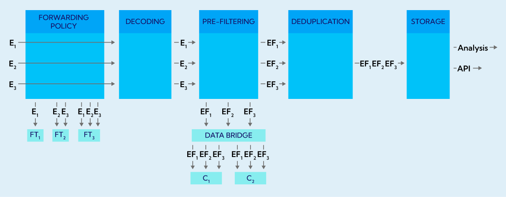
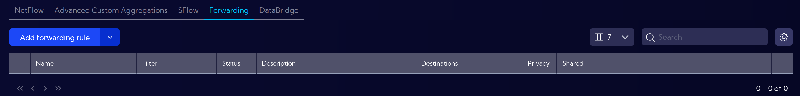
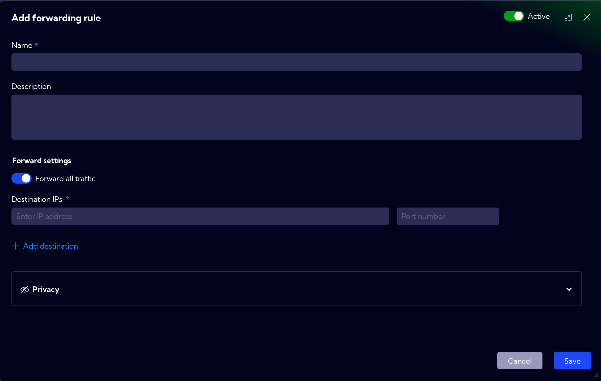
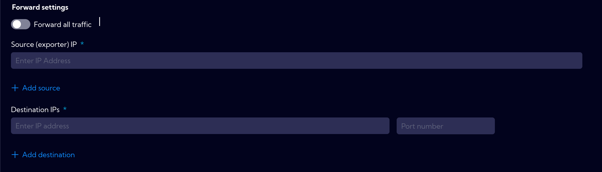
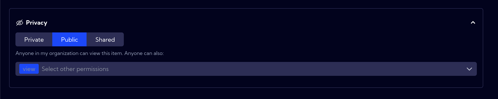

# Forwarding

## Overview

Sycope enables both forwarding and filtering of information that gets to the instance in several different ways, each with different capabilities and limitations.

Every Sycope instance, regardless of its license, allows low-level packet forwarding. This mechanism works at the socket level and takes place before packet decoding begins. This makes it possible to forward packets, even when the number of flows per second is high, without overloading the CPU and negatively affecting Sycope's performance. At the same time, the packet-level operation means that we can only control what IP address the packet came from (which exporter is the sender of the packet) and, based on that, decide where the packet should be forwarded to.

In the diagram below we see an example where packets containgin flow information from three exporters (E1, E2 and E3) are getting into the instance. The forwarding policy configuration triggers packet forwarding to three destinations – forwarding targets (FT1, FT2 and FT3). The configuration determines from which sources data should go to which destination. In this case, only packets originating from exporter E1 will be forwarded to FT1. To FT2, data coming from E2 and E3, and to FT3, data coming from all three exporters. This is only an example configuration in practice any combinations is possible (e.g. all data can be redirected to all targets).

:::info Technical note:
Forwarding works only with UDP protocol. Additionally the values of the source IP values in are spoofed we put values of original exporter instead of the IP of Sycope instance that received the packet. Spoof packets can be rejected in your network without additional configuration.
:::

The forwarding policy process does not in any way affect what information will go to a given Sycope instance. Regardless of what is set in the Forwarding policy configuration, all data that goes to the instance will be processed by Sycope. In the first step the packets will be decoded and interpreted as flows. After the decoding stage, we have full information about the contents of the flow information, along with the ability to use all its fields. Decoding thus enables a detailed and highly configurable pre-filtering process.

As part of pre-filtering, we can specify what information is to be rejected at this stage. Rejection of information at this stage is irreversible. Information rejected at this point will not be visible later in the system. At the same time, we would like to remind you that the forwarding process takes place earlier and pre-filtering does not affect in any way what data will be forwarderd to FT1, FT2 and FT3 according to policy.

Thanks to the fact that the pre-filtering process takes place after decoding flows, we can create almost any rules about what information is to be rejected. Here are some examples of rejection criteria:
* Traffic that goes out from IP address 192.168.1.1.
* Traffic that comes to IP address 192.168.1.1 on port 8080.
* Traffic between IP addresses 192.168.1.1 and 192.168.0.1.
* Traffic that is received on a port higher than 1024.
* Flows, which report the transmission of fewer bytes than 16.

Pre-filtering works on all data from each exporter. After pre-filtering policies are applied, the flows from each exporter are reduced according to specified rules and so the complete traffic from E1 is reduced to EF1 and similarly for the other exporters. The flows filtered in this way then go to the instance for the deduplication process, which allows information from different exporters with the same traffic to be combined and stored in the database. This data is then available for analysis in Sycope or to be obtained via API.

If a special forwarder-only license is purchased, it is also possible to continue forwarding information after pre-filtering to another Sycope instance. This license is highly useful in a situation where a huge number of flows are generated in the company's network, so large that processing and storing them on a single instance would not be possible.

The combination of two Sycope instances, one in forwarder-only mode and the other with typical Visibility Performance and Security licenses, will make it possible to spread the load over two machines. In such an arrangement, first all traffic is routed to the first instance running in Forwarder Only mode, which accepts the traffic, decodes and pre-filters it. It then forwards the already decoded and filtered flows via a special Data Bridge mode to the second Sycope instance. In this way, the first machine is charged with decoding and filtering, and the second analytical Sycope instance does not have to use the computing power for decoding, and additionally receives a smaller number of flows, only those that are the target of analysis.

## Setup

This menu **[Settings > NetFlow > Forwarding > Forwarding Policy]** can be used to configure NetFlow packets forwarding functionality. Here, you can set which traffic will be forwarded to specific machines.

The table shows the configured Exporters. The table contains the following fields:

- **Filter** - filters used in the rule
- **Status** - active/inactive - rule status 
- **Description** - rule description
- **Destinations** - place where packets are forwarded (IP address and port)
- **Privacy** - an icon that indicates the privacy status of the rule
- **Shared** - users to whom the rule has been made accessible

### Creating a new rule

To create a new forwarder rule, click on the `Add forwarding rule` button then the wizard for creating a new rule will appear.

The wizard has the following fields/options:

- **Active/inactive** switch in top-right corner

- **Name** - rule name

- **Description** - rule description

- **Forward settings**

  - **Forward all traffic** switch - when on, all traffic is redirected to the configured location.  
  When off, the **Source (exporter) IP** field appears, where you can specify the exporters' IP addresses from which data will be forwarded
  - **Destination IPs** - IP address to which data will be forwarded
  - **Port number** - to which data will be forwarded

- **Privacy** - you can grant permissions for a **forwarder rule**

  - **Private** - accessible to the owner

  - **Public** - visible to all, but You can grant permission:
    - **delete**
    - **edit**
    - **grant permissions**

  - **Shared** - accessible to one or more selected **User roles** with `+ Add permission` button.

### Pre-Filtering  

At the Pre-Filtering stage, the decoded data is filtered based on the filters set in **[Settings > NetFlow > Forwarding > Netflow pre-filtering policy]**.  

The filtered traffic can be forwarded to recipients, called ***Collectors***, configured in **[Settings > NetFlow > Forwarding > Collectors]**.  

:::note
Only packets that meet the requirements of the set filters will be forwarded. If no filters are set, all traffic is forwarded.
:::