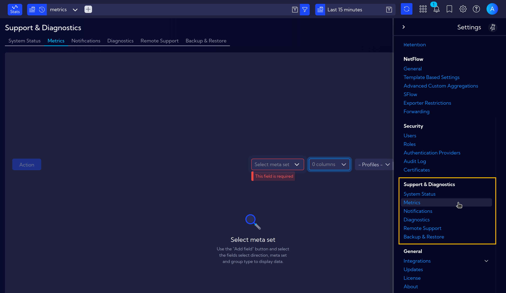
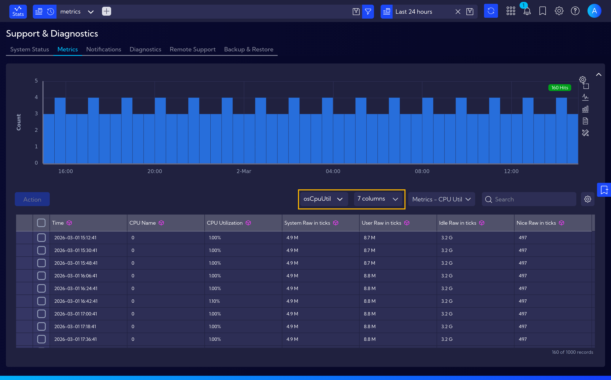

# Metrics

The menu **[Settings > Support and Diagnostics > Metrics]** provides an overview of internal system metrics, allowing you to monitor the health and performance of individual system components.

Available metrics cover various areas of the system, such as **osDiskUtil** (disk utilization), **osCpuUtil** (CPU utilization), **netflowFilter** (NetFlow filter statistics) and many others.

To browse metrics, use the **Select Meta Set** dropdown to choose a specific group of metrics. You can also customize column visibility for a clearer view of the presented information.

