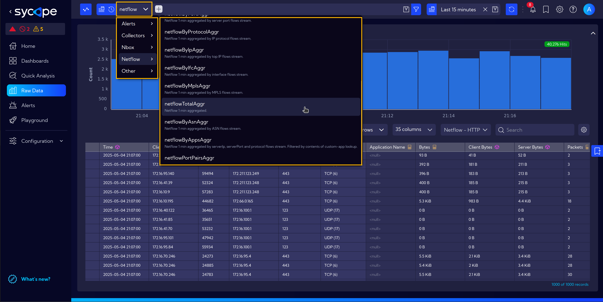
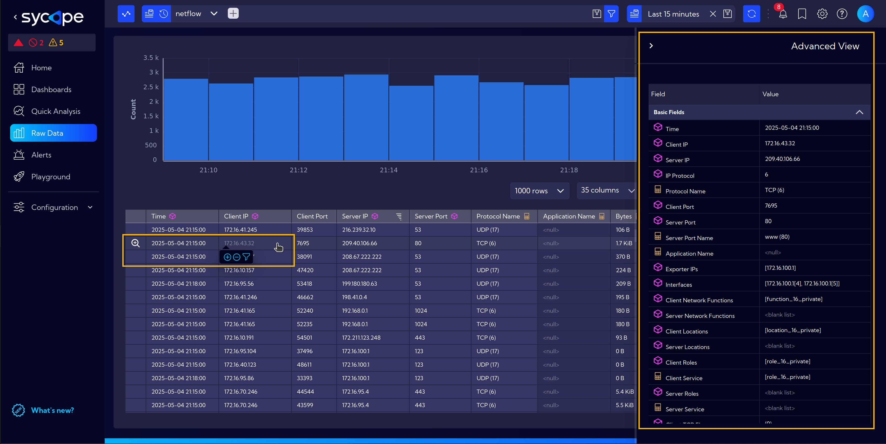
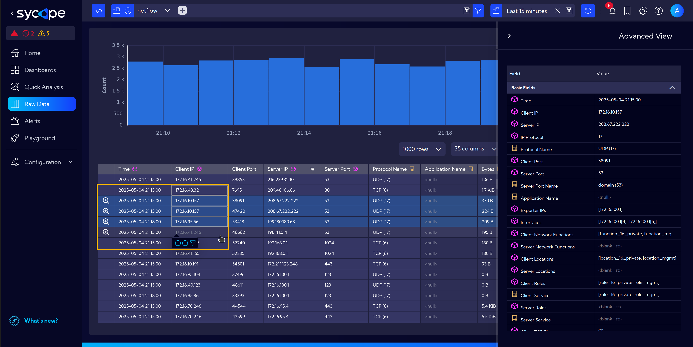

# User Interface

Detailed description.

## Main window

After logging into the system the **Main window** will have the following [Home](/User-Guide/Home) view:

In the home view you can add any **Dashboard** that is in the system by clicking the home icon in the **[Dashboards]** menu and will be shown when the system is started.

## Menus

In the GUI interface of the Sycope system we can distinguish two areas:

- **Top menu** - on the top
- **Main menu** - on the left 

### Top Menu

At the top of the screen you can see the search bar along with a set of icons. The functionalities assigned to the icons starting from the left are as follows.

#### Statistics

This menu provides the statistics for the selected data stream. Using this menu, you can quickly evaluate the values appearing in the data stream and select those that are relevant to you. The data here is limited to 10,000 records.

For each source, the `Basic fields` panel shows the aggregated data regarding the value of each individual field.

| Field    | Description                               |
| -------- | ----------------------------------------- |
| Count    | Number of all values of a given field.    |
| Distinct | Number of unique values of a given field. |

After expanding a given field, a summary of ten fields with the largest number of values will be shown. For example, regarding the data shown in the above image, for the "Server IP" there is 10,000 values, including 739 unique ones, and e.g. for IP of "8.8.8.8", the number of values is 2237.

Then, below the `Basic fields` panel, the next panels will show the statistics of values for specific fields in the given source. For example, for the `Netflow` source it will be `Measures` and `Ohter`.

#### Search Bar

The **Search bar** is one of the key components of the Sycope system. By using it, you can build filters or queries, both in a simple way using graphical components, as well as using the **NQL** language commands (advanced mode).

**History** icon opens a window displaying a list of recently performed operations in the Sycope System.

From here, it is possible to copy a previously used query (available in the **Query** column) or jump directly to the corresponding view by clicking the shortcut icon in the **Go to** column.

In the **Filter menu** you can choose how the search bar works: in simple mode or advanced mode. In addition, there is access to the **Playground** functionality in which you can test the operation of the **NQL** code.

To create a filter from scratch, simply click on the  icon or select **Add filter** from the **Filter menu** (figure above). A creator will appear with fields to fill in.

Another way of creating a filter is to click on the value selected in the Viewport, for example, at a specific country name.

A wizard window will appear with fields filled in by the System which, of course, can be modified. After approval, the filter in the form of a tile will appear in the search bar.

By clicking on the filter tile, you can modify the filtered values, for example, by adding more country names.

The next step in building filters that the search bar allows you to do is to add another value (in the form of a tile) and use one of the "and" or "or" logical operators.

You can also modify individual filter elements by clicking on the corresponding element.

<!-- Custom filters can be saved to favorite filters by clicking on the  icon in the search bar. The list of favorite filters is available by clicking on the  icon. -->

---

#### Time ranges

It is one of the most important menus in the system. Here you define the time range for which the data is analyzed. The values you set here affect the Dashboards, Widgets, filters and queries.

When you click on the bar, the configuration window will appear.

You can select a time interval for absolute as well as relative values. The most commonly used time intervals are also placed here. For relative time values, you can set an automatic refresh time or do it manually by clicking on the **Refresh button**. You can save the configured **Time ranges** you use frequently to favorites. To delete/clear the time range field simply click on the  icon.

---

#### Quick access menu

This menu gives you quick access to your favorite Dashboards and Dashboard groups, as well as to Bookmarks.

---

#### Notifications

This menu contains all the notifications generated by the system. For your convenience they are colored according to their importance. 

After clicking on a notification, detailed information about it will be displayed.

---

#### User Options

The last icon in the top bar is the user options menu icon with options for the logged-in user, in this case the user is the Administrator.

The **Profile Menu** allows you to change the system password. 

The **Personal Settings** allow you to personalize selected system parameters.

Logout is used to log out of the system.

---

### Main Menu

The **Main menu** is located in the left sidebar. This sidebar can be rolled up or expanded by pressing the **<** or **>** symbol in the upper left corner, next to the Sycope logo.

Starting from the top, the left sidebar contains:

- The icon area with system notifications

- Main menu with a sub-menu

- The "Whats new?" menu with a description of key changes for the current version of the System

The main menu consists of the following submenus and tabs:

- [**Home**](/User-Guide/Home)
- [**Dashboard**](/User-Guide/Dashboards)
- [**Quick Analysis**](/User-Guide/Quick-Analysis)
- [**Raw Data**](/User-Guide/Raw-Data)
- [**Alerts**](/User-Guide/Alerts)
- [**Asset Discovery**](/User-Guide/Asset-Discovery)
- [**Playground**](/User-Guide/Playground)
  
- [**Configuration**](/User-Guide/Configuration)
  - [**Widgets**](/User-Guide/Configuration/Widgets)
  - [**Rules**](/User-Guide/Configuration/Rules)
  - [**Shortcuts**](/User-Guide/Configuration/Shortcuts)
  - [**Filters**](/User-Guide/Configuration/Filters)
  - [**Reports**](/User-Guide/Configuration/Reports)

---

##  Raw Data Menu - UI Description

The **`Raw Data`** menu contains **Data streams** in table and chart form.

The **Graph** shows the NetFlow count for each minute.

The **Table** in the columns contains fields that are available in the selected **Data Stream** which is selected from the drop-down menu. 

Please note that only 1000 records are displayed in the Table.

You can change the fields to be displayed in the table by clicking on the "columns" drop-down menu and selecting or deselecting the fields you are interested in.

### Raw Data Advanced View

To see more detailed information for the selected **Data stream**, the **Advanced View** option is built in. To open the **Advanced View**, click the magnifying glass icon in the first column of the **Table** and the Flyout with **Advanced information** will appear on the right.          

You can add more rows to the **Advanced view** by pressing the **Control key** and clicking on the row you want to add.

### Search Bar

The search bar and its associated icons in the top menu have the same functions as for Dashboards and widgets and are described at the beginning of this document.

#### Advanced Mode

After switching to advanced search bar mode, you can build filters based on NQL language commands.

The Sycope system offers a mechanism of extended sub-tellings to facilitate the creation of filters in the NQL language. An example of creating a filter using this method is shown in the figures below.

Frequently used filters can be added to favorites.

A list of favorite filters is available at the beginning of the search bar.

The list of favorite filters can be edited in the menu **[Configuration > Filters]**.

### Graph

In the example, the **Graph** shows the number of flows per time unit. In the **Sycope** system, the smallest granularity is 1 min.

On the right side of the **Graph** there are five buttons for formatting it.

Starting from the top, these are:

- **Zoom** - is used to select the area to zoom in on the graph.
- **Switch to Line Chart** - is used to change the graph from bars to line
- **Switch to Bar Chart** - is used to change the graph from line to bars 
- **Data View** - is used to switch to text form which shows the numerical values on which the graph was based, that is the timestamp values and their corresponding Counts
- **Toggle Scale (Linear/Logarithmic)** - changes the scale from linear to logarithmic and vice versa

