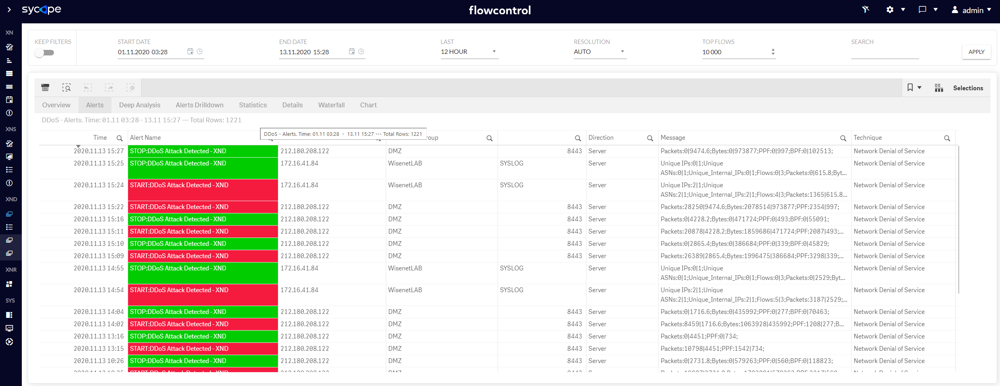
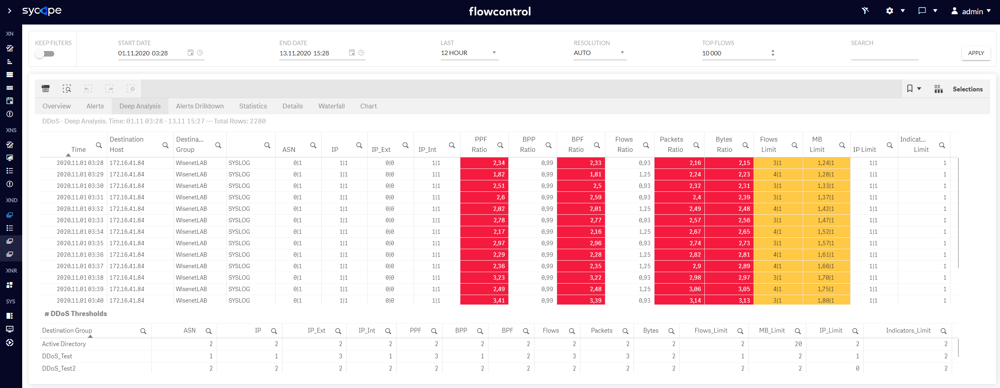
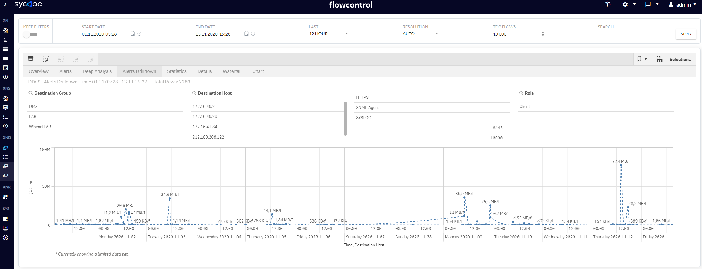
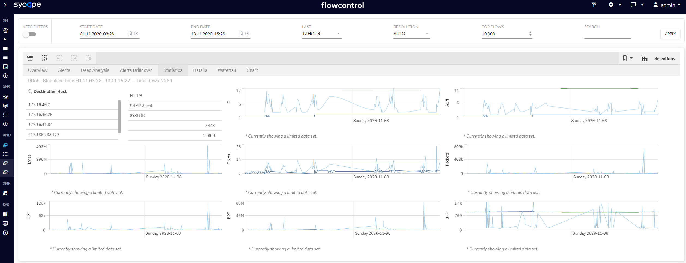
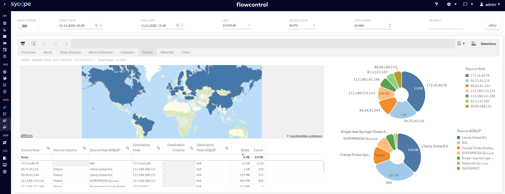

Below you find dashboards to help you analyze DDoS attacks

| Dashboard  Name  | Description                                                  |
| ---------------- | ------------------------------------------------------------ |
| Overview         | Visualization of general statistics on DDoS attacks.         |
| Alerts           | Table of DDoS start and end alerts.  START: DDoS Attack Detected – XND – launch of the attack.  STOP: DDoS Attack Detected – XND – end of the attack. |
| Deep  Analysis   | Table of the DDoS parameters from every minute of the attack. Exceeded threshold parameters are highlighted in red. In the lower part of the view there is an auxiliary table with threshold configurations per Group, to make it easier to monitor the causes of generated alerts. |
| Alerts Drilldown | Trends monitoring of DDoS attacks in the context of monitored DDoS parameters from each minute of the attack in the form of a graph on which you can select the DDoS attack parameter. |
| Statistics       | Trends monitoring of DDoS attacks in the context of monitored DDoS parameters from each minute in the form of a series of graphs, which facilitate the analysis of DDoS attacks. |
| Details          | Details information on DDoS attacks i.e. source IP address, destination IP address, geographical location. |

*Table 5.1* *DDoS dashboards list*

*Fig. 5.1 DDoS Overview*

*Fig. 5.2 DDoS Alerts*

*Fig. 5.3 DDoS Deep Analysis* 

*Fig. 5.4 DDoS Alerts Drilldown*

*Fig. 5.5 DDoS Statistics* 

*Fig. 5.6 DDoS Details*
