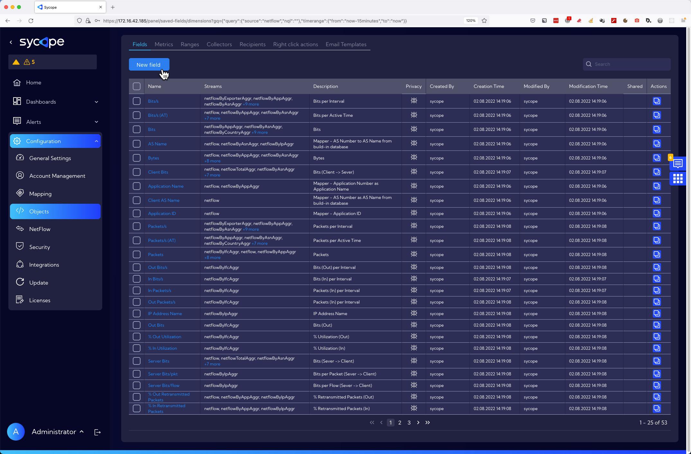
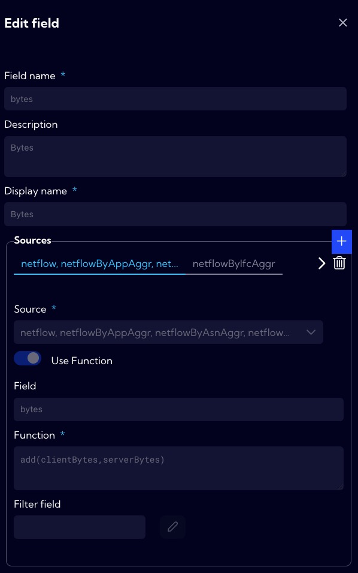
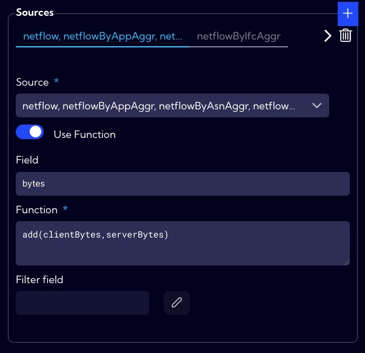
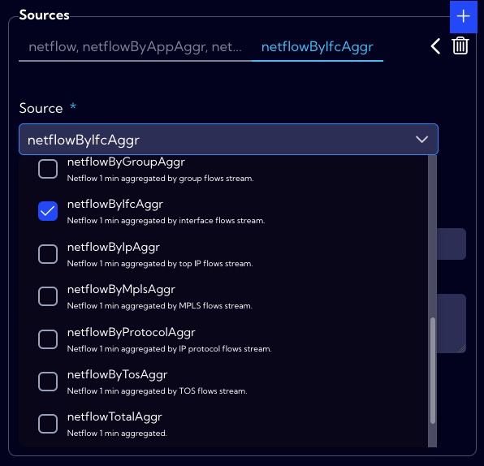
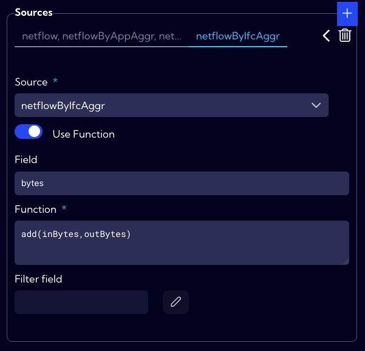

# Example of field creation - bytes field

Creating a **new field** is nothing more than mathematical operations on one or more fields in a single row of the database and saving the result under the new field name.

In the system we have fields **clientBytes** (number of bytes sent as client) and **serverBytes** (number of bytes sent as server). We need a field that is the sum of these two fields to know, for example, which IP address had the highest volume of traffic in total, i.e. as a client and/or as a server. To do this, we will create a new **bytes** field (Dispaly Name: **Bytes**), which will be the sum of the **clientBytes** and **serverBytes** fields.

## Implementation

To create a **new field**, go to [**Configuration->Objects->Fields**] menu and click **New Fields** button.

The wizard for creating a new field appears.

1. In the **Field name**, we enter the database name (NQL) of the new field. In the system it is assumed that such names are typed with a lowercase letter, and if the name consists of two or more words, the successive words are typed without a space, starting each word with a capital letter for example **ipAddressName**. In our example, the field name is **bytes**.
2. In the **Display name**, we enter the name under which the new field will be visible in the system. In our example, the field name is **Bytes**.

3. As mentioned earlier, two other fields are needed to create the **bytes** field. These are fields: **clientBytes** i **serverBytes** for data streams: **netflow,  netflowByAppAggr,  netflowByAsnAggr netflowByCountryAggr,  netflowByGroupAggr,  netflowByIpAggr,  netflowByMplsAggr,  netflowByProtocolAggr,  netflowByTosAggr,  netflowTotalAggr**. 
  
  
   
   
   The bytes field is supposed to be the result of adding the values of two fields, so the function that implements this action has the form:`add(clientBytes,serverBytes)`
   
   
   
   However, for the **netflowByIfcAggr** stream these are the fields: **inBytes** and **outBytes**.
   
   

   Corresponding to the fields, the function is of the form:`add(inBytes,outBytes)`.
   
   
   
4. In the **Number formatting section**, we specify how to format the data in our new field. 
  
   
   
5. In the **Privacy** section, you can set permissions for the created item. If you want it to be visible to all users, you should set the **Public** option.
  
   
