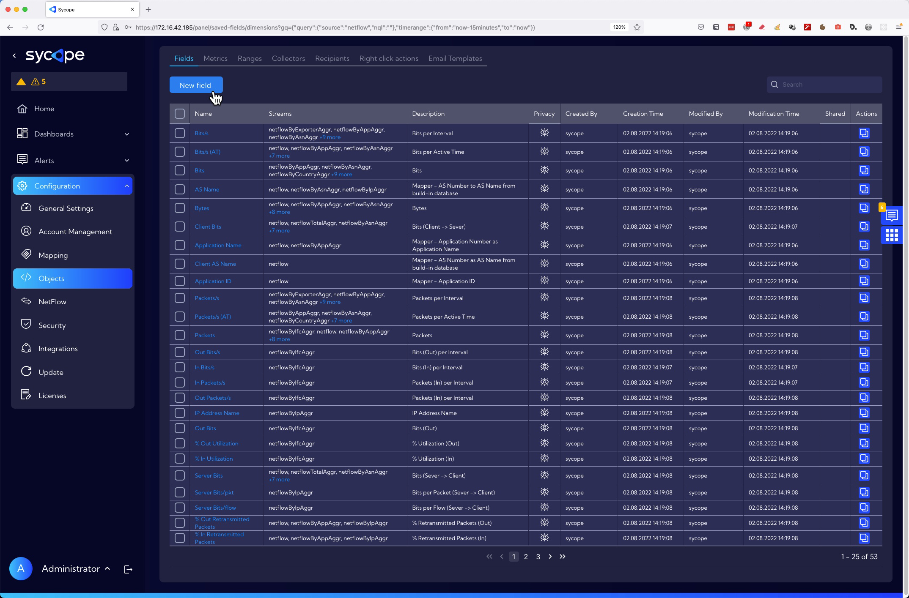
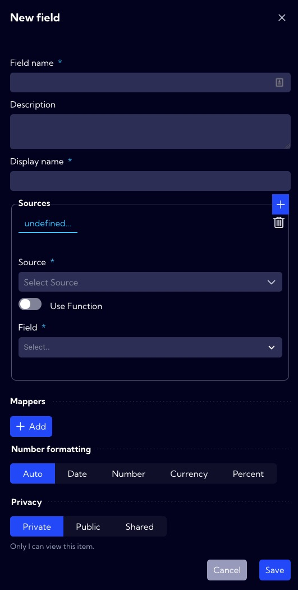
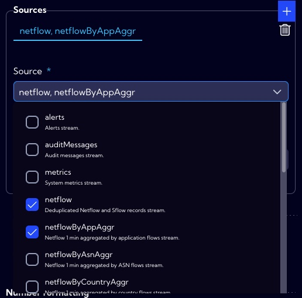
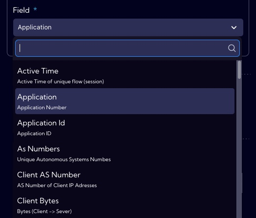
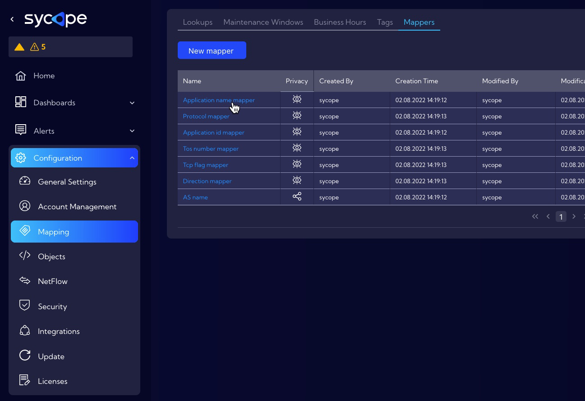

# Example of advanced field creation - use of mapper - Application Name

Creating a **new field** is nothing more than mathematical operations on one or more fields in a single row of the database and saving the result under the new field name.

As an example, we will create a new field **Application Name** that will store the application name, using the **Application name mapper** and the **Application** field that stores the application number.

## Implementation

To create a **new field**, go to [Configuration->Objects->**Fields**] menu and click **New Fields** button.

The wizard for creating a new field appears.

1. In the **Field name**, we enter the database name (NQL) of the new field. In the system it is assumed that such names are typed with a lowercase letter, and if the name consists of two or more words, the successive words are typed without a space, starting each word with a capital letter for example **ipAddressName**. In our example, in the field name we use mapper name so it takes the form **applicationName**.
   
   
   
2. In the **Display name**, we enter the name under which the new field will be visible in the system. In our example, the field name is **Application Name**.
   
   
   
3. The source for our new field is the **Application** field with the application number so we need to select the data stream in which this field exists.
   
    
   

   Of course, we must also select the field **Aplication**.
   
   
   
4. In the **Mappers** field, we select the mapper for which the value of the **Application** field should be the source. In our case it is the **Application name mapper**.
   
   
   
   We can find this mapper in the [Configuration->Mapping->**Mappers**] menu.
   
   
5. In the **Number formatting section**, we specify how to format the data in our new field.
   

6. In the **Privacy** section, you can set permissions for the created item. If you want it to be visible to all users, you should set the Public option.
   
   
   
7. If all the necessary fields of the form have been correctly completed press **Save** button to save the created object.
