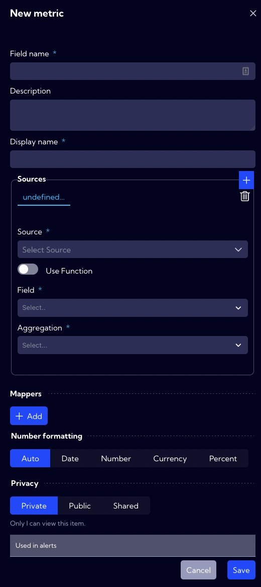

# Example of Metric creation - simple metric

A **Metric** is a function that aggregates a given field and is used in **Widgets** and **Alerts**. Defining **Metrics** makes our work easier we can use them multiple times in different places in the system, for example, when creating a **Dashboard** composed of several **Widgets** that use the same **Metric**. Then, instead of creating the same **Metric** several times, you define the **Metric** once in metrics menu and just select it in **Widgets** without having to create and format it again. 

As an example, we will configure a simple **Metric** that sums per client bytes without using the **Use Function** option.

## Implementation

To create a **new metric**, go to [**Configuration->Objects->Metrics**] menu and click **New metric** button.

The wizard for creating a new metric appears.

1. In the **Field name**, we enter the database name (NQL) of the new metric. The system adopts the following rules for creating names for metrics: we start the name of the metric with "_" then write the name of the aggregation and the name of the field. Thus, in our example, it will be _sumClientBytes.
   
   
   
2. In the **Display name**, we enter the name under which the new field will be visible in the system. In our example, the field name is **Sum Client Bytes**.

   

3. In the **Sources section**, we indicate in the **Source field** the stream or streams of data where there is a field that the metric will use.
   
   
   
   
   
4. Select the **Field** - in our example **Client Bytes**.
   
   
   
5. Choose **Aggregation** - in our example, **Sum**. 

  

6. In the **Number formatting section**, we specify how to format the data in our new field. 
   
   
   
5. In the Privacy section, you can set permissions for the created item. If you want it to be visible to all users, you should set the Public option.
   
   
6. If all the necessary fields of the form have been correctly completed press **Save** button to save the created object.
