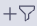
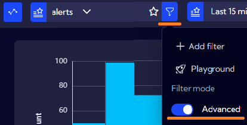
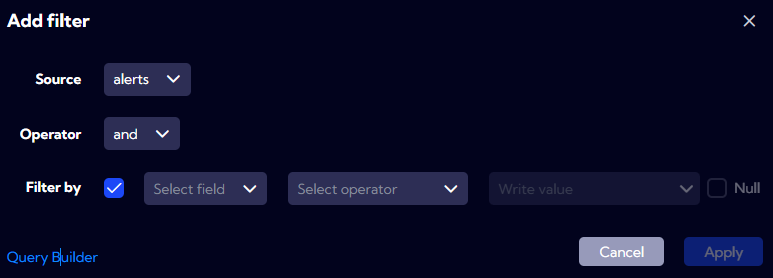
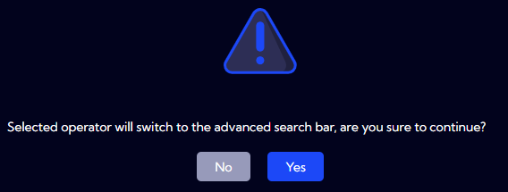
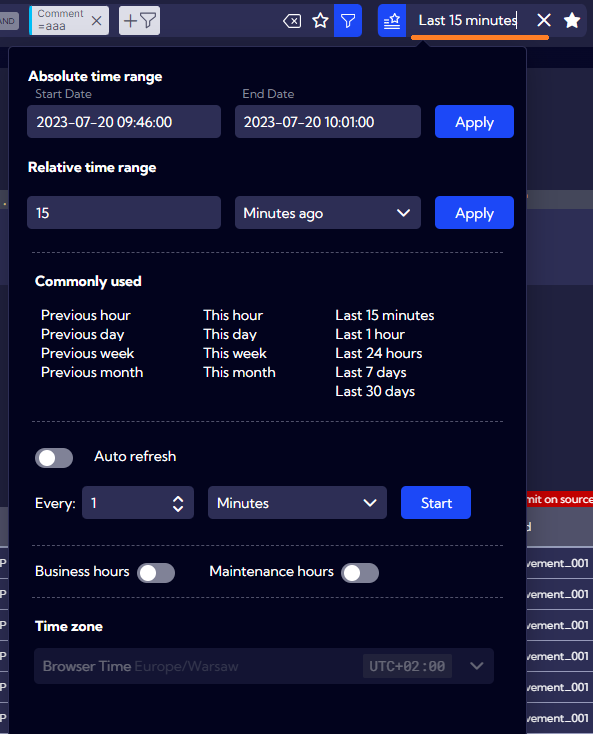

# Search bar

The main purpose of the search bar field is to create a filter for data originating from a selected source.


The search bar is available in each view of the Sycope application that presents data, for example, in the "Dashboard", "Playground", "Raw Data", and so on.

The filter of the search bar filters the data displayed in the view elements (graphs, tables). Even if you switch to different views, the search bar keeps the defined filter.


## Creating a filter

After selecting the data source from the "combobox" field


you can move on to creating/filling in the NQL phrase defining your data filter.

You have two options to choose from:

- Creating a filtering expression using a wizard, with the  button 
  
- Entering the filtering expression "by hand" by selecting the "Advanced" option


### Wizard

By using the wizard, you can create the filtering expression in a window with check boxes instead of entering the expression by yourself. Each time you click the  button, you add a single element of the filtering expression separated from other given operators. In this way, you can generate only the part of the NQL that constitutes the "where" filtering command.




| Field | Description                       |
| --------- | ----------------------------------------- |
| Source    | Data source. |
| Operator  | The operator separating the created element from the one already created in the filtering expression. |
| Filter by | Element of the filtering expression. |
| Filter by - Select field    | Selection of the field from the source object which you want to use to filter data. |
| Filter by - Select operator | Selection of the operator or the function which you want to apply to the selected field. |
| Filter by - Write value     | Filter value. |
| Filter by - Null            | Should be checked if you want the value to be null. |

Depending on the selected field, you can either enter the values "by hand" in the "Write value" field or select them from a list of values available for that field. In some cases, after selecting the field and the appropriate operator or function, the value field will turn into a list of available options for that combination of field and operator. For example: 


After clicking on the `Query Builder` button you can also access an advanced filter creation option.

After building the filter, the filtering expression in the search bar will be shown in the form of "tiles", for example:


In order to see the "real" NQL syntax, please activate the `Advanced` option.

If the created filter becomes so complex that it is not possible to present it in the form of "tiles", then during the saving of the filter (the `Apply` button) the following message will be displayed:



After confirming, the search bar will be switched into `Advanced` mode. This happens usually after selecting an advanced function instead of an operator in the `Select operator` field.

If you need to see in detail what type of NQL is being generated under the "tiles" of the filter, you can switch to the "Playground" view ( button -> Playground).

Here, with the `Edit query` option disabled, you can simultaneously see the filtering expression in the search bar in the form of "tiles", as well as the corresponding NQL expression in the `Query` field.

---

### Advanced mode

In case of selecting the Advanced mode, in the text field of the search bar you can enter any `where` filtering expression of the NQL language. You can also enter any available NQL command, not only the filtering one, for example: `project`, `limit`, `sort`, and so on.

In general, the search bar accepts any type of NQL, under the condition that as a result of its execution, data is returned. Therefore, it can be any, however complex, type of NQL, for example:

```
src stream="alerts" 
 | valInColl(clientIp, "top10ClientIpLast15Minute_Alerts", "clientIp") 
 | splitAggr countAlertName0=count(alertName) 
             (timeAggr on timestamp interval="1m" dir="desc" bucketAlias="srcEventTimestamp"), 
             (aggr by clientIp as clientIp unwind=true maxBuckets=20) unwind=true 
 | sort countAlertName0 desc 
 | limit 480
```

Provided that the NQL returns data, there is no limitation to its size or structure.

The complete NQL code starts with providing the data source, for example: `src stream="testdata"`, as presented in the example below.

`src stream="testdata" | where country="DE" and dep="HR" | project +fName, +lName | sort fName`

An element of the search bar field is a field of data source selection from a drop-down list. That is why after making the selection, you only need to enter the remaining part of the NQL expression from the example in the text field, that is:

`where country="DE" and dep="HR" | project +fName, +lName | sort fName`

It does not need to be exclusively an NQL filter but also other available commands and functions can be used.

While creating an expression in the search bar with the use of the "Filter Menu" or "Select Filters" wizards (icons `+/` in the text field, on the right side), you can generate the part of the NQL that is the `where` command.


### Filtering by time

If the objects of the selected data source have a `timestamp` time field, then each defined filter will be supplemented with filtering by the time range selected in the field shown below:  

.

The filter will not be displayed in the filtering expression of the search bar field nor in the NQL displayed in the `Advanced` mode but it will be applied in each date query sent to the Backend. If the source objects do not have a `timestamp` field, the filtering by time range will be ignored.


