# Device Detection

The Device Detection feature enables users to control and audit device visibility within their business network.  
**Allow List** and **Watch List** can be used to classify authorized devices and monitor selected endpoints, making it easy to identify new or unknown devices.  
The feature leverages physical MAC addresses to detect any endpoint accessing the network. In addition, the **OUI lookup mechanism** maps MAC addresses to hardware vendors, allowing the system to identify device manufacturers such as Apple, Dell, HP, and others. 

## Requirements 

The Device Detection feature relies on the Source MAC Address field included in flow data exported by network devices such as routers. This field is required for the feature to function properly. However, some network devices may not support exporting this field.

In such cases, users can configure multiple flow sources for Device Detection. Sycope’s deduplication and enrichment mechanisms correlate data from additional sources - such as virtual switches, firewalls, wireless controllers, and other network devices - to supplement missing MAC address information. 

## Dedicated Dashboards 

Users now have access to the **Device Detection** Dashboard group, which includes both **View** and **History** dashboards. The Device Detection dashboard provides a comprehensive overview of all known, unknown, and rogue devices. Rogue devices can be added to the **Watch List**, allowing users to monitor and track any unauthorized or suspicious assets on the network. 

The **Device Detection View** enables users to quickly identify unknown devices and take appropriate actions directly from the **Context Menu**. Available actions include updating the **Allow List**, sending a ping, or triggering a REST API call - for example, to block an IP address.  

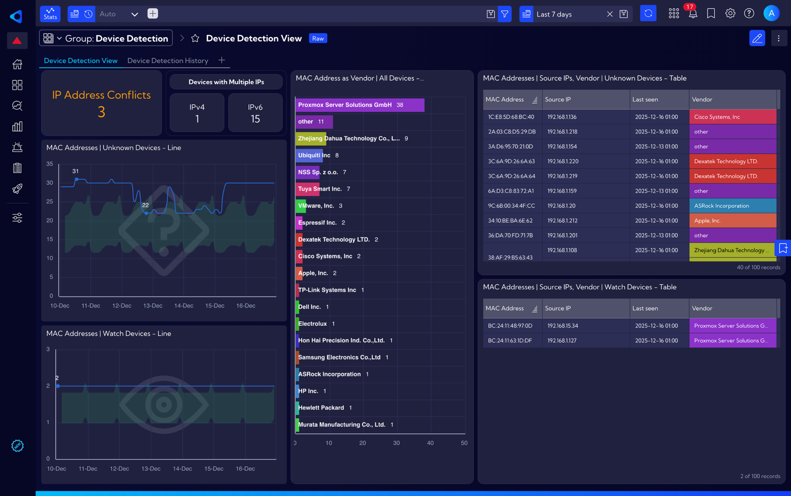

Leveraging enhanced detection data, we have introduced new widgets to identify potential IP address conflicts, where two or more devices attempt to use the same IP address. These issues are often difficult to detect using traditional methods.  
However, with flow-based traffic analysis, Sycope can **detect conflicts** within minutes.

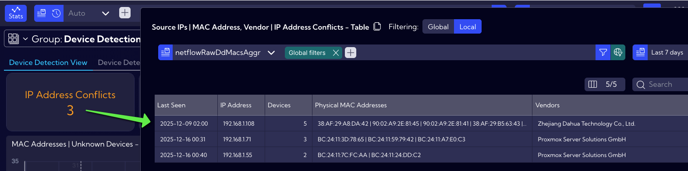

Sycope can also detect when multiple IP addresses are assigned to a single device. The drilldown view is separated into **IPv4** and **IPv6** to account for the different ways DHCP may assign each address type.

In this example, the first three rows are automatically flagged as **Router Hops** and are intentionally ignored to prevent false positives.

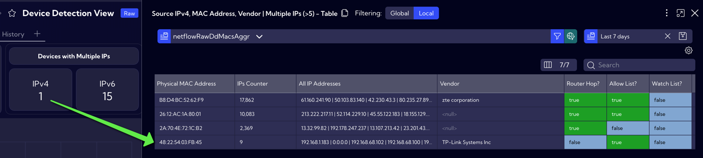

The **Device Detection History** tab allows users to drill down into a specific physical MAC address or IP address and review the exporters on which it was observed, including the exporter name and location.

Additionally, the tab features a dedicated widget for **raw data analysis**.

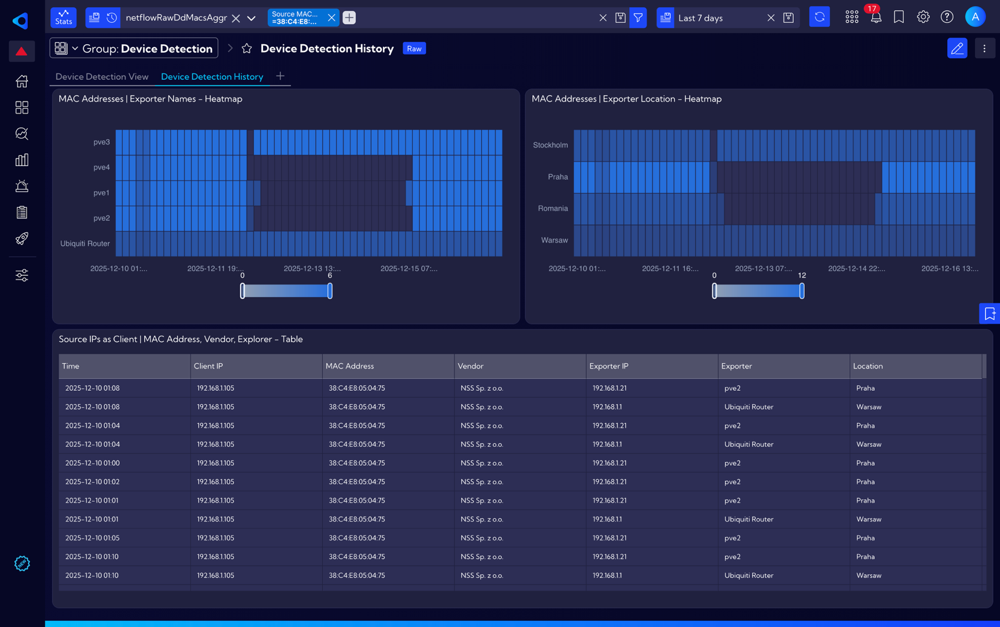

## Initial Configuration

Users can enable and start using the Device Detection feature in just a few simple steps, as outlined below.

### Enable MAC Address support

To ensure proper operation of the Device Detection feature, the **physical MAC address** must be included in the exported flow data. In NetFlow, this field is referred to as ***sourceMacAddress***.

To enable it, navigate to **[Settings → NetFlow → Template-Based Settings]**. Click **`[Add Profile]`**, assign a profile name, and then expand the **`Apply profile to exporters`** drop-down list to select the relevant exporters. In the final step, select ***sourceMacAddress*** from the available fields.

Users can verify whether a specific exporter is sending flow records containing the ***sourceMacAddress*** value by checking the Exporter IP column.

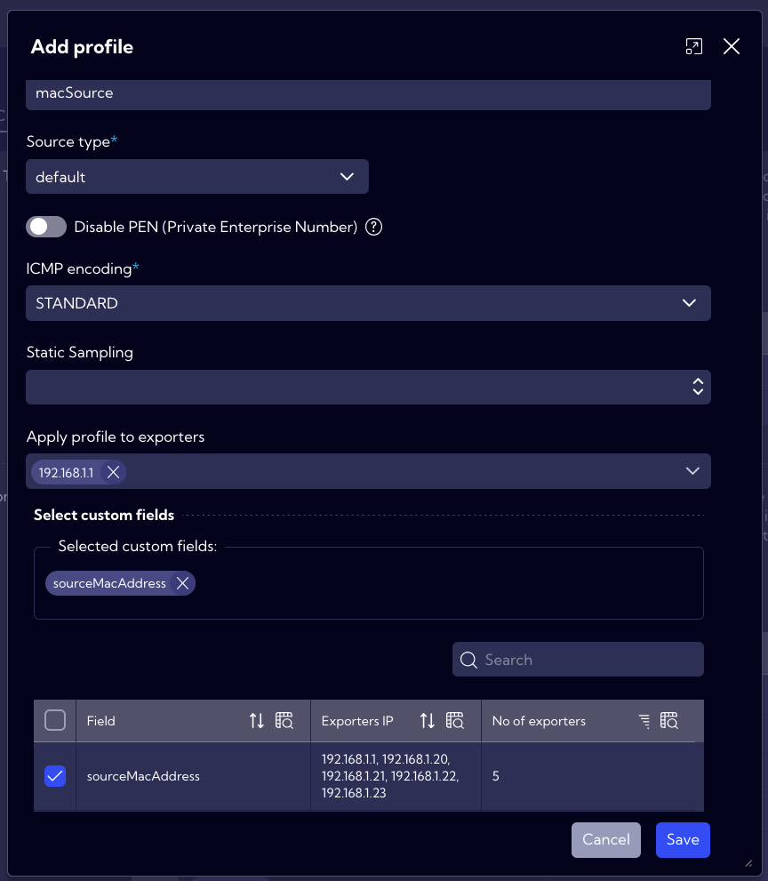

### Define Allow Lists

Once Sycope starts receiving flow data containing MAC addresses, all detected devices in the network will initially be classified as **Unknown**. This is expected behavior, and users are required to create a new **Allow List**.

To simplify this process, Sycope provides an easy method to generate an Allow List directly from the collected data. To do so, navigate to **[Dashboards → Full dashboards list → Device Detection View]**. Then, hover over the **MAC Addresses | Source IPs, Vendor | Unknown Devices – Table** widget. Click the **Drilldown** icon (downward arrow) that appears in the bottom-right corner of the widget.

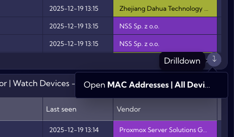

From this view, users can see all saved MAC addresses for the selected time-period. It is recommended to adjust the time range accordingly - for example, to the **Last 7 days**. As shown in the screenshot below, the widget allows for **exporting full data** in CSV format.

If all currently discovered devices are business-owned and considered trusted, the exported file can be used directly to populate the Allow List. Otherwise, users should review and modify the data as needed before importing it.

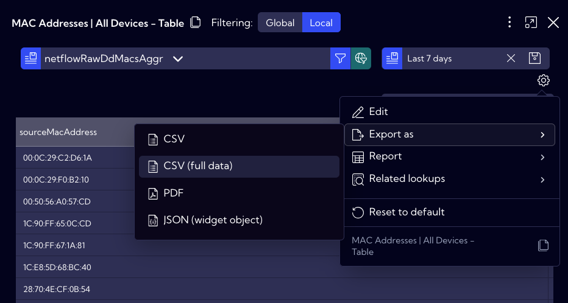

Next, navigate to **[Settings → Mapping → Lookups]**, locate the **dd-allow-list** lookup, and click on it. Select **`Edit CSV`**, then click **`Import`** and **Browse** to choose the previously exported CSV file (containing the full dataset).

After the import is complete, click **`Apply`** file and then **`Save`**. Once saved, Sycope will recognize these devices as trusted, and any newly detected device will be flagged as **Unknown**.

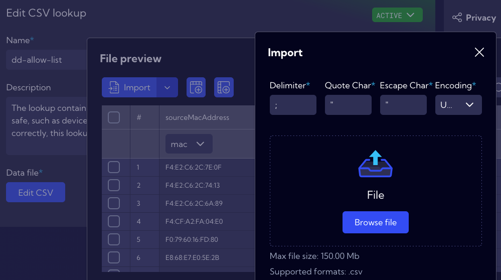

### Eliminate false positives

Depending on the network topology, devices such as routers may affect the physical MAC address information contained in flow data. In some cases, flow records may include the MAC address of a router or the nearest network hop instead of the actual endpoint device. For the Device Detection feature to function correctly, such entries must be excluded so that only true endpoint MAC addresses are used.

To address this, a dedicated collector named **dd_router_hops** has been introduced. Users can review its entries in the Raw Data view by selecting **[Settings → Objects → Collectors → dd_router_hops]**. For easier analysis, a dedicated visualization is also available. By navigating to **[Dashboards → Full dashboards list → Device Detection View]** and clicking the **Drilldown** widget in the **IPv4 KPI**, users can view all entries where **“Router Hop?”** is flagged as true. These records represent network devices identified as router hops by the dedicated collector.

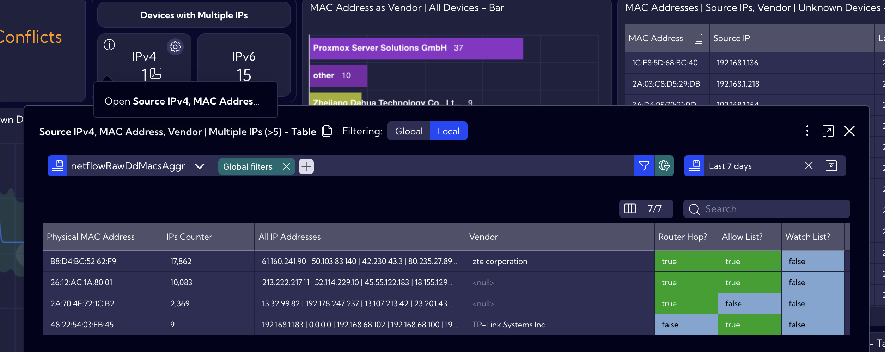

In some environments, users may also need to exclude specific network devices from the Device Detection feature. Examples include network virtualization appliances such as **Cisco CSR 1000v** (Cloud Services Router 1000v) or **Juniper vSRX Virtual Firewall**, which may generate additional network traffic and modify the MAC address field in flow data. Depending on the deployment and usage, these devices may not be automatically excluded by the dedicated collector.

In such cases, the relevant MAC addresses must be added to the **dd-ignore-list** lookup. Users can do this in one of two ways. The first option is to right-click the MAC address in any widget, select **`Actions`**, and choose **`Add value`** to lookup. A pop-up window will then allow the value to be saved to the **dd-ignore-list**.

Alternatively, users can edit the lookup directly by navigating to **[Settings → Mapping → Lookups]** and updating the **dd-ignore-list** manually.

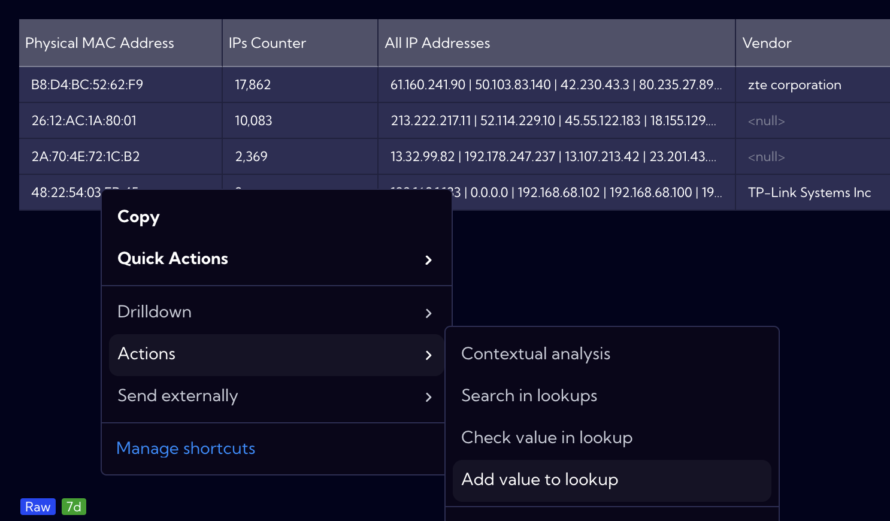

### List Management

The Device Detection feature relies on four lookup lists to operate effectively:
- **dd-watch-list** - The lookup contains a list of physical MAC addresses of discovered endpoints that were manually added by the user and are considered rogue. These endpoints should be monitored closely.
- **dd-oui-db** - The lookup contains a list of physical MAC address prefixes and their associated vendor names. It is based on the publicly available IEEE Standards Association database.
- **dd-ignore-list** - The lookup contains a list of physical MAC addresses of manually added endpoints that should be excluded from the Device Detection feature. This exception can be useful, for example, for a network appliance that was not detected by the dd_router_hops collector but is still generating false positives in MAC-to-IP assignment.
- **dd-allow-list** - The lookup contains a list of physical MAC addresses of manually added endpoints that are considered safe, such as devices owned by the organization. To ensure the Device Detection feature operates correctly, this lookup should be properly populated.

The **dd-oui-db lookup** is locked and can only be viewed. The other lookups are editable by users. Entries can be added either by right-clicking a MAC address in any widget, selecting **`Actions`**, and choosing **`Add value to lookup`**, or by editing the lookup directly via **[Settings → Mapping → Lookups]**.

### Alerts

Four new alerts have been created for the Device Detection feature. The **Unknown Device Detection** and **Watch Device Detection** alerts rely on the configured lookups and current flow data statistics, so it is important to ensure the Device Detection feature is properly set up before enabling them. The **High IP Count on Device** alert requires historical data and discovered router hops to function accurately and avoid false positives. Therefore, it is recommended to let the Device Detection feature run for several days before enabling this alert.  
The IP Address Conflict alert depends solely on flow data and can be enabled immediately after the Device Detection feature is configured.
- **High IP Count on Device** - The rule identifies devices with an unusually high number of assigned IP addresses and generates an alert upon detection.
- **IP Address Conflict** - The rule identifies IP address conflicts by detecting two or more physical MAC addresses using the same IP address and generates an alert upon detection.
- **Unknown Device Detected** - The rule identifies devices whose physical MAC addresses are not present in the Allow List Lookup and classifies them as unknown.
- **Watch Device Detected** - The rule identifies devices whose physical MAC addresses are present in the Watch List Lookup and generates alerts upon their detection.

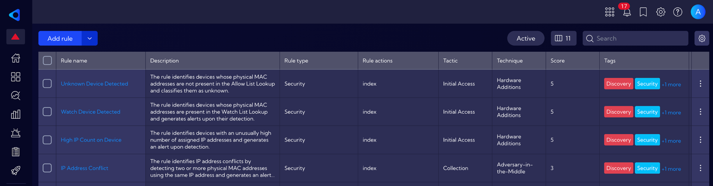

