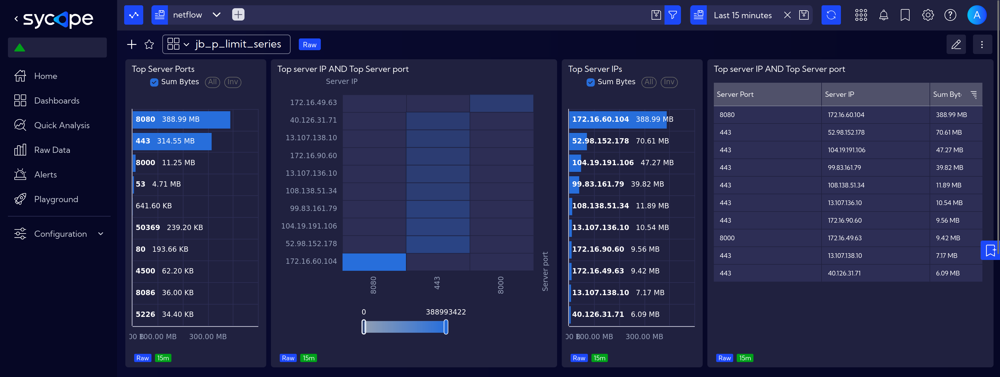
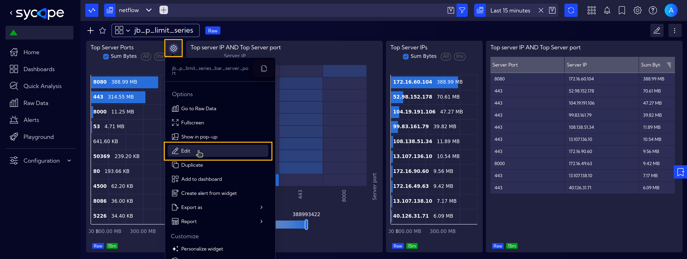
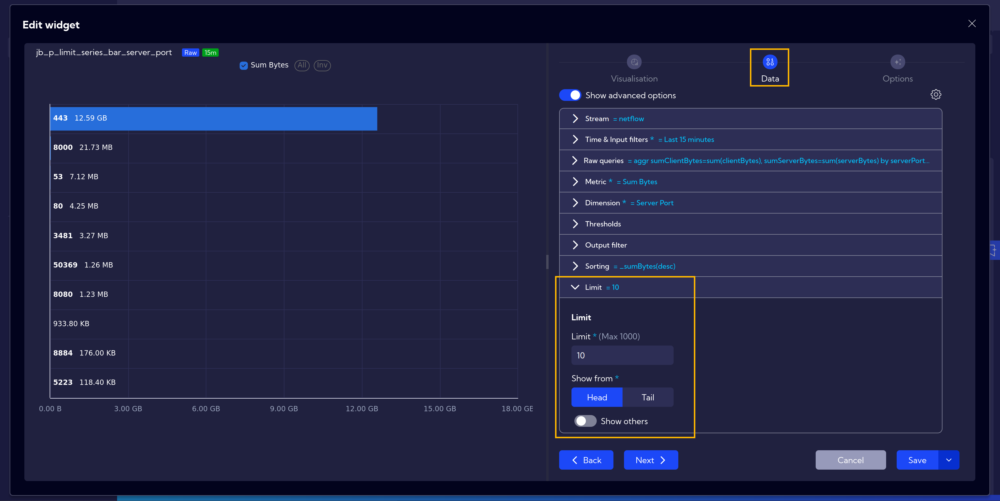
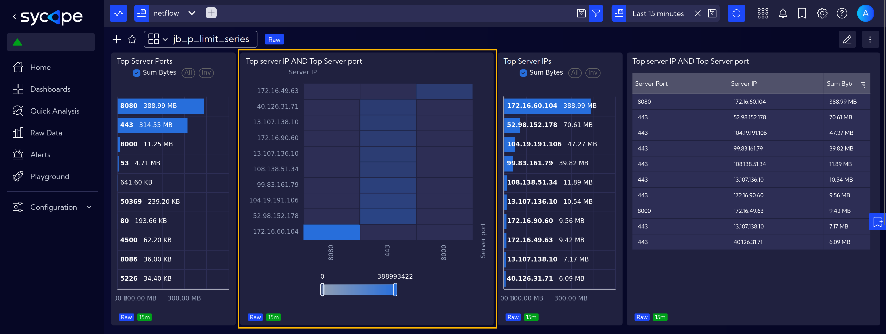
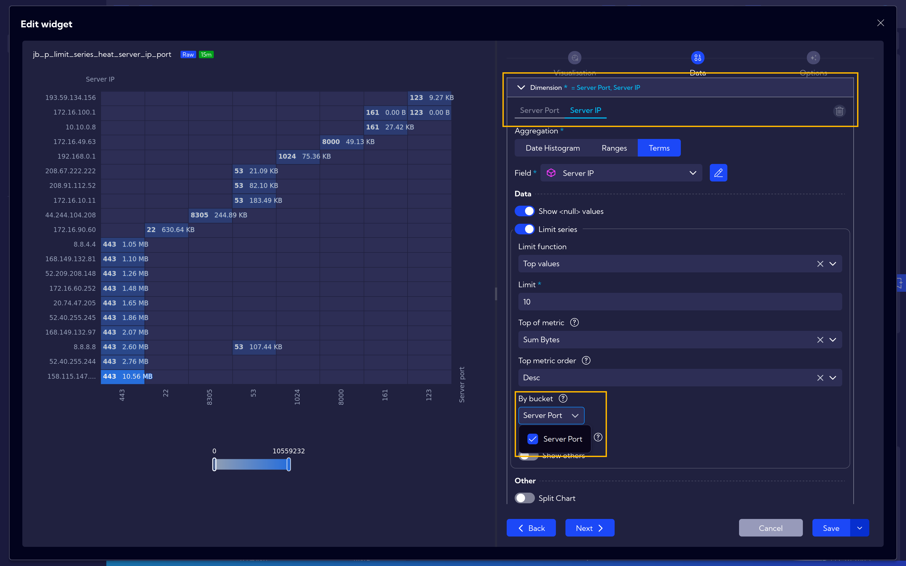

# Limit Series

The Limit Series function is used to display only the top values in a dataset based on a chosen metric.

 In the presented dashboard, it is applied to **netflow** data, showing only the **top 10 server ports** and **top 10 server IPs** based on traffic volume.

 

Using the **Top Server Ports** widget as an example, let's go through the settings.  

First, open the widget settings and navigate to the **Data** tab.  
After configuring all the necessary settings, i.e. ***Sum Bytes*** as **Metric**, ***Server Port*** as **Dimension** and desired **Sorting** options, scroll down to the last expander, where you can set the **Limit**. Additionally, you can choose whether to display the first entries (head) or the last entries (tail) in the table.

## By Bucket

The default limits work in such a way that we have separate top 10 IPs and separate top 10 ports. As seen on the heatmap, not necessarily all top 10 IPs connected to all top 10 ports.

To address this issue, there is an additional option called **By bucket**, which allows to show the top 10 IPs and, for each of them, the top 10 ports.

Go to the widget options and in **Data** section, in **Dimension** expander, locate the **Server IP** value and modify the limit calculation method. Use **By Bucket** option and select there ***Server Port***.  
This adjustment ensures that for each Server IP, the top 10 server ports are visualized.

