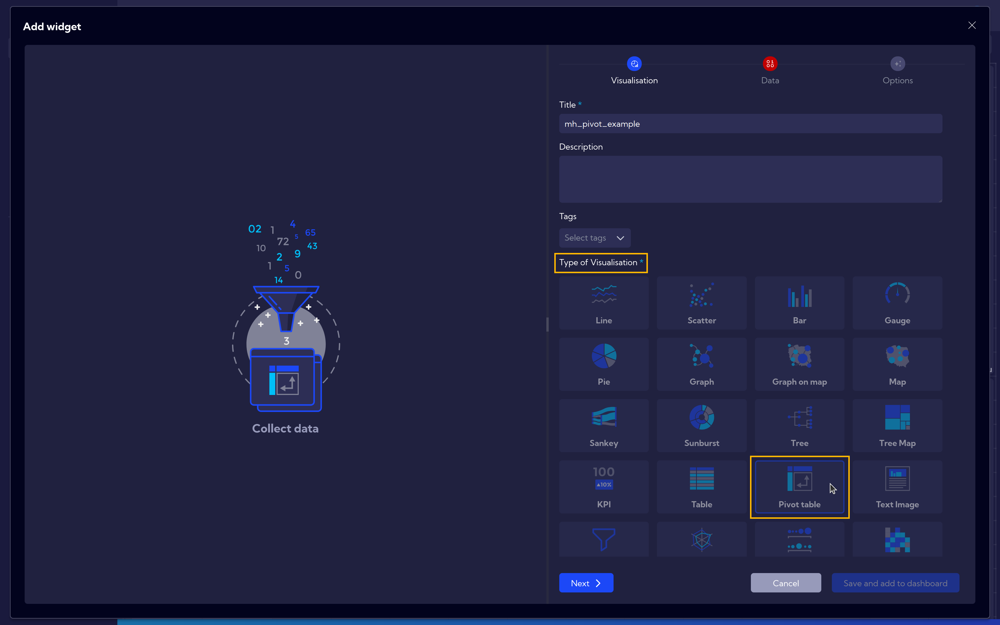
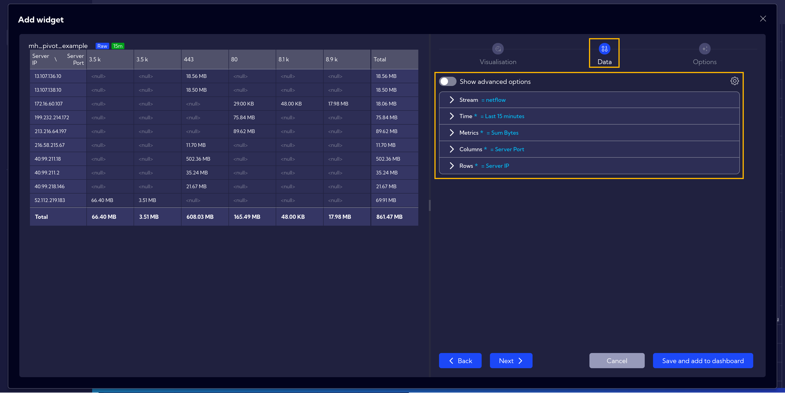
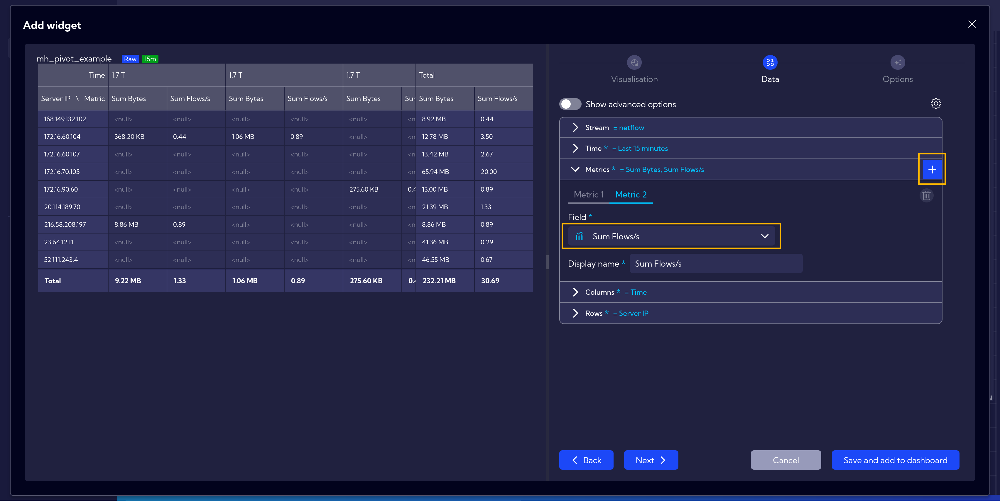
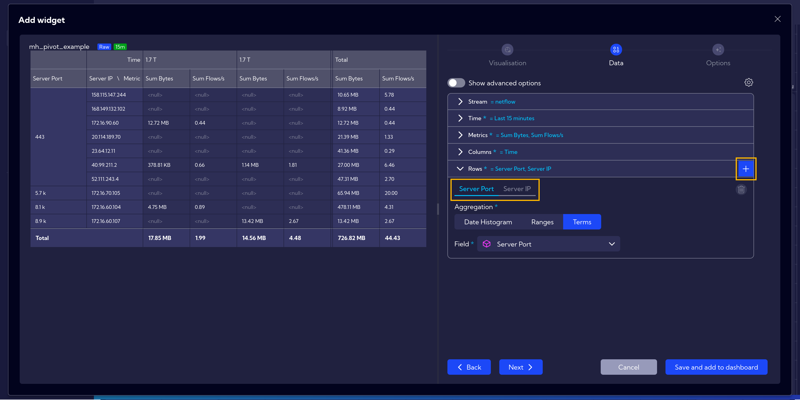
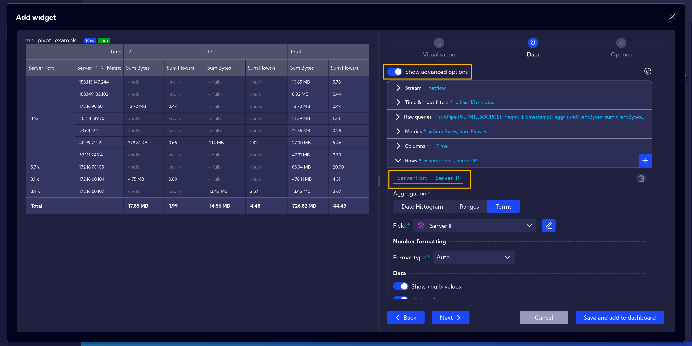
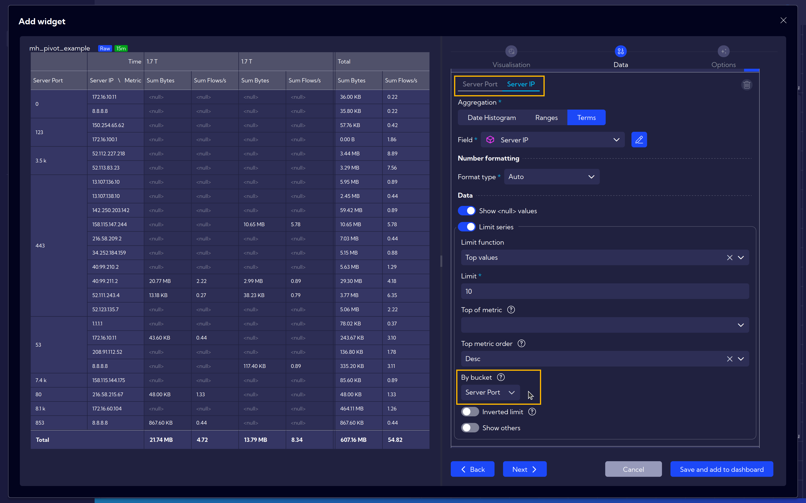
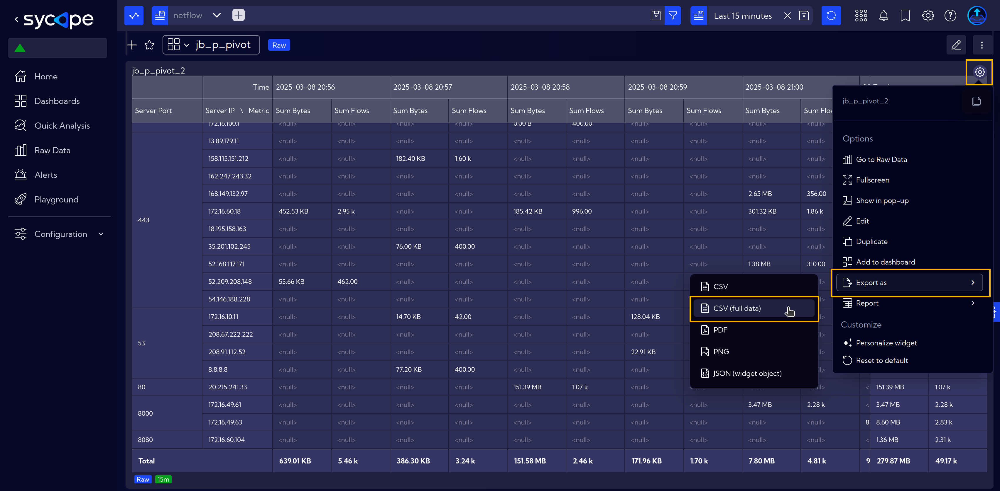

# Pivot Table

A pivot table is a powerful tool for summarizing and analyzing large datasets. It allows users to dynamically group, filter, and aggregate data, making it easier to identify trends and patterns. By simply dragging and dropping fields, users can create custom reports without needing complex formulas or manual calculations.

Pivot tables are now available as visualization widgets in Sycope.

## Simple Example

A new [Widget](/User-Guide/Configuration/Widgets) can be created similarly to this [Widget Example](/Examples/Widget-Example-Simple).  
Alternatively, it can be added directly to the dashboard, as described in the Dashboards guide [Add/Edit Dashboard](/User-Guide/Dashboards#addedit-dashboard).

After starting the widget creation and assigning it a name, select **Pivot Table** as the ***Type of Visualization***.

Next, in the **Data** tab, fill in the data according to your specific case.

In this example, we select the following options:
- **Stream**: ***netflow***
- **Time**: ***15 minutes***
- **Metrics**: ***Sum Bytes***
- **Columns**: ***Server Port***
- **Rows**: ***Server IP***

Remember to save your work at the end.

The resulting table displays the sum of bytes for each port associated with the IP addresses.

## Advanced Example

It's also possible to create a more advanced table.  
In this example, we add ***Sum Flows*** as an additional metric.

In the **Columns** section, we set ***Time***, and in the **Rows** section, we add an additional field: ***Server Port*** and swap its position with ***Server IP*** by simply dragging it to the first position.

Next, after clicking on **Show advanced options**, go to **Rows**: ***Server IP***.

After scrolling down to the [Limiting](/Examples/Limit-Series) options, select ***Server Port*** under the **By bucket** setting.  
This will allow you to view the Top 10 ports for each IP address.

The final table presents network traffic data over a 15-minute window, showing the **total bytes** transferred and the **number of flows** for different **server IPs** and **ports**. The data is **organized by time**, allowing for an analysis of traffic trends and identifying which servers and ports are most active. The last column aggregates the total values for the entire period, highlighting the highest traffic sources. Empty fields indicate no recorded activity at specific times.

## Export Data

To export raw data, e.g. for further processing, click the **Settings icon**, select **Export as**, and choose **CSV** for filtered data (if limitations were applied) or **CSV (full data)** for the complete dataset.

