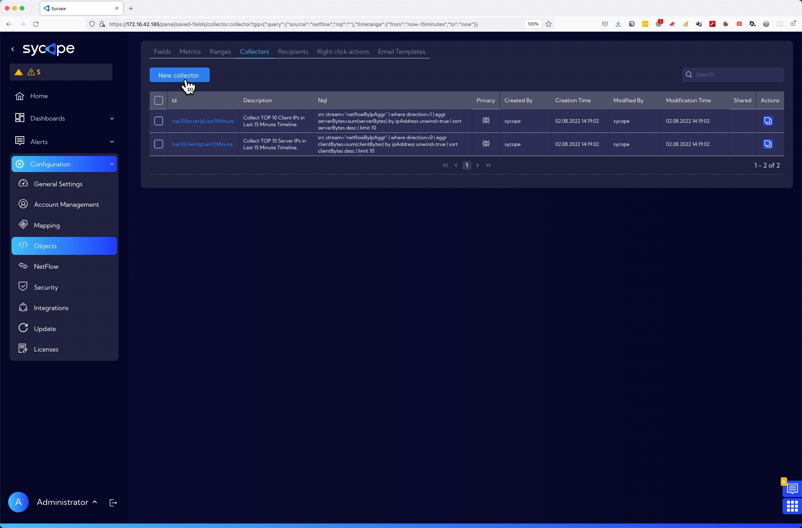
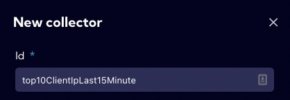
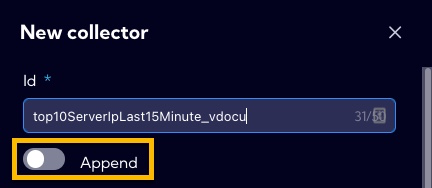
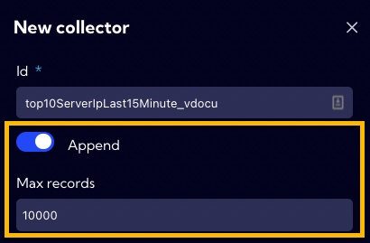
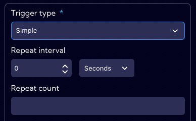
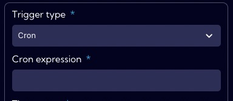
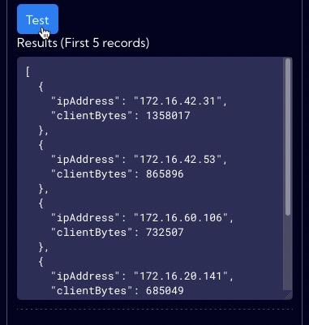

# Collector Creation Example

**Collector** is a type of database (data stream) for which we can configure a process that periodically queries for specific data. The data acquired by the process feeds the **Collector** database. **Collector** data can be used in two ways:

1. As a **simple database** with data on which you can work and transform data.
2. As a **collection of data** that can be used as a filter when querying another stream with data.

We will analyze the process of creating a **Collector** using the example of a **Collector** that will collect and save **TOP 10 Client IPs in Last 15 Minute Timeline.**

## Implementation

To create a **new Collector**, go to **[Settings > Configuration > Objects > Collectors]** menu and click **Add collector** button.

The wizard for creating a new **Collector** appears.

1. In the **Id** field, we enter the Collector NQL name.

  

2. The collector has two modes of saving data:
   - **Append switch OFF** - Data collected from a query are overwritten (default mode).
     
   - **Append switch ON** - Data collected from a query are saved until the limit specified in the **Max Records** field is exceeded.
     
   
3. **Collector** (data query) can be triggered in two ways specified in the **Trigger type** field:

   - **Simple** - launch every interval of time specified in the **Repeat interval** field. The **Repeat count** field specifies the number of launches - when it is empty the query will be executed indefinitely.

     

   - **Crone** - launched using job scheduler on Unix-like operating systems.	
     		

4. In the **Time range** field, set the time range on which Collector will operate.
   

5. In the **NQL** field we enter the syntax of the query - in our case it is:

   `src stream="netflowByIpAggr" | where direction=0 | aggr clientBytes=sum(clientBytes) by ipAddress unwind=true | sort clientBytes desc | limit 10`

   

6. Using the **Test** button, we can test how our query works - what data will be returned.
   

7. If all the necessary fields of the form have been correctly completed press **Save** button to save the created object.
