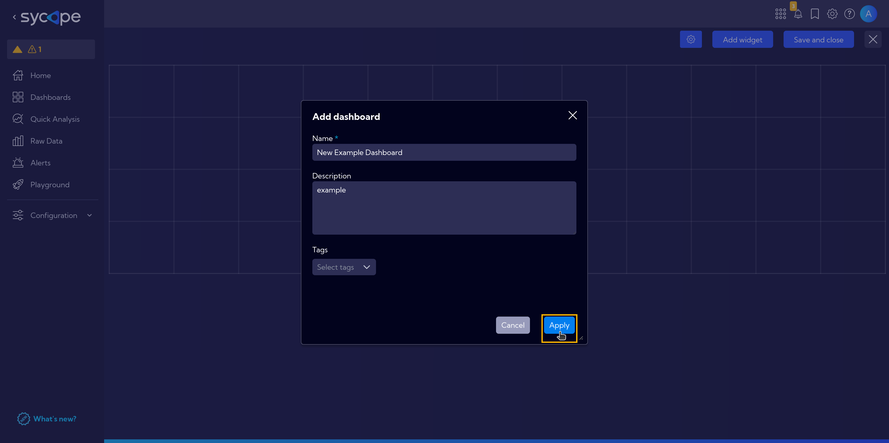
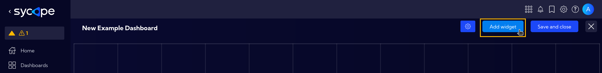
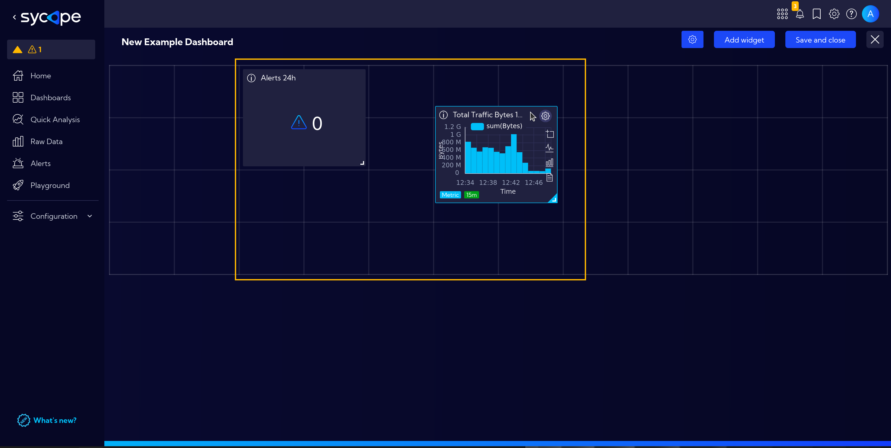
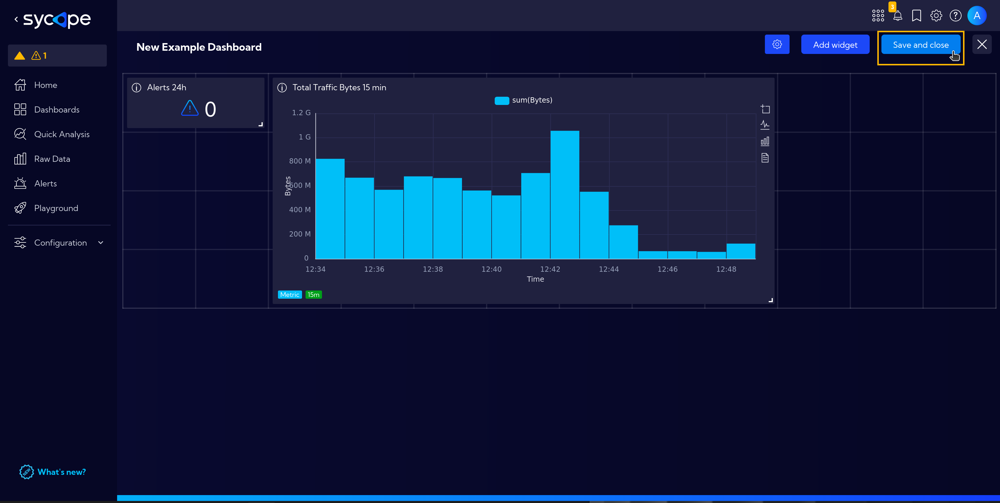
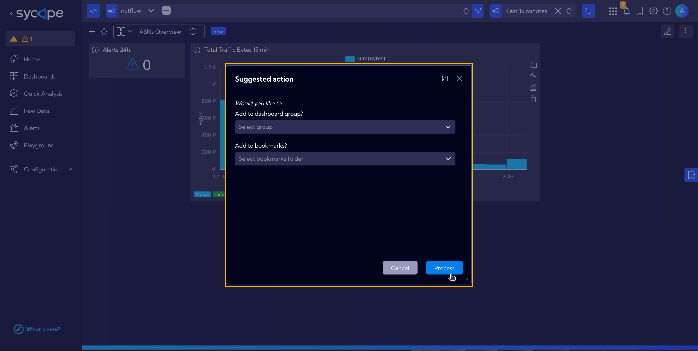
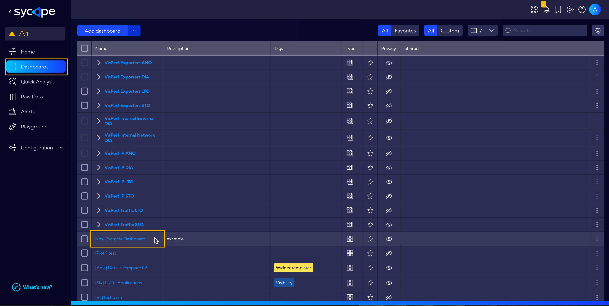

# Create a Custom Dashboard

This tutorial provides information on how to create our own simple dashboard.  
We will use the previously created [simple](/Examples/Widget-Example-Simple) and [advanced](/Examples/Widget-Example-Advanced) widgets.

Let's start by selecting **`[Menu > Dashboards > Full dashboards list]`**,

and clicking **`Add Dashboard`** button.

Name our new dashboard and proceed by clicking `Apply`.

In the next view, we have a dashboard grid where we add our widgets.

After clicking the `Add widget` button, we have a full list of system widgets. Our created **Total Traffic Bytes 15 min** and **Alerts 24h** widgets are also there.  
To make searching easier, use the search bar. Type *total traffic* to find our **Total Traffic Bytes 15 min** widget.  
Now we can add the widget to the dashboard by clicking the `plus icon` or using the drag-and-drop method.

Now repeat the search for **Alerts 24h**.

Now we have our widgets on the dashboard. For now, they are the same size and arranged in a single row.  
We can drag them to any location and arrange as we like.

For better visibility of the data, we can also resize them.  
Finally, click the `Save and close` button to save the progress of our work.

The next dialog box allows us to immediately add the dashboard to a selected group or to bookmarks.

Our new dashboard is ready! Let's go to the list of all dashboards **`[Menu > Dashboards]`** and find ours.

This is what a completed simple dashboard looks like.

You can experiment on your own and create complex dashboards like this one showing information about applications running on the network. Feel free to experiment!

:::info More information:

For more specific information on how to [create a new dashboard](/User-Guide/Dashboards#addedit-dashboard), select and customize the appropriate [widgets](/User-Guide/Configuration/Widgets), and assign it to the selected [group](/User-Guide/Dashboards#dashboard-groups), refer to the relevant sections of the documentation.

:::
