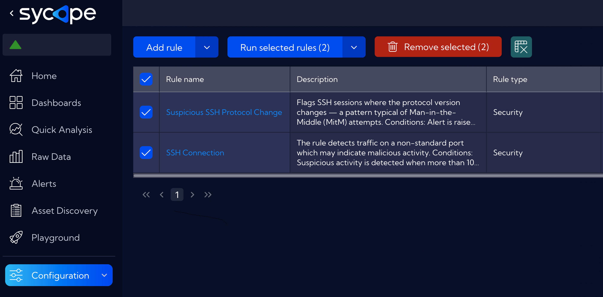
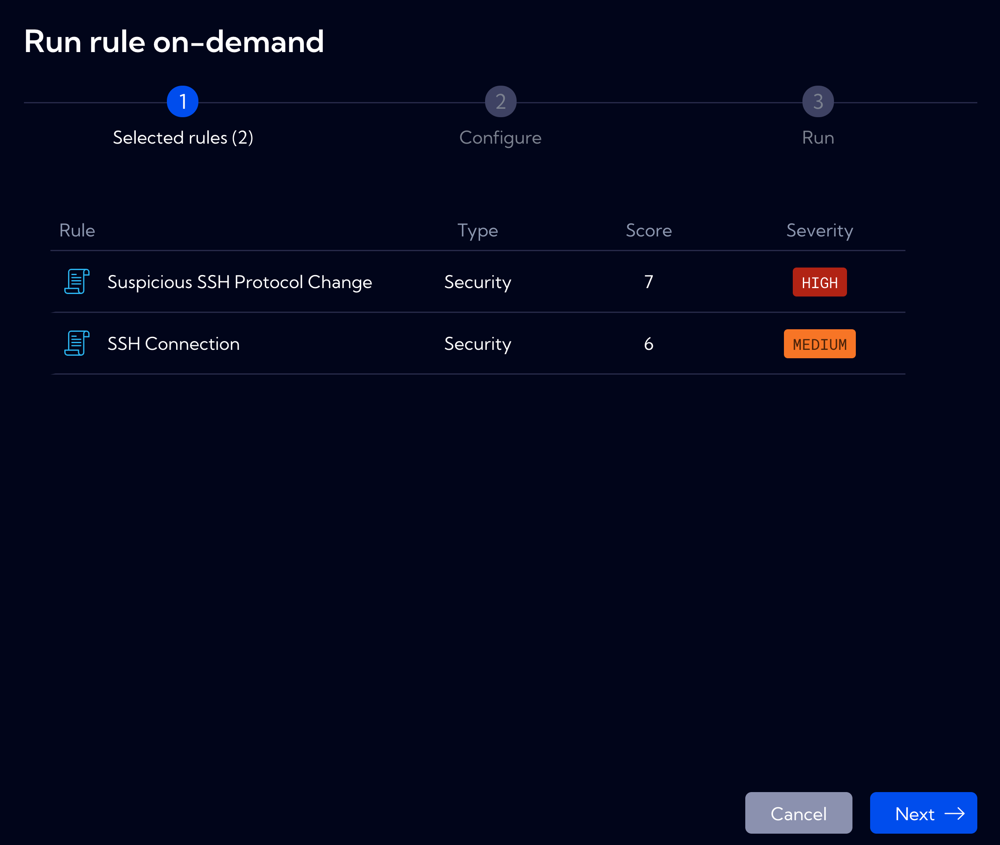
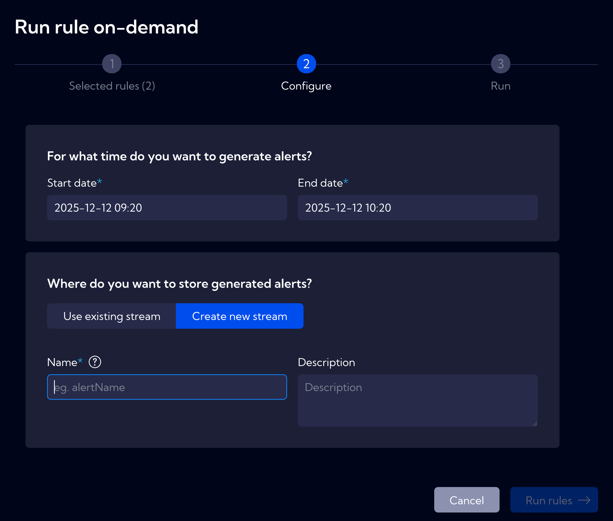

# Run Rules On-Demand Example

## Accessing the Feature
To run rules on-demand, navigate to **[Configuration > Rules]**, select one or more rules from the list, and click the **`Run selected rules`** button.

## Wizard Steps

The feature provides a guided three-step wizard:

### Step 1: Selected Rules

Review the list of rules to be executed. The table displays:
- **Rule** - Name of the selected rule
- **Type** - Rule type (Security, Performance, etc.)
- **Score** - Severity score assigned to the rule
- **Severity** - Alert severity level (HIGH, MEDIUM, LOW)

### Step 2: Configure

Define the parameters for historical analysis:

**Time Range**

Specify the time period to analyze by setting:
- **Start date** - Beginning of the analysis period
- **End date** - End of the analysis period

**Alert Storage**

Choose where to store the generated alerts:
- **Use existing stream** - Store alerts in an existing alert stream
- **Create new stream** - Create a dedicated stream for the results

When creating a new stream, provide:
- **Name** - Unique identifier for the stream (e.g., *forensic_2025*, *incident_investigation_dns*)
- **Description** - Optional description of the stream purpose

### Step 3: Run

Click **`Run rules`** to execute the selected rules against the specified historical data.  
The system will process the data and generate alerts based on rule conditions.

## Use Cases

### Rule Validation

Test and validate new or modified alert rules before deploying them in production.  

**Example:** After creating a new detection rule for lateral movement, run it against the last 30 days of traffic to verify it generates expected alerts without excessive false positives.

### Forensic Analysis

Retroactively detect threats in historical traffic data when new threat intelligence becomes available.  

**Example:** A SOC team receives intelligence about a DNS tunneling campaign active during a specific period. They can select DNS-related rules, set the time range matching the threat intelligence dates, and create a dedicated stream like *dns_tunneling_investigation_2025* to isolate findings for focused analysis.

### Incident Investigation

Investigate suspicious activity timeframes identified after the fact.  

**Example:** When a compromised host is discovered, analyze historical traffic from that host by running relevant security rules against the period before detection to understand the full scope of the incident.

## Stream Name Field

Enter a unique name for the new alert stream. This stream will contain only alerts generated by this on-demand rule execution, keeping them separate from your real-time detection alerts. Use descriptive names that include the investigation context, e.g., *incident_2025_01_dns* or *forensic_november_scan*.  

### Viewing Results

After execution completes, generated alerts appear in the designated stream. To view results:
1. Navigate to **[Alerts]** or **[Raw Data]**
2. Select the stream you specified during configuration
3. Analyze the alerts using standard Sycope filtering and visualization tools

Alerts generated through on-demand execution contain the same fields and metadata as real-time alerts, enabling consistent investigation workflows.

## Best Practices

- **Use descriptive stream names** - Include date ranges or investigation context (e.g. *forensic_nov2025_lateral_movement*)
- **Start with narrow time ranges** - Begin with shorter periods to validate results before expanding
- **Create dedicated streams for investigations** - Keep on-demand results separate from production alerts for cleaner analysis
- **Document your investigations** - Use the ***Description*** field to record the purpose and context of each analysis
