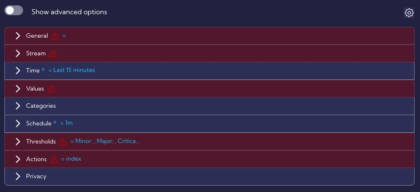
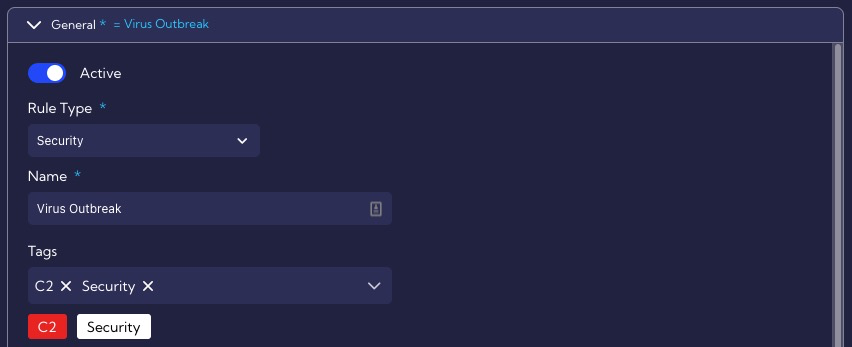
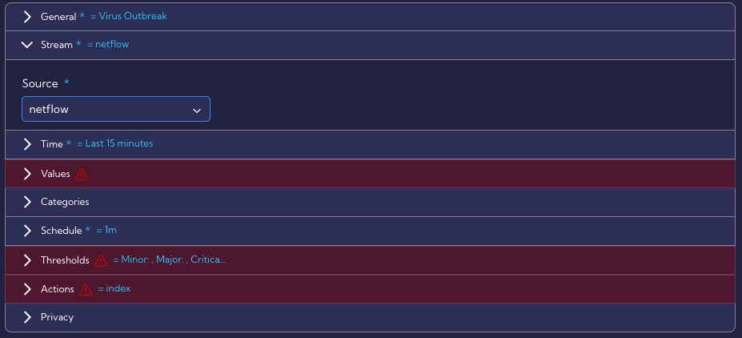
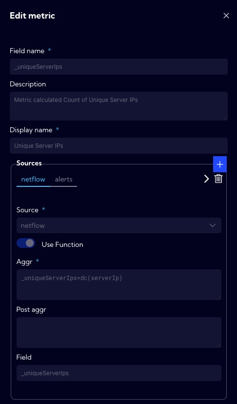
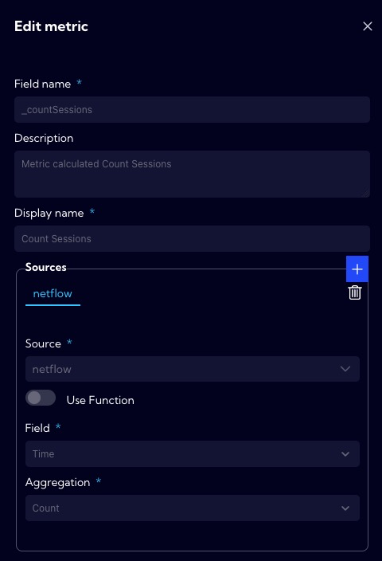

# Examples of alert rule creation - advanced way

The advanced method of creating a **Rule** is to design it from scratch. In our example, we will create a rule named **Virus Outbreak** to detect malware spreading. Detection of such a case can be realized by detecting the communication of one workstation with many others in a short period of time. So let's proceed to create such a rule from scratch.

## Implementation

To design a new rule go to menu **[Alerts->Rule Set]** and then click **New rule** and select **From scratch** option.


When clicked, a rule wizard window appears in which the system indicates which fields should be filled in.




1.  In the **General** section we set the rule enable (Active), fill in the required fields: **Rule Type**, **Name**, **Score** and optionally **Tags**, Description or MITRE (Tactic, Technique, Subtechnique).
    

    
2.  In the **Stream** section, we choose Netflow because we want to analyze traffic on raw flows.
    
3. In the **Time** section, we leave the default value of 15 minute.
4. In the **Values** section, we select the fields for which we want to set thresholds for anomaly detection. In our case these are: **Unique Server IPs** and **Count Sessions**. 
   
   These metrics are predefined, and you can preview it in [**Configuration->Objects ->Metrics**].
   
   
   In case you want to use a custom metric, you can create one from the [**Values -> Add new metric**] , or you can go to [**Configuration->Objects -> Metrics**].
   
5. In the **Categories** section, we set grouping by Client IP and Server Port, because we want to detect a situation where an infected host (Client IP) communicates with multiple servers (Unique Server IPs) on a given port (Server Port).
   
   
   
6. In the **Schedule** section, we leave the default parameters for interval and throttling, i.e. 1 minute, because, for this scenario, a time interval of 1 minute will be right. In the Indexed fields option, the same values are set as in Categories.
7. In the **Thresholds** section, set the exceedance values for the metrics configured in the Values section.
   

   The correlation rule will trigger when in a period of 1 minute, one host (Client IP) will communicate with at least 10 hosts (Server IP) using the same port and there will be at least 1 established session (Count Sessions). If there are more of these attempts then the rule will have a higher criticality - depending on the configured thresholds (Major and Critical).
   
8. In the **Actions** section, we specify that all our alerts (Critical, Major, Minor) generated by this rule will be saved in the alerts table, and we also set custom fields that should additionally be included in the alert (First Client Country, First Client Function, First Client ASN).
   
   Custom fields are metrics, so their configuration is available in the [Configuration->Objects ->**Metrics**].


### Advanced options

In our example, we will also use the advanced options available by clicking the **Show advanced option** switch. 


We want our rule to generate as few False Positives alerts as possible so we use the **Time & Input Filters** section for this purpose. 

1. In the **Time & Input Filters** section, in order to limit detection to only private addresses and the Workstations function group, we enter the following condition in the **Filter by**:

   ```
   lookupKeyExists("groups-private", {"cidr": serverIp } ) AND lookupKeyExists("groups-private", {"cidr": clientIp } ) AND any(serverGroups, ["Workstations"]) 
   ```

   

   IP Addresses of  the Workstations function group may be changed in the  [**Configuration->Mapping->Lookups->groups-function**].

2. Finally, in the **Sorting** section, we can set sorting by some metric, such as **Unique Server IPs**.
   
   
   If we think that our rule has been configured as we expected, we should press **Create** and the rule will appear in the list of rules in the system.
   
